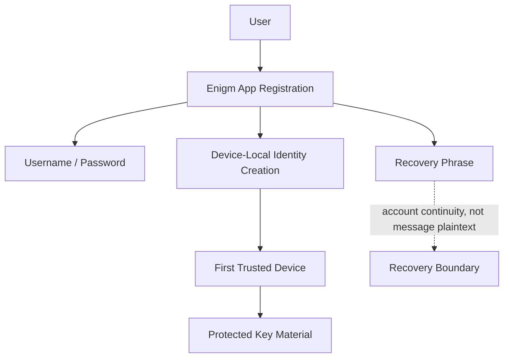

The Enigm account model is a security architecture for separating user identity, Device Trust, administrative lifecycle control, and protected message content.

Enigm App is the core user-facing product. The account model exists to support secure messaging, secure calls, multi-device workflows, recovery boundaries, device lifecycle management, and enterprise security review without treating a user account as equivalent to a single physical device.

## Overview

An Enigm account represents the user identity and account-level policy context. A device represents a separate execution context that must be explicitly associated with the account before it can participate in protected operations.

This means:

- User onboarding and registration are handled through Enigm App.
- Account authentication uses username and password credentials.
- Recovery is supported through a recovery phrase.
- Identity is created on the device during registration.
- An Enigm account is not bound to one physical device.
- A device can be enrolled, reviewed, revoked, and replaced.
- Account Trust and Device Trust are evaluated separately.
- Administrative lifecycle operations are handled through Enigm Command where managed workflows apply.
- Optional Enigm OS device management can provide additional Trust state signals.
- Message plaintext remains outside administrative lifecycle access.

## Account Identity

Account identity provides the user-level context for authentication, session lifecycle, authorization, recovery state, and policy assignment.

Account identity answers questions such as:

- Which Enigm account is requesting access?
- Is the app session active and valid?
- Which policy applies to the account?
- Which devices are associated with the account?
- Which recovery boundaries apply?

Account identity does not automatically establish Device Trust, message access, network eligibility, or administrative authority.

## User Onboarding And Registration

Enigm App registration is designed to establish account identity and initial Device Trust without requiring unnecessary public identifiers.

The onboarding model includes:

- Username and password account credentials.
- Recovery phrase generation.
- Device-local identity creation.
- Explicit association of the first trusted device.
- Separation between recovery capability and normal message access.

Standard Enigm account creation does not require an email address, phone number, or identity document. This supports identity minimization and reduces dependence on public identifiers.

The account model should be described as pseudonymous and identity-minimizing rather than as an absolute identity-erasure claim. Account state, device state, payment records, security events, legal obligations, or user behavior can still create exposure outside the standard registration model.

Registration should be treated as a security-sensitive workflow. A newly created identity, the first associated device, protected key material, and recovery phrase handling establish the initial account security boundary.

The public registration model is:

1. The user creates an Enigm account in Enigm App.
2. The user sets username and password credentials.
3. Enigm App creates the account identity on the device.
4. Enigm App establishes the first trusted-device association.
5. Enigm App generates or presents the recovery phrase workflow.
6. Protected key material remains governed by the device-bound key-management model.
7. Account recovery is separated from normal message decryption.

## Device Association

Device association is explicit and controlled. A device must be associated with an Enigm account before it can participate in secure messaging, secure calls, multi-device synchronization, or managed device workflows.

Device association uses Privacy-Preserving Device Handles. These identifiers are intended to support policy, lifecycle review, and audit correlation without exposing unnecessary public identity metadata or direct device identifiers.

Device association supports:

- Enrollment of a new device.
- Review of device state.
- Revocation of an existing device.
- Replacement of a device.
- Separation between account identity and Device Trust.
- Optional Trust state reporting from Enigm OS.

## Device Lifecycle

The Enigm device lifecycle is security-sensitive and auditable.

Lifecycle states include:

- **Enrollment**: a device is added to an account through an authorized flow.
- **Review**: a device is evaluated for lifecycle, policy, or Trust state.
- **Activation**: a device becomes eligible for supported protected operations.
- **Replacement**: a new device supersedes an existing device through an authorized flow.
- **Suspension**: a device is temporarily restricted.
- **Revocation**: a device is removed from future protected operations.
- **Retirement**: a device is removed from active lifecycle management.

Revocation should restrict future use of the device for protected operations. Replacement should be treated as a new trust event rather than an automatic continuation of the previous device.

## Account Trust and Device Trust

Account Trust and Device Trust are separate security concepts.

Account Trust evaluates:

- Authentication state.
- Session lifecycle.
- Account lifecycle state.
- Recovery state.
- Account-level policy.
- Administrative policy.

Device Trust evaluates:

- Enrollment state.
- Review state.
- Revocation state.
- Replacement state.
- Privacy-Preserving Device Handle.
- Device-associated protected key state.
- Optional Trust Security Center posture.
- Remote Attestation outcome when device-integrity evidence is required.

Protected operations may require both a trusted account state and a trusted device state.

## Session Lifecycle

Session lifecycle controls determine whether an authenticated app session may continue to perform protected operations.

Enigm App sessions are limited to 6 hours. Session lifecycle state is evaluated separately from Device Trust, protected key material, recovery state, and administrative authorization.

Session evaluation should consider:

- Account authentication state.
- Device association state.
- Device revocation state.
- Policy changes issued through Enigm Command.
- Recovery state changes.
- Optional Enigm OS Trust state signals where deployed.

A session should not be treated as permanently valid if Device Trust changes, account recovery begins, or administrative policy restricts the account or device.

Session expiration or closure does not decrypt messages, export private keys, or bypass message expiration policy. It limits account access state and protected workflow eligibility.

## Enigm Command Lifecycle Management

Enigm Command provides lifecycle management for account security and devices in managed deployments.

Enigm Command supports:

- Device review.
- Device revocation.
- Device replacement workflows.
- Active session review and closure.
- Full account deletion workflows.
- Platform data deletion workflows.
- Account policy assignment.
- Managed device mode configuration.
- Security posture review.
- Audit review.

Administrative actions must not grant access to message plaintext, private key material, secure call content, or implementation-sensitive protocol state.

## Managed Device Mode and Remote Wipe

Managed device mode is an optional capability for deployments where the user enables Enigm managed device capabilities.

When managed device capabilities are enabled, authorized workflows may support device-management actions such as policy enforcement, device lifecycle updates, and remote wipe.

Remote wipe is only available when the user enables Enigm managed device capabilities. It should be treated as a managed device operation, not as a general account operation.

Remote wipe should not be documented as a mechanism for accessing message plaintext. Its purpose is device lifecycle control and risk reduction for managed devices.

## Optional Enigm OS Trust State

Enigm OS can provide additional Trust state signals when deployed as a dedicated secure device layer.

Signals include:

- Trust Security Center posture.
- Device-management state.
- Network-policy state.
- Privacy-mode state.
- OTA verification state.
- Remote Attestation outcome when device-integrity evidence is required.

These signals can strengthen Device Trust decisions. The Enigm account model remains valid when Enigm OS is not present.

## Account Recovery Boundaries

Recovery flows must be designed so they do not weaken normal message confidentiality.

Recovery helps restore account access, replace a device, or re-establish device association. Recovery must not automatically grant access to message plaintext or private key material.

This boundary separates continuity of account access from access to protected message content.

The recovery phrase is account-recovery material, not a mechanism for silently decrypting message history. Recovery workflows must remain separated from normal message decryption and multi-Device Trust establishment.

## Identity Metadata Minimization

The account model should minimize dependency on public identifiers where possible.

Enigm should avoid exposing unnecessary identity metadata in:

- Public documentation.
- Routine logs.
- Audit exports.
- Enigm Command views.
- Device lifecycle records.
- Support workflows.

Where correlation is required, Privacy-Preserving Device Handles should be preferred over direct public identifiers.

## Separation of Identity, Device, and Message Content

The account model separates:

- **Identity**: the account and user-level policy context.
- **Device**: the enrolled execution context and its Trust state.
- **Message content**: protected content handled by secure messaging workflows.

Enigm Command may manage identity and device lifecycle state. It must not become a plaintext message access surface.

## Security Considerations

### Device enrollment

Device enrollment should be explicit, authorized, and auditable. A newly enrolled device should not automatically inherit all historical trust.

### Device revocation

Device revocation should restrict future protected operations for that device and should affect session, key, and synchronization eligibility according to policy.

### Session lifecycle

Session lifecycle should respond to account state, device state, recovery events, and administrative policy changes.

### Account recovery boundaries

Recovery should support continuity without weakening message confidentiality or exposing private key material.

### Enigm Command security boundaries

Enigm Command should provide lifecycle and policy control, not access to message plaintext.

### Managed device mode

Managed device mode enables additional device-management capabilities only when the user enables Enigm managed device capabilities.

### Trust state reporting

Trust state reporting should provide decision categories and posture signals without exposing internal implementation details.

### Privacy-preserving identifiers

Privacy-preserving identifiers should support lifecycle and audit correlation while reducing unnecessary exposure of identity metadata.

### Identity, device, and content separation

Identity, device association, and message content should remain separate control domains.

## Trust Boundaries

The main trust boundaries are:

- User to Enigm App account session.
- Account identity to device association.
- Device association to protected key material.
- Device Trust to secure messaging and secure calls.
- Enigm Command to account and device lifecycle.
- Managed device mode to remote wipe capability.
- Optional Enigm OS Trust state to Device Trust.
- Recovery workflow to normal message access.

## Limitations

Public documentation does not disclose recovery internals, device identifier format, cryptographic parameters, approval mechanics, or operational procedures.

## Threat Model References

Relevant threat-model areas include account and app compromise, device lifecycle abuse, Enigm Command abuse, Enigm OS policy bypass where deployed, intelligence manipulation, and loss of audit visibility.
