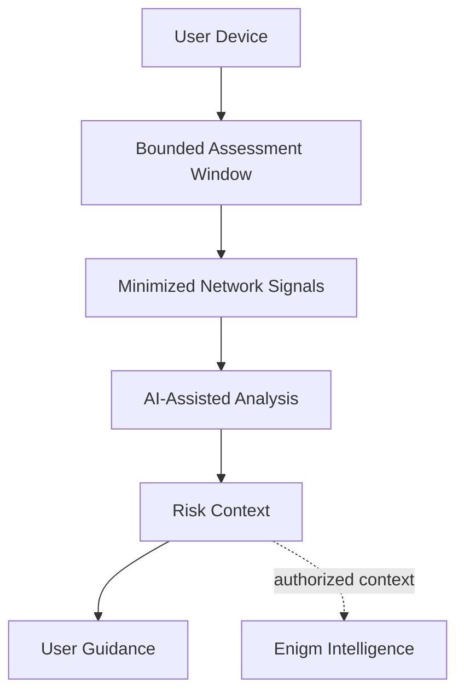

Active Defense is an Enigm App security capability designed to help users evaluate mobile spyware, malware, and suspicious network-behavior risk without inspecting protected communications.

It is not a messaging feature, not an administrative bypass, and not an assurance that a device is free from compromise. Active Defense exists to provide privacy-preserving security visibility that supports user decisions, Device Trust evaluation, and defensive response workflows where policy permits.

## Overview

Active Defense analyzes security-relevant network behavior from the user's phone over a bounded assessment period. The objective is to identify indicators that may be consistent with mobile malware, commercial spyware, surveillance tooling, command-and-control behavior, or exfiltration-like activity.

Active Defense is designed as a non-intrusive capability:

- It does not require root access.
- It does not require broad filesystem access.
- It does not decrypt application-layer traffic.
- It does not inspect message plaintext, call content, media, attachments, documents, or user conversations.
- It analyzes minimized technical signals, network-flow behavior, protocol characteristics, and security findings.

Active Defense is part of Enigm App. Enigm OS may provide additional device integrity signals where deployed, but Active Defense remains an App-level security capability.

## Design Objectives

Active Defense is designed to:

- Support mobile malware and spyware risk assessment.
- Identify suspicious network behavior during defined assessment windows.
- Detect indicators consistent with advanced targeted spyware activity without claiming complete detection of any specific family.
- Provide user-facing findings, severity context, and recommendations.
- Reduce uncertainty around Device Trust.
- Preserve content confidentiality during security analysis.
- Support Enigm Intelligence correlation where authorized and policy-permitted.
- Improve privacy by helping users identify device conditions that may expose protected communications.

The objective is risk reduction and security visibility, not absolute compromise determination.

## Non-Intrusive Assessment Model

Active Defense is designed around network-behavior analysis rather than device-content inspection.

The assessment model focuses on:

- Network metadata and flow characteristics.
- Timing, recurrence, and burst behavior.
- Protocol and transport characteristics.
- Name-resolution behavior.
- Certificate and channel-integrity indicators.
- Destination-risk context.
- Covert-channel indicators.
- Multi-signal correlation.

Active Defense should avoid broad filesystem inspection, content decryption, or unnecessary access to application-private data. The preferred model is minimized security-signal analysis that supports malware-risk assessment while preserving user content confidentiality.

## Network Behavior Analysis

Advanced mobile spyware often remains invisible at the user-interface level, but its operational phases can still produce observable network behavior. Active Defense is designed to evaluate those network-behavior patterns without reading encrypted payload content.

Examples of behavior categories include:

- Periodic beaconing or recurring outbound communication patterns.
- Protocol behavior inconsistent with expected device activity.
- Destination or routing patterns that require review.
- Unusual upload/download asymmetry.
- High-entropy encrypted traffic patterns associated with non-standard channels.
- DNS behavior consistent with tunneling, generated domains, or unusual resolution patterns.
- Certificate-chain or transport-fingerprint anomalies.
- Protocol-port mismatch or tunnel-like behavior.
- Burst timing that may be consistent with staged data transfer.

These categories are documented at a high level only. Public documentation does not disclose detection rules, signatures, thresholds, intelligence sources, correlation logic, or operational parameters.

## AI-Assisted Risk Analysis

Active Defense uses AI-assisted analysis to evaluate network-behavior signals and produce security context.

The AI layer is intended to support:

- Multi-signal correlation.
- Pattern recognition across network-behavior categories.
- Confidence-based findings.
- Severity classification.
- User-readable recommendations.
- Escalation context for Enigm Intelligence where authorized.

AI-assisted analysis does not independently determine platform truth. Findings should be treated as security context that supports user review, Device Trust decisions, and security investigation workflows.

## Threat Analysis Model

Active Defense evaluates categories of security behavior rather than exposing internal detection logic.

Analysis may consider:

- Network behavior associated with suspicious communication patterns.
- Destination and protocol characteristics.
- Secure name-resolution behavior.
- Transport fingerprinting anomalies.
- Certificate and channel-integrity indicators.
- Repeated or unusual connection behavior.
- Timing, volume, and burst characteristics.
- Encrypted traffic metadata where inspection is not required to read payload content.
- Potential covert-channel indicators.
- Device posture and integrity signals where available.
- Security findings produced by platform protections.
- Correlation between multiple independent security indicators.

Active Defense should treat individual findings as security context. A single observation may be informational, while related observations across multiple categories may increase confidence that user review is appropriate.

## Malware And Spyware Risk

Active Defense is intended to help identify risk patterns associated with mobile malware, spyware, stalkerware, commercial surveillance tooling, and advanced targeted spyware.

Examples of risk categories include:

- Suspicious outbound communication behavior.
- Unusual network timing or connection recurrence.
- Protocol behavior inconsistent with expected device activity.
- Potential command-and-control communication patterns.
- Potential exfiltration-like traffic behavior.
- Potential post-compromise callback behavior after physical access or device exposure.
- Device posture degradation that may affect trust decisions.

Active Defense can help identify behavior consistent with advanced spyware classes. It must not be interpreted as an assurance that every spyware family, implant, exploit chain, or targeted surveillance operation will be detected.

## Assessment Workflows

Active Defense supports security assessments initiated by the user or triggered by policy-supported security workflows.

Conceptual assessment modes include:

- **On-demand assessment**: initiated by the user before or after a security-sensitive activity.
- **Startup assessment**: performed around device startup when early network behavior provides useful security context.
- **High-risk review assessment**: used after the user suspects device seizure, tampering, exposure, or unusual behavior.

Assessment workflows should be designed to:

- Keep the user informed when analysis is active.
- Avoid unnecessary access to private content.
- Produce understandable findings.
- Separate informational observations from higher-risk findings.
- Recommend next steps without making unsupported conclusions.

Assessment duration, trigger policy, and report handling are deployment and product configuration concerns. Public documentation does not publish timing values, capture parameters, analysis thresholds, or operational workflow details.

## Privacy Model

Active Defense is designed to support privacy rather than expand surveillance of the user.

The privacy model is based on:

- Data minimization.
- Purpose limitation.
- Content confidentiality.
- Privacy-preserving device handles.
- Reduced identity exposure.
- Security context instead of broad user-content collection.

Active Defense is not intended to inspect:

- Message plaintext.
- Call content.
- Media content.
- Attachments.
- Documents.
- User conversations.

Security analysis should prefer minimized technical signals and aggregated findings where possible. Where raw security observations are required for analysis, retention should be minimized and governed by the Enigm data-retention model.

## Relationship With Enigm App

Enigm App remains the primary user-facing product. Active Defense extends the app with network-behavior security visibility that can help users make privacy and Device Trust decisions.

Active Defense supports:

- Device security review.
- User guidance after suspicious findings.
- Account and device lifecycle decisions.
- Multi-Device Trust evaluation.
- Managed-device reporting where enabled.

Active Defense does not grant administrative systems access to protected message content or private key material.

## Relationship With Enigm OS

When Enigm OS is deployed, Active Defense may use additional local trust signals, such as Trust Security Center state, network policy state, managed-device state, privacy mode state, and device integrity posture.

Enigm OS is an additional hardening layer. It does not replace Active Defense, Enigm App end-to-end encryption, or user trust decisions.

## Relationship With Enigm Intelligence

Active Defense findings may contribute security context to Enigm Intelligence where authorized and policy-permitted.

Enigm Intelligence may correlate Active Defense findings with other security signals to support investigation, risk assessment, defensive response, and operator visibility. Correlation must preserve access controls, data minimization, and content confidentiality.

Active Defense is not the full Threat Intelligence Platform. Enigm Intelligence provides broader correlation and risk evaluation across the ecosystem.

## Findings And User Guidance

Active Defense findings should provide clear security guidance without overstating certainty.

Findings may include:

- Informational network observations.
- Suspicious behavior requiring review.
- Higher-risk multi-signal correlation.
- Device Trust impact.
- Recommended user action.
- Recommended security review.

Guidance may include:

- Review recommended.
- Device Trust may be reduced.
- Network behavior requires attention.
- Update or configuration review recommended.
- Consider revoking or replacing a device if compromise is suspected.
- Contact security support through designated channels where appropriate.

Findings should distinguish between confirmed policy failures, suspicious indicators, and informational observations.

## Security Considerations

- Active Defense should operate with least access necessary for the assessment.
- Findings should be protected as security-sensitive information.
- Device-originated signals may be less reliable if the device is already compromised.
- Multi-signal correlation can improve confidence but does not eliminate uncertainty.
- Managed-device reporting must remain separate from protected communication content.
- Security analysis should not weaken end-to-end encryption or key protection.

## Privacy Considerations

Active Defense supports the Enigm privacy-first model by helping identify device conditions that may expose private communications.

Privacy considerations include:

- Avoid collecting unnecessary identity metadata.
- Avoid broad retention of raw security observations where security context is sufficient.
- Avoid content inspection for message, call, media, attachment, and conversation data.
- Use privacy-preserving identifiers for account-device correlation where possible.
- Limit access to findings according to authorization and policy.

## Trust Boundaries

Primary trust boundaries include:

- User to Enigm App.
- Enigm App to Active Defense.
- Active Defense to minimized network and security signals.
- Active Defense to optional Enigm OS trust signals.
- Active Defense to Enigm Intelligence where authorized.
- Active Defense findings to Enigm Command review workflows.

Administrative visibility into Active Defense findings does not imply visibility into message plaintext, call content, media, attachments, or private key material.

## Security Limitations

Active Defense improves device-risk visibility, but it does not eliminate mobile security risk.

Important limitations:

- It does not ensure detection of every malware or spyware family.
- Advanced compromise may reduce the reliability of device-originated signals.
- Dormant implants or low-signal behavior may not produce enough observable network activity during an assessment window.
- False positives and false negatives are possible.
- Network-level analysis can identify suspicious behavior but may not prove compromise, attribution, or intent.
- Encrypted payloads remain opaque by design.
- Social engineering, physical coercion, and malicious trusted users remain outside the scope of malware-risk assessment.
- A clean assessment is not an assurance that a device is uncompromised.

Active Defense should be treated as a security and privacy support layer within Enigm App, not as a replacement for device hardening, secure software updates, end-to-end encryption, or user trust decisions.

## Threat Model References

Relevant threat-model areas include endpoint compromise, spyware risk, device lifecycle abuse, malware-assisted account takeover, network observation, metadata exposure, malicious trusted users, loss of device integrity, and reduced reliability of device-originated security signals.
