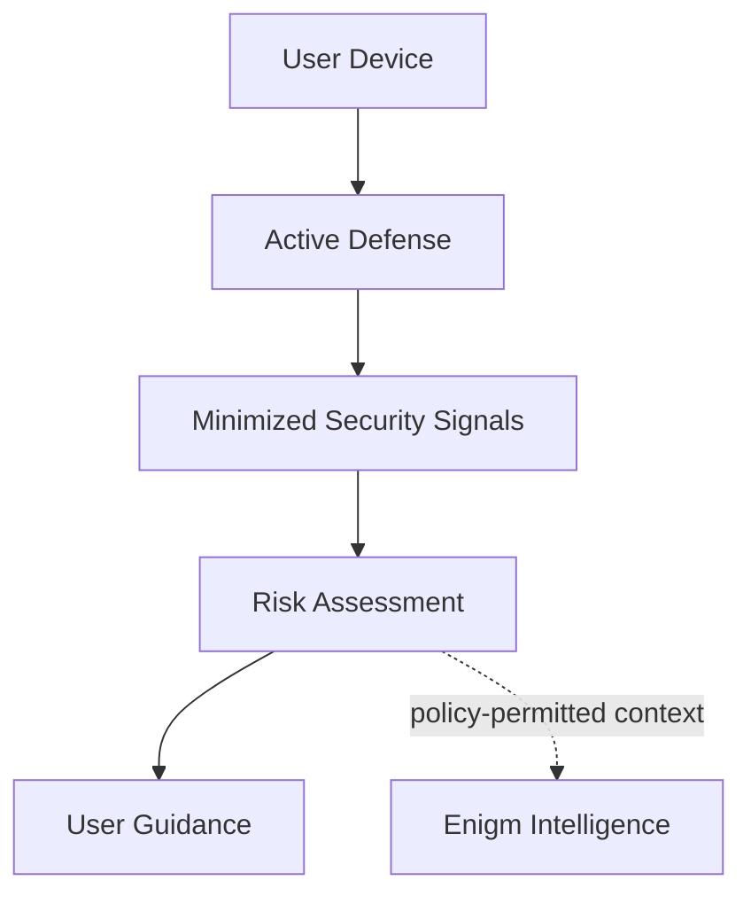

Active Defense is an Enigm App security capability designed to help users evaluate mobile malware, spyware, and suspicious device activity risk.

It is not a messaging feature, not an administrative bypass, and not a guarantee that a device is free from compromise. Active Defense exists to provide privacy-preserving security visibility that supports user decisions, device trust evaluation, and defensive response workflows where policy permits.

## Overview

Active Defense analyzes security-relevant device and network behavior to identify indicators that may suggest malware, spyware, surveillance tooling, or suspicious device activity.

The capability is designed around the Enigm privacy model:

- Security analysis should use minimized security signals.
- Message content, call content, media, attachments, and user conversations are not intended to be inspected.
- Security findings should provide actionable context without exposing unnecessary identity metadata.
- Results should support user control, device trust decisions, and privacy protection.

Active Defense is part of Enigm App. Enigm OS may provide additional device integrity signals where deployed, but Active Defense must remain useful as an App-level security capability.

## Design Objectives

Active Defense is designed to:

- Identify suspicious mobile security behavior.
- Support malware and spyware risk assessment.
- Provide user-facing security findings and recommendations.
- Reduce uncertainty around device trust.
- Preserve content confidentiality during security analysis.
- Support Enigm Intelligence correlation where authorized and policy-permitted.
- Improve privacy by helping users identify device conditions that may expose protected communications.

The objective is risk reduction and security visibility, not absolute compromise determination.

## Threat Analysis Model

Active Defense evaluates categories of security behavior rather than exposing internal detection logic.

Analysis may consider:

- Network behavior associated with suspicious communication patterns.
- Destination and protocol characteristics.
- Secure name-resolution behavior.
- Transport fingerprinting anomalies.
- Certificate and channel-integrity indicators.
- Repeated or unusual connection behavior.
- Timing, volume, and burst characteristics.
- Encrypted traffic metadata where inspection is not required to read payload content.
- Potential covert-channel indicators.
- Device posture and integrity signals where available.
- Security findings produced by platform protections.
- Correlation between multiple independent security indicators.

Active Defense should treat individual findings as security context. A single observation may be informational, while related observations across multiple categories may increase confidence that user review is appropriate.

## Malware And Spyware Risk

Active Defense is intended to help identify risk patterns associated with mobile malware, spyware, stalkerware, and surveillance-oriented tooling.

Examples of risk categories include:

- Suspicious outbound communication behavior.
- Unusual network timing or connection recurrence.
- Protocol behavior inconsistent with expected device activity.
- Potential command-and-control communication patterns.
- Potential exfiltration-like traffic behavior.
- Device posture degradation that may affect trust decisions.

These categories are documented at a high level only. Public documentation does not disclose detection rules, signatures, thresholds, intelligence sources, or correlation logic.

## Scan And Assessment Workflows

Active Defense may support user-initiated and policy-supported assessments.

Conceptual assessment modes may include:

- **On-demand assessment**: initiated by the user before or after a security-sensitive activity.
- **Startup assessment**: performed around device startup where supported, when early network behavior may provide useful security context.
- **High-risk review assessment**: used after a user suspects device seizure, tampering, exposure, or unusual behavior.

Assessment workflows should be designed to:

- Keep the user informed when analysis is active.
- Avoid unnecessary access to private content.
- Produce understandable findings.
- Separate informational observations from higher-risk findings.
- Recommend next steps without making unsupported conclusions.

Where supported, assessment results may contribute to device trust visibility, Enigm Command review workflows, or Enigm Intelligence security context.

Active Defense should avoid broad filesystem inspection, content decryption, or unnecessary access to application-private data. The preferred model is security-signal analysis that supports malware-risk assessment while preserving user content confidentiality.

## Privacy Model

Active Defense is designed to support privacy rather than expand surveillance of the user.

The privacy model is based on:

- Data minimization.
- Purpose limitation.
- Content confidentiality.
- Privacy-preserving device handles.
- Reduced identity exposure.
- Security context instead of broad user-content collection.

Active Defense is not intended to inspect:

- Message plaintext.
- Call content.
- Media content.
- Attachments.
- Documents.
- User conversations.

Security analysis should prefer minimized technical signals and aggregated findings where possible.

## Relationship With Enigm App

Enigm App remains the primary user-facing product. Active Defense extends the app with device-risk visibility that can help users make security decisions.

Active Defense may support:

- Device security review.
- User guidance after suspicious findings.
- Account and device lifecycle decisions.
- Multi-device trust evaluation.
- Managed-device reporting where enabled.

Active Defense does not grant administrative systems access to protected message content or private key material.

## Relationship With Enigm OS

When Enigm OS is deployed, Active Defense may benefit from additional local trust signals, such as Trust Security Center state, network policy state, managed-device state, privacy mode state, and device integrity posture.

Enigm OS is an additional hardening layer. It does not replace Active Defense, Enigm App end-to-end encryption, or user trust decisions.

## Relationship With Enigm Intelligence

Active Defense findings may contribute security context to Enigm Intelligence where authorized and policy-permitted.

Enigm Intelligence may correlate Active Defense findings with other security signals to support investigation, risk assessment, defensive response, and operator visibility. Correlation must preserve access controls, data minimization, and content confidentiality.

Active Defense is not the full threat intelligence platform. Enigm Intelligence provides broader correlation and risk evaluation across the ecosystem.

## User Guidance

Active Defense findings should provide clear security guidance without overstating certainty.

Guidance may include:

- Review recommended.
- Device trust may be reduced.
- Network behavior requires attention.
- Update or configuration review recommended.
- Consider revoking or replacing a device if compromise is suspected.
- Contact security support through designated channels where appropriate.

Findings should distinguish between confirmed policy failures, suspicious indicators, and informational observations.

## Security Considerations

- Active Defense should operate with least access necessary for the assessment.
- Findings should be protected as security-sensitive information.
- Device-originated signals may be less reliable if the device is already compromised.
- Multi-signal correlation can improve confidence but does not eliminate uncertainty.
- Managed-device reporting must remain separate from protected communication content.
- Security analysis should not weaken end-to-end encryption or key protection.

## Privacy Considerations

Active Defense supports the Enigm privacy-first model by helping identify device conditions that may expose private communications.

Privacy considerations include:

- Avoid collecting unnecessary identity metadata.
- Avoid broad retention of raw security observations where security context is sufficient.
- Avoid content inspection for message, call, media, attachment, and conversation data.
- Use privacy-preserving identifiers for account-device correlation where possible.
- Limit access to findings according to authorization and policy.

## Trust Boundaries

Primary trust boundaries include:

- User to Enigm App.
- Enigm App to Active Defense.
- Active Defense to minimized security signals.
- Active Defense to optional Enigm OS trust signals.
- Active Defense to Enigm Intelligence where authorized.
- Active Defense findings to Enigm Command review workflows where applicable.

Administrative visibility into Active Defense findings does not imply visibility into message plaintext, call content, media, attachments, or private key material.

## Security Limitations

Active Defense improves device-risk visibility, but it does not eliminate mobile security risk.

Important limitations:

- It may not detect every malware or spyware family.
- Advanced compromise may reduce the reliability of device-originated signals.
- False positives and false negatives are possible.
- Network-level analysis can identify suspicious behavior but may not prove intent.
- Encrypted payloads may remain opaque by design.
- Social engineering, physical coercion, and malicious trusted users remain outside the scope of malware-risk assessment.
- A clean assessment is not a guarantee that a device is uncompromised.

Active Defense should be treated as a security and privacy support layer within Enigm App, not as a replacement for device hardening, secure software updates, end-to-end encryption, or user trust decisions.

## Threat Model References

Relevant threat-model areas include endpoint compromise, spyware risk, device lifecycle abuse, malware-assisted account takeover, network observation, metadata exposure, malicious trusted users, loss of device integrity, and reduced reliability of device-originated security signals.
