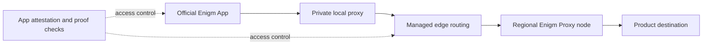
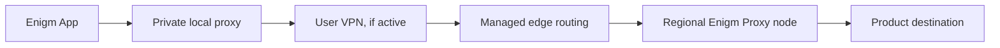

Enigm Proxy is the mandatory app-scoped privacy layer for Enigm App product traffic. It is integrated into the app, starts with the app, and prevents Enigm App product traffic from leaving directly to the Internet.

Enigm Proxy is not a device-wide VPN. It does not modify traffic from other applications or from the operating system, and it can operate while the user keeps a separate VPN active.

## Service Model

Enigm Proxy is scoped to Enigm App traffic controlled by the product. The app obtains temporary access after validating that it is an official, supported installation. On iOS, this includes platform app attestation for supported devices. The resulting credentials are short-lived and renewed automatically while the app remains eligible.

Each protected connection uses fresh cryptographic proof material to reduce replay and credential-reuse risk. The app creates a private local proxy inside its own process, connects through an encrypted channel to Enigm's proxy service, validates the connected node, and only then enables product traffic.

If Enigm Proxy cannot be established or validated, Enigm App does not silently fall back to direct product traffic.

## Network Coverage

Enigm Proxy applies to Enigm App product traffic controlled by the app. It does not claim to protect every device connection, every operating-system request, or traffic from unrelated apps.

Some account, enrollment, challenge, and renewal requests can connect directly to the control plane because they are required to establish or renew proxy eligibility. These requests are separate from user browsing destinations and protected product content.

## Availability

Enigm Proxy infrastructure is deployed and operational for the initial iOS integration. Android should not be described as generally available until the Android app integration has been implemented and released. The architecture is prepared for Android support, subject to product implementation and launch.

Current public regional coverage:

| Region | Public availability scope |
| --- | --- |
| Germany | Enigm Proxy regional coverage |
| Singapore | Enigm Proxy regional coverage |
| United Kingdom | Enigm Proxy regional coverage |
| United States | Enigm Proxy regional coverage |

Regional selection is handled dynamically based on health, latency, and availability. Temporary affinity can reduce unnecessary node changes while an access credential remains active. Enigm App can show the connected node, country, or region when that information is exposed in the product interface.

## Privacy Boundary

Enigm Proxy is designed to reduce direct network exposure for Enigm App product traffic. Proxy nodes should not keep access logs of user destinations or user traffic content.

Enigm Proxy does not forward headers that expose the original client IP address to the proxy backend. DNS handling for proxy infrastructure is configured to avoid user-query logging. Local system logs are limited, volatile, and not intended to contain user traffic content.

Availability monitoring uses synthetic checks and aggregate health metrics. Security monitoring and Enigm Intelligence can protect proxy infrastructure and detect attacks, but they should not be described as systems that inspect user message content, call content, media, attachments, or private conversations.

Enigm Proxy does not hide identifiers that a user voluntarily provides to another service, such as an account login, form entry, payment detail, or identifier included in a request. Managed edge routing providers can process inbound connection metadata according to their own roles and policies.

## Security Boundary

Only official, verified Enigm App installations should be eligible to obtain Enigm Proxy access. Supported iOS builds use platform app attestation, short-lived credentials, and proof-bound requests to reduce unauthorized access, token replay, and credential reuse.

Backend services are not documented as public direct-entry points. Public documentation intentionally avoids IP addresses, non-public network identifiers, administrative ports, pool identifiers, credential identifiers, private paths, certificates, tokens, keys, and deployment procedures.

Enigm Proxy uses normal TLS validation. Public documentation should not instruct users to disable certificate validation, accept insecure certificates, or bypass app-integrated proxy checks.

## Failure Behavior

If a regional node becomes unhealthy, routing should stop sending new eligible connections to that node. Enigm App can renew credentials and reconnect automatically.

If Enigm App cannot restore a validated proxy connection, it should block new product requests that require Enigm Proxy rather than degrade silently to direct traffic.

## VPN Compatibility

Enigm Proxy can coexist with a user-selected VPN:

The user's VPN can still protect device transport up to the VPN provider. Enigm Proxy then provides an Enigm-controlled exit path for Enigm App product traffic. VPN providers, private DNS settings, captive portals, and local network policies can affect behavior, so compatibility should not be described as identical across all networks.

## Enigm Proxy, VPN Service, And Tor

Enigm Proxy is an app-scoped mandatory proxy layer for Enigm App product traffic.

VPN Service is an optional network privacy and transport-protection component associated with Enigm App policy. It can affect a broader network path depending on product configuration and deployment policy.

Tor Gateway is a separate Enigm Command-governed access path for selected public web surfaces. It is not the Enigm App proxy layer and should not be described as a general-purpose infrastructure or product-traffic path.

## Frequently Asked Questions

### Is Enigm Proxy a VPN?

No. Enigm Proxy is scoped to Enigm App product traffic. It is not a device-wide VPN and does not route traffic from other apps.

### Does Enigm Proxy protect other applications?

No. It applies to Enigm App product traffic controlled by the app.

### Can I use Enigm Proxy with a VPN?

Yes. Enigm Proxy can run while a user-selected VPN is active. Network policies, private DNS settings, or provider restrictions can affect compatibility.

### What happens if Enigm Proxy is unavailable?

Enigm App should reconnect automatically where possible. If it cannot establish and validate a safe proxy path, product requests that require Enigm Proxy should remain blocked rather than falling back to direct traffic.

### How do I know which region I am connected to?

When exposed in the product interface, Enigm App can show the connected node, country, or region.

### Does Enigm log the pages or destinations I use?

Enigm Proxy nodes should not keep access logs of user destinations or traffic content. Limited operational metadata can still be required for routing, authentication, availability, abuse prevention, and security.

### Can the edge routing provider see my IP?

Managed edge routing providers can process inbound connection metadata according to their own roles and policies. Enigm's public documentation should not describe this as absolute anonymity.

### Does Enigm Proxy provide an anonymity guarantee?

No. Enigm Proxy reduces direct network exposure for Enigm App product traffic, but it does not provide absolute identity protection, untraceability, or complete resistance to traffic analysis.

### Is Enigm Proxy available on Android?

Android should not be described as generally available until the Android app integration has been implemented and released. The architecture is prepared for Android support.

### Can I disable Enigm Proxy?

Enigm Proxy is part of the Enigm App security and privacy model. Enigm App product traffic should not have a direct or insecure bypass mode.

## Related Documentation

- [App Network Privacy](/app/network-privacy)
- [VPN Service](/app/vpn-service)
- [Privacy](/security/privacy)
- [Platform Limitations](/legal/limitations)
