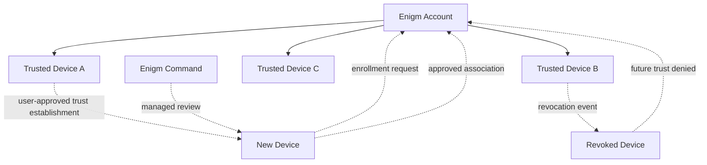

Multi-device support in Enigm App is a trust and security problem. An Enigm account may be associated with multiple trusted devices, but each device must establish trust before receiving access to protected account resources.

This document is intended for security auditors, enterprise customers, technical partners, and security engineers. It describes the public multi-Device Trust architecture without exposing protocol messages, non-public routing identifiers, infrastructure names, storage paths, operational topology, sensitive values, or implementation-sensitive details.

## Overview

An Enigm account is separate from any single physical device. A device becomes eligible for protected operations only after explicit enrollment and trust establishment.

Multi-device architecture must preserve:

- Account security.
- Device-specific trust.
- Message confidentiality.
- Device revocation behavior.
- Device replacement behavior.
- Administrative visibility without plaintext access to messages.

Enigm OS may contribute additional integrity signals where deployed, but it is not required for the multi-device architecture.

## Device Trust Model

Device Trust and Account Trust are separate concepts.

Account Trust evaluates account authentication, session lifecycle, account policy, and recovery state. Device Trust evaluates whether a specific device is enrolled, trusted, revoked, replaced, or restricted.

Device Trust considers:

- Device enrollment state.
- Device association state.
- Protected device state.
- Device revocation state.
- Device replacement state.
- Local unlock state where relevant.
- Optional managed-device status signals.
- Optional Enigm OS integrity signals where deployed.

A valid account session does not automatically establish trust for a newly introduced device.

## Device Enrollment

Device enrollment is explicit. A new device must establish trust before receiving access to protected account resources.

Enrollment should verify that the new device is authorized to join the account context. Existing trusted devices participate in enrollment workflows when user-approved trust establishment is used. Managed deployments may also use Enigm Command policy to review or approve enrollment.

Enrollment is security-sensitive because it can affect:

- Secure messaging access.
- Secure call access.
- Multi-device synchronization.
- Device-associated protected key material.
- Future trust decisions.
- Revocation and replacement workflows.

## Device Association

Device association links an Enigm account to a specific trusted device context.

Device association should use Privacy-Preserving Device Handles. These identifiers support lifecycle review, policy evaluation, and audit correlation without exposing unnecessary public identity metadata.

Device association must not be treated as a passive metadata update. It is an authorization-sensitive event that changes which devices may participate in protected workflows.

## Trusted Device Lifecycle

Trusted devices move through lifecycle states.

Common lifecycle states include:

- **Pending enrollment**: a device has started an enrollment workflow but is not yet trusted.
- **Trusted**: a device is eligible for supported protected operations.
- **Restricted**: a device has reduced access due to policy, posture, or review state.
- **Revoked**: a device is no longer trusted for future protected operations.
- **Replaced**: a device has been superseded by another device.
- **Retired**: a device has been removed from active lifecycle management.

Lifecycle events should be visible through Enigm Command in managed deployments.

## Device Revocation

Device revocation must immediately affect future trust decisions.

A revoked device must not continue receiving newly protected content. Revocation should affect:

- Future secure messaging eligibility.
- Future secure call eligibility.
- Future multi-device synchronization.
- Future access to protected account resources.
- Future use of device-associated protected key state.
- Enigm Command lifecycle status.

Revocation does not ensure removal of content already received and decrypted on a device before revocation. This is a security limitation of any model where an endpoint previously had authorized access.

## Device Replacement

Device replacement must be supported without weakening the trust model.

Replacement should be treated as a new trust event. A replacement device should not silently inherit full trust from the previous device without an explicit trust workflow.

Replacement workflows should account for:

- Account authentication.
- Prior device state.
- New device enrollment.
- Revocation or retirement of the previous device.
- Message synchronization policy.
- Protected key lifecycle.
- Enigm Command review where managed administration applies.

Recovery-assisted replacement must not automatically grant plaintext access to historical messages.

## Multi-Device Security Considerations

Multi-device operation must preserve message confidentiality.

Security considerations include:

- Device enrollment must be explicit.
- New devices must establish trust before receiving account resources.
- Device association is security-sensitive.
- Existing trusted devices may participate in enrollment when user-approved trust establishment is used.
- Device Trust and Account Trust must remain separate.
- Revoked devices must not receive newly protected content.
- Multi-device workflows must not silently copy private key material without an explicit trust workflow.
- Administrative functions must not provide plaintext access to messages.
- Optional managed-device capabilities may provide additional device status signals.
- Optional Enigm OS integrity signals may strengthen trust decisions where deployed.

## Enigm Command Integration

Enigm Command provides lifecycle visibility and management for devices in managed deployments.

Enigm Command may support:

- Device inventory review.
- Enrollment review.
- Revocation actions.
- Replacement tracking.
- Managed-device status review.
- Trust state reporting.
- Audit review.

Enigm Command must not provide plaintext access to messages, private key material, secure call content, or protected attachments.

## Architecture Diagram

## Security Limitations

Multi-Device Trust reduces risk but does not remove every endpoint risk.

Important limitations:

- A compromised trusted device may expose content after authorized local decryption.
- Revocation affects future trust decisions but cannot ensure removal of content already accessed by the revoked device.
- User disclosure can move content outside Enigm controls.
- External recording or capture can occur outside the app security boundary.
- Incorrect administrative policy can affect device lifecycle behavior.
- Enigm OS can provide additional integrity signals, but multi-Device Trust must remain valid without requiring Enigm OS.

## Threat Model References

Relevant threat-model areas include account and app compromise, device lifecycle abuse, secure messaging compromise attempts, secure call compromise attempts, Enigm Command abuse, Enigm OS policy bypass where deployed, and loss of audit visibility.
