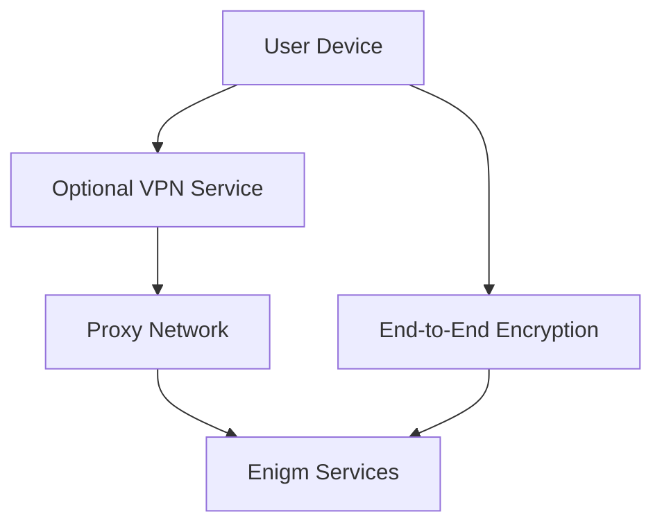

Enigm App can use network privacy layers that are separate from end-to-end encryption. VPN Service and Proxy Network controls reduce network exposure, separate traffic paths, and support metadata-reduction objectives without replacing Device Trust or protected key material.

## Overview

Network privacy controls address transport and observation risks. They do not decrypt or replace Enigm secure messaging, secure calls, or application-layer cryptography.

## VPN Service

VPN Service is optional and can provide additional transport privacy depending on user requirements and deployment policy. It can reduce network visibility from local networks, public Wi-Fi, and some intermediate observers.

VPN protection and end-to-end encryption solve different problems. The VPN does not replace message encryption, Device Trust, user trust decisions, or endpoint security.

## Proxy Network

The Proxy Network provides a traffic-separation and privacy boundary between client devices and platform services. It contributes to metadata reduction, reduces direct exposure between clients and backend services, and supports platform routing policy.

Communication confidentiality continues to depend on application-layer encryption, protected key material, trusted device association, and verification workflows.

## Traffic Analysis Considerations

The platform can use traffic separation, background network activity, and traffic-shaping techniques designed to reduce confidence in simple timing-correlation and communication-pattern analysis.

These controls can make simple inference less reliable, but they do not guarantee anonymity or eliminate advanced traffic analysis.

## What These Controls Help Mitigate

Network privacy controls can reduce exposure from untrusted local networks, public Wi-Fi, direct service exposure, simple timing-correlation, and some metadata observation scenarios.

## What These Controls Do Not Mitigate

Network privacy controls do not protect against compromised endpoint devices, malware with sufficient privileges, social engineering, user disclosure, message disclosure by authorized participants, or content captured after authorized local decryption.

See [Platform Limitations](/legal/limitations).
