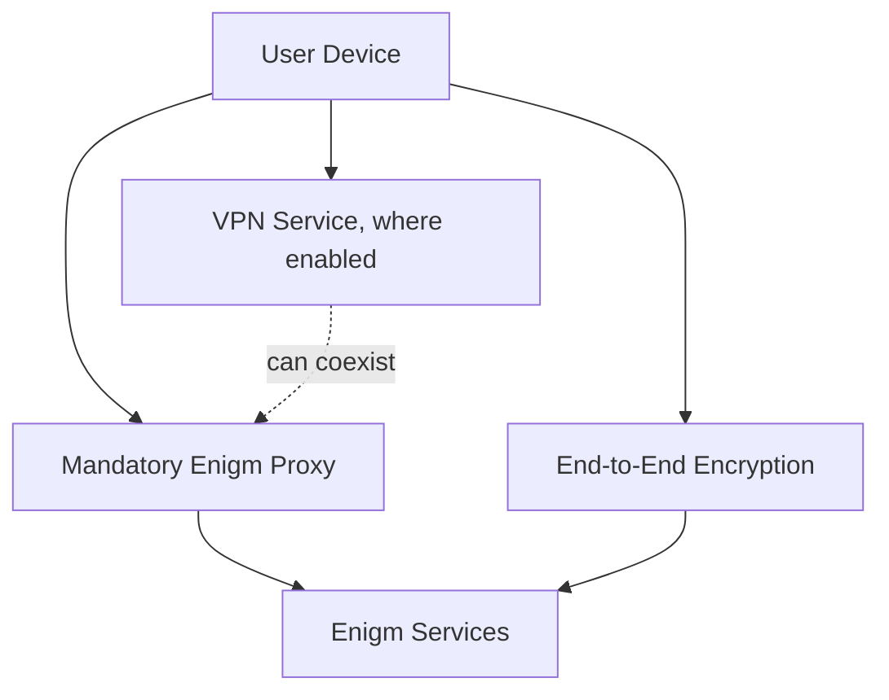

Enigm App uses network privacy layers that are separate from end-to-end encryption. Enigm Proxy, VPN Service, randomized network activity, and traffic-separation controls reduce network exposure and support metadata-reduction objectives without replacing Device Trust or protected key material.

## Overview

Network privacy controls address transport and observation risks. They do not decrypt or replace Enigm secure messaging, secure calls, or application-layer cryptography.

```mermaid
flowchart TD
  Device["User Device"]
  E2EE["End-to-End Encryption"]
  Proxy["Mandatory Enigm Proxy"]
  VPN["VPN Service, where enabled"]
  Services["Enigm Services"]

  Device --> E2EE
  Device --> Proxy
  Device --> VPN
  VPN -. can coexist .-> Proxy
  Proxy --> Services
  E2EE --> Services
```

## Enigm Proxy

Enigm Proxy is the mandatory app-scoped privacy layer for Enigm App product traffic. It starts with the app, routes product traffic through a private local proxy and Enigm-operated proxy path, and prevents product traffic from falling back silently to direct Internet access.

Enigm Proxy is not a device-wide VPN and does not protect traffic from other apps or from the operating system. It can coexist with a user-selected VPN.

See [Enigm Proxy](/app/enigm-proxy).

## VPN Service

VPN Service is optional and can provide additional transport privacy depending on user requirements and deployment policy. It can reduce network visibility from local networks, public Wi-Fi, and some intermediate observers.

VPN protection and end-to-end encryption solve different problems. The VPN does not replace message encryption, Device Trust, user trust decisions, or endpoint security.

See [VPN Service](/app/vpn-service).

## Traffic Analysis Considerations

Enigm App uses traffic separation, background network activity, randomized network activity, and traffic-shaping techniques designed to reduce confidence in simple timing-correlation and communication-pattern analysis.

These controls can make simple inference less reliable, but they do not provide absolute identity protection or eliminate advanced traffic analysis.

## Randomized Network Activity

Enigm App network privacy controls generate additional network activity that is not directly tied to active user conversations. This traffic is designed to make simple observation of two devices less useful when an observer attempts to infer whether two users are communicating.

The objective is to reduce confidence in analysis based on:

- Packet timing.
- Message timing.
- Traffic bursts.
- Connection frequency.
- Similarity between two device traffic patterns.
- Conversation start and stop timing.

Because this control is part of the Enigm App network privacy model, network activity from one device should not be interpreted as proof that a specific conversation is taking place. Likewise, matching or non-matching traffic patterns between two devices should not be treated as reliable evidence of a communication relationship.

This is a privacy layer, not a confidentiality layer. Communication confidentiality continues to rely on end-to-end encryption, protected key material, trusted device association, and verification workflows.

Cadence, generation logic, traffic volume, tuning values, scheduling behavior, and operational parameters remain controlled implementation details. The public model documents the privacy purpose and trust boundary of randomized network activity.

## Relationship With Metadata Reduction

Randomized network activity works together with metadata minimization, Enigm Proxy traffic separation, VPN Service transport protection where enabled, Privacy-Preserving Device Handles, and retention limits.

These controls are designed to reduce exposure and lower confidence in basic communication-pattern inference. They should not be interpreted as an absolute identity protection, untraceability, or complete traffic-analysis resistance claim.

## What These Controls Help Mitigate

Network privacy controls can reduce exposure from untrusted local networks, public Wi-Fi, direct service exposure, simple timing-correlation, conversation-pattern inference, and some metadata observation scenarios.

## What These Controls Do Not Mitigate

Network privacy controls do not protect against compromised endpoint devices, malware with sufficient privileges, social engineering, user disclosure, message disclosure by authorized participants, or content captured after authorized local decryption.

See [Platform Limitations](/legal/limitations).
