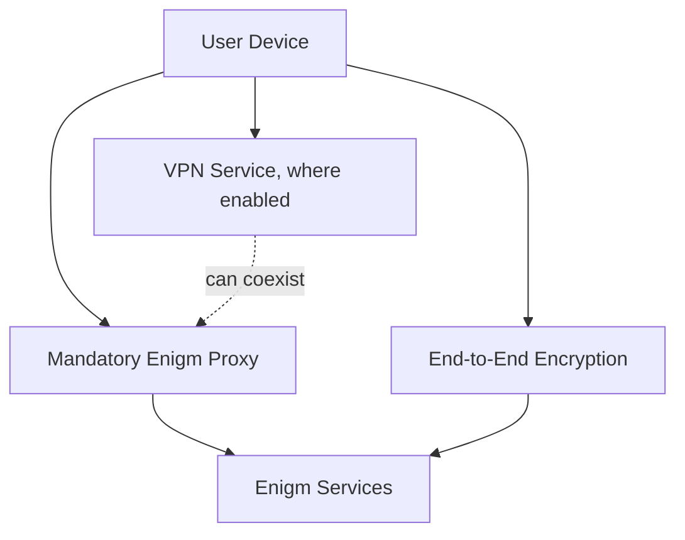
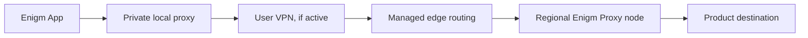

Enigm App uses network privacy layers that are separate from end-to-end encryption. Enigm Proxy, VPN Service, randomized network activity, and traffic-separation controls reduce network exposure and support metadata-reduction objectives without replacing Device Trust or protected key material.

## Overview

Network privacy controls address transport and observation risks. They do not decrypt or replace Enigm secure messaging, secure calls, or application-layer cryptography.

```mermaid
flowchart TD
  Device["User Device"]
  E2EE["End-to-End Encryption"]
  Proxy["Mandatory Enigm Proxy"]
  VPN["VPN Service, where enabled"]
  Services["Enigm Services"]

  Device --> E2EE
  Device --> Proxy
  Device --> VPN
  VPN -. can coexist .-> Proxy
  Proxy --> Services
  E2EE --> Services
```

## Enigm Proxy

Enigm Proxy is the mandatory app-scoped privacy layer for Enigm App product traffic. It starts with the app, routes product traffic through a private local proxy and Enigm-operated proxy path, and prevents product traffic from falling back silently to direct Internet access.

Enigm Proxy is not a device-wide VPN and does not protect traffic from other apps or from the operating system. It can coexist with a user-selected VPN.

Enigm App obtains temporary proxy access after validating that it is an official, supported installation. On iOS, this includes platform app attestation for supported devices. Access material is short-lived and renewed automatically while the app remains eligible. Each protected connection uses fresh cryptographic proof material to reduce replay and credential-reuse risk.

The app creates a private local proxy inside its own process, connects through an encrypted channel to Enigm's proxy service, validates the connected node, and only then enables product traffic.

Some account, enrollment, challenge, and renewal requests can connect directly to the control plane because they are required to establish or renew proxy eligibility. These requests are separate from user browsing destinations and protected product content.

Enigm Proxy infrastructure is deployed and operational for the initial iOS integration. Android should not be described as generally available until the Android app integration has been implemented and released. The architecture is prepared for Android support, subject to product implementation and launch.

Current Enigm Proxy public regional coverage:

| Region | Public availability scope |
| --- | --- |
| Germany | Enigm Proxy regional coverage |
| Singapore | Enigm Proxy regional coverage |
| United Kingdom | Enigm Proxy regional coverage |
| United States | Enigm Proxy regional coverage |

Regional selection is handled dynamically based on health, latency, and availability. Temporary affinity can reduce unnecessary node changes while access material remains active. Enigm App can show the connected node, country, or region when that information is exposed in the product interface.

## VPN Service

VPN Service is optional and can provide additional transport privacy depending on user requirements and deployment policy. It can reduce network visibility from local networks, public Wi-Fi, and some intermediate observers.

VPN protection and end-to-end encryption solve different problems. The VPN does not replace message encryption, Device Trust, user trust decisions, or endpoint security.

VPN Service is authorized through Enigm workflows and associated with Enigm App policy. The app and supporting control plane determine whether VPN Service can be used, which locations are eligible, and whether a network path remains healthy enough for assignment.

Current VPN Service public location coverage:

| Location | Public status scope |
| --- | --- |
| Amsterdam | Location availability |
| Brazil | Location availability |
| Germany | Location availability |
| Singapore | Location availability |
| Spain | Location availability |
| United Kingdom | Location availability |
| United States | Location availability |

Public status should stay limited to location and availability. It should not publish IP addresses, internal route state, backend telemetry, node identifiers, operational dashboards, provider-specific details, deployable endpoints, private API contracts, administrative ports, non-public network identifiers, credentials, keys, routing tables, or operational procedures.

## VPN Compatibility

Enigm Proxy can coexist with a user-selected VPN:

```mermaid
flowchart LR
  App["Enigm App"] --> Local["Private local proxy"]
  Local --> VPN["User VPN, if active"]
  VPN --> Edge["Managed edge routing"]
  Edge --> Proxy["Regional Enigm Proxy node"]
  Proxy --> Destination["Product destination"]
```

The user's VPN can still protect device transport up to the VPN provider. Enigm Proxy then provides an Enigm-controlled exit path for Enigm App product traffic. VPN providers, private DNS settings, captive portals, and local network policies can affect behavior, so compatibility should not be described as identical across all networks.

## Relationship With Tor Gateway

Enigm Proxy is an app-scoped mandatory proxy layer for Enigm App product traffic.

VPN Service is an optional network privacy and transport-protection component associated with Enigm App policy. It can affect a broader network path depending on product configuration and deployment policy.

Tor Gateway is a separate Enigm Command-governed access path for selected public web surfaces. It is not the Enigm App proxy layer and should not be described as a general-purpose infrastructure or product-traffic path.

## Traffic Analysis Considerations

Enigm App uses traffic separation, background network activity, randomized network activity, and traffic-shaping techniques designed to reduce confidence in simple timing-correlation and communication-pattern analysis.

These controls can make simple inference less reliable, but they do not provide absolute identity protection or eliminate advanced traffic analysis.

## Privacy Boundary

Enigm Proxy is designed to reduce direct network exposure for Enigm App product traffic. Proxy nodes should not keep access logs of user destinations or user traffic content.

Enigm Proxy does not forward headers that expose the original client IP address to the proxy backend. DNS handling for proxy infrastructure is configured to avoid user-query logging. Local system logs are limited, volatile, and not intended to contain user traffic content.

VPN Service should not log user traffic payloads, destinations, DNS query content, handshake details, per-peer activity records, or individual browsing activity. Operational logs and health signals should be minimized, aggregated where possible, rotated, protected, and retained only for limited operational purposes. Capacity checks should rely on aggregate pressure signals rather than user identifiers.

Availability monitoring uses synthetic checks and aggregate health metrics. Security monitoring and Enigm Intelligence can protect network privacy infrastructure and detect attacks, but they should not be described as systems that inspect user message content, call content, media, attachments, or private conversations.

Enigm Proxy does not hide identifiers that a user voluntarily provides to another service, such as an account login, form entry, payment detail, or identifier included in a request. Managed edge routing providers can process inbound connection metadata according to their own roles and policies.

## Security Boundary

Only official, verified Enigm App installations should be eligible to obtain Enigm Proxy access. Supported iOS builds use platform app attestation, short-lived credentials, and proof-bound requests to reduce unauthorized access, token replay, and credential reuse.

VPN Service nodes should enforce isolation between users and constrain access to private, reserved, unsupported, or high-risk network destinations according to Enigm policy.

Temporary network protections can be applied when Enigm security evaluation identifies confirmed, contextual risk. Public documentation should describe these controls at a category level and avoid detection rules, internal tooling, provider names, blocklist mechanics, sensor identifiers, or bypass-relevant details.

Network privacy controls do not inspect Enigm message plaintext, secure call content, media, attachments, private key material, or protected conversations.

## Failure And Availability Behavior

If an Enigm Proxy regional node becomes unhealthy, routing should stop sending new eligible connections to that node. Enigm App can renew credentials and reconnect automatically.

If Enigm App cannot restore a validated proxy connection, it should block new product requests that require Enigm Proxy rather than degrade silently to direct traffic.

VPN Service capacity should be evaluated through aggregate system and network pressure signals. When a location or node approaches operational limits, assignment policy can stop sending new eligible sessions to that path while preserving existing user experience where possible.

Automatic VPN capacity-aware server selection, client rejection, or assignment changes require backend and app integration. They should not be described as generally implemented unless that integration has been released.

Rapid VPN location changes are a client, backend, and service-lifecycle coordination problem. They should not be described as a server outage by default. Public documentation should avoid internal mutation ordering, protocol errors, address reuse details, peer identifiers, and private recovery procedures.

VPN Service release activity should use verified release inputs, integrity checks, canary observation, sequential rollout, health validation, and rollback capability. Public documentation should not include operational commands, infrastructure credentials, administrative paths, provider-specific dashboards, maintenance procedures, or runbooks that would help reproduce or attack the service.

## Randomized Network Activity

Enigm App network privacy controls generate additional network activity that is not directly tied to active user conversations. This traffic is designed to make simple observation of two devices less useful when an observer attempts to infer whether two users are communicating.

The objective is to reduce confidence in analysis based on:

- Packet timing.
- Message timing.
- Traffic bursts.
- Connection frequency.
- Similarity between two device traffic patterns.
- Conversation start and stop timing.

Because this control is part of the Enigm App network privacy model, network activity from one device should not be interpreted as proof that a specific conversation is taking place. Likewise, matching or non-matching traffic patterns between two devices should not be treated as reliable evidence of a communication relationship.

This is a privacy layer, not a confidentiality layer. Communication confidentiality continues to rely on end-to-end encryption, protected key material, trusted device association, and verification workflows.

Cadence, generation logic, traffic volume, tuning values, scheduling behavior, and operational parameters remain controlled implementation details. The public model documents the privacy purpose and trust boundary of randomized network activity.

## Relationship With Metadata Reduction

Randomized network activity works together with metadata minimization, Enigm Proxy traffic separation, VPN Service transport protection where enabled, Privacy-Preserving Device Handles, and retention limits.

These controls are designed to reduce exposure and lower confidence in basic communication-pattern inference. They should not be interpreted as an absolute identity protection, untraceability, or complete traffic-analysis resistance claim.

## What These Controls Help Mitigate

Network privacy controls can reduce exposure from untrusted local networks, public Wi-Fi, direct service exposure, simple timing-correlation, conversation-pattern inference, and some metadata observation scenarios.

## What These Controls Do Not Mitigate

Network privacy controls do not protect against compromised endpoint devices, malware with sufficient privileges, social engineering, user disclosure, message disclosure by authorized participants, content captured after authorized local decryption, user-provided identifiers sent to third-party services, or network conditions that block required connectivity.

Enigm Proxy does not protect other applications or the entire device. VPN Service does not provide absolute anonymity, complete traffic-analysis resistance, endpoint compromise protection, or availability on every network. Protocol compatibility should not be described as cryptographically restricted to the official Enigm App alone; access should be governed through authorization, lifecycle, eligibility, and policy controls rather than protocol-only claims.

See [Platform Limitations](/legal/limitations).
