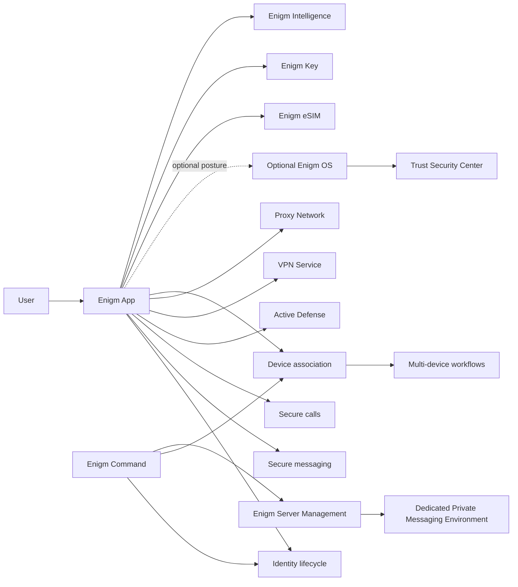

Enigm is the private messaging product in the Enigm ecosystem. It is delivered through the user-facing app, which is why this section uses the app documentation structure.

Enigm is the main interface through which users access private messaging, secure calls, Active Defense, trusted devices, multi-device workflows, PIN-gated app access, security-level visibility, optional VPN Service usage, integrated Proxy Network usage where enabled, and policy-aware access to supporting Enigm services. Account creation is performed through Enigm Command.

Enigm OS is an optional dedicated secure device layer. When present, it can contribute Trust Security Center posture, device-management state, OTA verification state, and Remote Attestation signals. Enigm remains the central private messaging product; Enigm OS hardens supported deployments rather than replacing the messaging product.

Supporting products and components include Enigm Command, Enigm Server, VPN Service, Proxy Network, Enigm eSIM, Enigm Key, Payment Privacy, Tor Gateway, Enigm Intelligence, Threat Intelligence Platform, and Enyra. These extend policy, administration, dedicated private messaging environments, secure networking, emergency alerting, malware-risk visibility, and risk evaluation around Enigm.

## Overview

Enigm coordinates six primary security domains:

- **Identity lifecycle**: Enigm Command account creation, authentication, session state, recovery state, PIN policy, and account-level policy.
- **Communication security**: secure messaging, secure calls, key-management workflows, message expiration, and protected content handling.
- **Active Defense**: AI-assisted mobile spyware and network-behavior analysis without inspecting protected communications.
- **Device association**: explicit enrollment, replacement, revocation, and lifecycle evaluation for devices linked to an account.
- **Multi-device workflows**: controlled account access across multiple authorized devices without automatically trusting newly introduced devices.
- **Platform integration**: policy and visibility through Enigm Command, optional network privacy through VPN Service, traffic separation through Proxy Network, data-only connectivity through Enigm eSIM in supported coverage areas, and risk signals through Enigm Intelligence.

For the ecosystem-wide cryptographic model, including end-to-end encryption, post-quantum cryptography, key lifecycle, secure storage, verification workflows, and OTA cryptography, see [Cryptography](/security/cryptography).

## Secure Messaging

Secure messaging is a core Enigm App workflow. Message content is prepared and protected in the app before delivery through authorized paths. Device association, key-management state, expiration policy, and recipient eligibility are evaluated as part of the messaging model.

Enigm secure messaging supports text and multimedia workflows, including messages, files, images, videos, and other supported media. Conversation and group policy can control sending, forwarding, deletion, and media handling while preserving the end-to-end encryption model.

Secure media handling is designed to reduce unnecessary plaintext exposure through protected viewing, limited local persistence, expiration, and capture-resistance controls according to device capability and policy. These controls reduce exposure during normal use; they do not ensure protection against compromised endpoints, external recording, or intentional disclosure by authorized participants.

The messaging architecture is documented separately in [Secure Messaging](/app/secure-messaging).

## Onboarding And Account Creation

Account creation is performed through Enigm Command. Enigm App uses the resulting account identity to establish app access, Device Trust, secure messaging, secure calls, and protected workflows while minimizing dependency on public identifiers.

The registration model includes:

- Username and password authentication.
- Recovery phrase generation and handling.
- 6-digit numeric PIN setup.
- Initial trusted-device association.
- Separation between account recovery and access to protected messages.

Standard Enigm account creation does not require an email address, phone number, or identity document. This supports identity minimization and reduces unnecessary identity exposure.

Enigm App sessions use a 1-hour validity window and are automatically renewed while the session remains eligible under account, device, and policy controls. Session state is evaluated separately from Device Trust, protected key material, recovery state, and administrative authorization.

Enigm App access is PIN-gated after authentication. PIN validation is performed against the Enigm server-side security layer, not only on the local device. The user can configure the PIN prompt to appear immediately or after a defined inactivity period.

When the app is closed or the PIN prompt is triggered, Enigm App clears sensitive runtime state from memory and removes decrypted runtime material from the active app context. Sensitive runtime data is protected while resident in memory according to the Enigm App runtime protection model.

If enabled, a reverse PIN can trigger protected-content deletion according to the data-deletion and retention model and mark the user profile as at risk. This workflow deletes messages, voice messages, call records, multimedia, attachments, and other protected conversation content available to the account; it does not delete the Enigm account itself. Entering the PIN incorrectly 5 times closes the app session and records a user-risk state visible to contacts until the user successfully validates with the correct PIN.

## Profile Security Level And Discovery

Enigm App displays a user security level: Low, Medium, High, or Extreme.

The level reflects account configuration such as message lifetime, online visibility, voice modulation, PIN behavior, reverse PIN activation, VPN Service usage, and notification privacy. Contacts can see this level on the user's profile to understand the user's current protection posture.

Users are added through a unique contact identifier. Users cannot be searched by username or display name.

Users can configure whether they are discoverable through the public Enigm discovery surface or available only through Enigm Server private environments. This setting can be managed from Enigm App or Enigm Command.

Online visibility is configurable. Notifications are designed not to reveal message content or sender identity.

## Secure Calls

Secure calls are treated as protected real-time communication workflows. Call establishment should evaluate account state, device association, policy state, and supported network context.

Voice modulation is documented as a privacy feature when enabled by user or policy. It is intended to reduce direct voice recognizability during supported calls, not to claim resistance against all voice-identification methods.

## Active Defense

Active Defense is an Enigm App capability designed to help users evaluate mobile malware, spyware, and suspicious network-behavior risk.

Active Defense analyzes minimized network-behavior signals over bounded assessment windows. It is intended to support user guidance, Device Trust decisions, managed-device visibility where enabled, and Enigm Intelligence correlation where authorized.

Active Defense is not intended to inspect message plaintext, call content, media, attachments, documents, or user conversations.

The Active Defense model is documented separately in [Active Defense](/app/active-defense).

## Device Association

Enigm App does not treat identity and Device Trust as the same concept. A user account may be valid while a specific device is not eligible for a protected operation.

## Identity Lifecycle

The identity lifecycle includes account authentication, session state, recovery state, administrative policy state, and device association. Enigm App uses identity context as one input to authorization; it does not treat authentication alone as sufficient for every protected operation.

Administrative lifecycle operations are available through Enigm Command when an enterprise or managed deployment requires policy assignment, device review, or audit evidence.

## Multi-Device Workflows

Multi-device workflows support account use across explicitly associated devices. A newly introduced device should be evaluated as a new trust event, not as an automatic extension of an existing session.

Multi-device workflows may involve:

- Device enrollment.
- Device replacement.
- Device revocation.
- Key lifecycle updates.
- Conversation or call eligibility updates.
- Recovery workflows separated from normal message access.

## Integration With Enigm Command

Enigm Command is the web control panel product for individual users, organizations, and enterprise administrators. It supports account policy, connected-device visibility, active session closure, unauthorized device removal, device revocation, platform data deletion workflows, full account deletion workflows, Enigm Server purchase and creation, server ID join request review, server membership management, server-scoped content lifecycle controls, Tor Gateway access to selected web surfaces, Enigm eSIM purchase and lifecycle management, Enigm Key device lifecycle visibility, Enigm OS managed-device mode when enabled by the user, Enyra Product Assistant, rollout visibility, audit review, and security posture review.

Enigm Command should not expose protected message content, call content, private key material, or implementation-sensitive protocol state.

## Integration With Optional Enigm OS

When Enigm OS is deployed, Enigm App consumes additional Device Trust signals, including Trust Security Center posture, device-management state, privacy-mode state, network-policy state, OTA verification state, and Remote Attestation outcomes.

Enigm OS signals are additive. Enigm App security must not assume that every deployment uses Enigm OS.

## Integration With VPN Service And Proxy Network

VPN Service and Proxy Network are supporting Enigm App network privacy and traffic-separation components. VPN Service provides optional network privacy and transport protection. Proxy Network reduces direct exposure between app clients and platform services where enabled.

VPN Service and Proxy Network are separate from Enigm Server and separate from Enigm App end-to-end encryption. They do not define the app security model, replace Device Trust, or provide access to message plaintext.

Network service use should be authorized, policy-aware, and auditable where security-relevant. Protected communication content should remain separate from routine network-policy records.

## Integration With Enigm eSIM

Enigm eSIM provides data-only mobile connectivity for supported devices across supported coverage areas. It is purchased and managed through Enigm Command, linked to the user's Enigm account for lifecycle management, and can be unlinked, deleted, or retired by the user.

Enigm eSIM connectivity can be combined with VPN Service and Proxy Network usage. It does not replace Enigm App end-to-end encryption, Device Trust, secure messaging, secure calls, or protected key material.

## Integration With Enigm Server

Enigm Server provides dedicated private messaging environments for approved Enigm users.

Users request access to an Enigm Server environment using the server ID shared by the administrator. Enigm App accesses Enigm Server environments when account state, Device Trust, administrator approval, membership policy, and server policy allow it. Enigm Server does not replace secure messaging, secure calls, protected key material, end-to-end encryption, or Device Trust.

Server administration controls membership and the lifecycle and availability of server-scoped encrypted content. Administrative deletion controls operate on encrypted content objects and lifecycle state. They do not grant access to message plaintext, attachment plaintext, user communications, private key material, or cryptographic authority.

## Integration With Enigm Key

Enigm Key is a physical emergency connectivity device associated with a user's Enigm account.

Enigm App supports Enigm Key initial linking, synchronization, emergency contact configuration, emergency event visibility, device lifecycle review, revocation, and replacement workflows. Initial linking and emergency contact configuration are controlled from Enigm App.

Enigm Key emergency workflows should remain user-controlled, event-bound, and separated from normal message or call content. During an active emergency workflow, location sharing is intended to continue until the user cancels the emergency sending workflow.

When inactive, Enigm Key is intended to remain dormant to reduce unnecessary location exposure and network activity.

## Security Considerations

- Enigm is the primary user-facing security surface.
- Account Trust and Device Trust are evaluated separately.
- Device association should be explicit and auditable.
- Secure messaging and secure calls should rely on protected key material and authorized device state.
- Active Defense should improve device-risk visibility without weakening content confidentiality or user privacy.
- Enigm Command actions should be authenticated, authorized, and auditable.
- Optional Enigm OS posture can strengthen Device Trust decisions where deployed.
- VPN Service and Proxy Network should support network privacy and metadata reduction without requiring disclosure of protected content.
- Enigm Server should support server membership and server-scoped encrypted content lifecycle controls without becoming a plaintext, attachment, user communication, or private key access surface.
- Enigm Key should use authenticated, encrypted communication and event-bound emergency data handling.

## Privacy Considerations

Enigm App should minimize collection and separate protected content from operational metadata by trust domain.

## Trust Boundaries

The primary trust boundaries are:

- User to Enigm App
- Enigm App to account identity state
- Enigm App to device association state
- Enigm App to secure messaging and secure calls
- Enigm App to Active Defense findings
- Enigm App to Enigm Command policy
- Enigm App to optional Enigm OS posture
- Enigm App to VPN Service and Proxy Network
- Enigm App to Enigm Server membership and server policy
- Enigm App to Enigm eSIM connectivity
- Enigm App to Enigm Key emergency workflows
- Enigm App to Enigm Intelligence outcomes

## Architecture Diagram

## Limitations

See [Platform Limitations](/legal/limitations).

## Threat Model References

Relevant threat-model areas include account and app compromise, device lifecycle abuse, Enigm OS policy bypass where deployed, network-policy misuse, intelligence manipulation, Enigm Command abuse, and loss of audit visibility.
