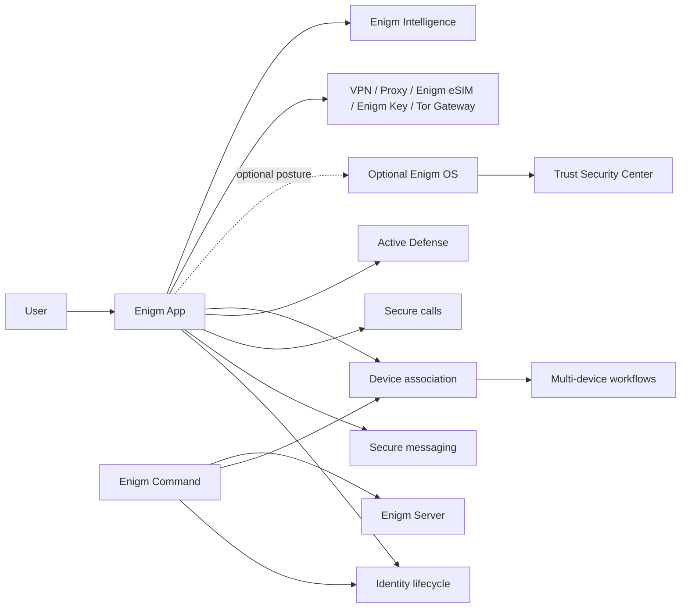

Enigm is the private messaging product in the Enigm ecosystem. It is delivered through the user-facing app, which is why this section uses the app documentation structure.

Enigm is the main interface through which users manage onboarding, registration, identity, secure messaging, secure calls, Active Defense, trusted devices, multi-device workflows, and policy-aware access to supporting Enigm services.

Enigm OS is an optional dedicated secure device layer. When present, it can contribute Trust Security Center posture, device-management state, OTA verification state, and Remote Attestation signals. Enigm remains the central private messaging product; Enigm OS hardens supported deployments rather than replacing the messaging product.

Supporting products and components include Enigm Command, Enigm Server, VPN Network, Proxy Network, Enigm eSIM, Enigm Key, Payment Privacy, Tor Gateway, Enigm Intelligence, Threat Intelligence Platform, and Enyra. These extend policy, administration, private environments, secure networking, emergency alerting, malware-risk visibility, and risk evaluation around Enigm.

## Overview

Enigm coordinates six primary security domains:

- **Identity lifecycle**: account creation, authentication, session state, recovery state, and account-level policy.
- **Communication security**: secure messaging, secure calls, key-management workflows, message expiration, and protected content handling.
- **Active Defense**: mobile malware-risk assessment, security findings, and device-risk guidance without inspecting protected communications.
- **Device association**: explicit enrollment, replacement, revocation, and lifecycle evaluation for devices linked to an account.
- **Multi-device workflows**: controlled account access across multiple authorized devices without automatically trusting newly introduced devices.
- **Platform integration**: policy and visibility through Enigm Command, network support through VPN Network, Proxy Network, Enigm eSIM, and Tor Gateway, and risk signals through Enigm Intelligence.

## Secure Messaging

Secure messaging is a core Enigm App workflow. Message content is prepared and protected in the app before delivery through authorized paths. Device association, key-management state, expiration policy, and recipient eligibility are evaluated as part of the messaging model.

The messaging architecture is documented separately in [Secure Messaging](/app/secure-messaging).

## Onboarding And Registration

Enigm App onboarding is designed to establish identity and device trust while minimizing dependency on public identifiers where supported.

The registration model includes:

- Username and password authentication.
- Recovery phrase handling.
- Device-local identity creation.
- Initial trusted-device association.
- Separation between account recovery and access to protected messages.

Where supported, Enigm App should not require an email address, phone number, or identity document for normal account creation. This supports identity minimization and reduces unnecessary identity exposure.

## Secure Calls

Secure calls are treated as protected real-time communication workflows. Call establishment should evaluate account state, device association, policy state, and supported network context.

The secure calling model is documented separately in [Secure Calls](/app/secure-calls). Public documentation describes the security architecture and trust assumptions without exposing protocol internals, routing mechanics, media infrastructure, or operational details.

## Active Defense

Active Defense is an Enigm App capability designed to help users evaluate mobile malware, spyware, and suspicious device activity risk.

Active Defense analyzes minimized security signals and device-risk context. It is intended to support user guidance, device trust decisions, managed-device visibility where enabled, and Enigm Intelligence correlation where authorized.

Active Defense is not intended to inspect message plaintext, call content, media, attachments, documents, or user conversations.

The Active Defense model is documented separately in [Active Defense](/app/active-defense).

## Device Association

Enigm App does not treat identity and device trust as the same concept. A user account may be valid while a specific device is not eligible for a protected operation.

Device association is explicit and lifecycle-bound. Devices can be enrolled, replaced, suspended, revoked, or retired through authorized workflows. Privacy-preserving device handles support account-device correlation for policy, audit, and lifecycle review without exposing direct public device identifiers.

## Identity Lifecycle

The identity lifecycle includes account authentication, session state, recovery state, administrative policy state, and device association. Enigm App uses identity context as one input to authorization; it does not treat authentication alone as sufficient for every protected operation.

Administrative lifecycle operations may be available through Enigm Command where an enterprise or managed deployment requires policy assignment, device review, or audit evidence.

## Multi-Device Workflows

Multi-device workflows support account use across explicitly associated devices. A newly introduced device should be evaluated as a new trust event, not as an automatic extension of an existing session.

Multi-device workflows may involve:

- Device enrollment
- Device replacement
- Device revocation
- Key lifecycle updates
- Conversation or call eligibility updates
- Recovery workflows separated from normal message access

## Integration With Enigm Command

Enigm Command is the administrative product for managed policy and review workflows. It may support account policy, connected-device visibility, session closure, device removal, data deletion workflows, account deletion workflows, Enigm Server, Enigm eSIM, Enigm Key emergency contacts, rollout visibility, audit review, and security posture review.

Enigm Command should not expose protected message content, call content, private key material, or implementation-sensitive protocol state.

## Integration With Optional Enigm OS

When Enigm OS is deployed, Enigm App can consume additional device trust signals, including Trust Security Center posture, device-management state, privacy-mode state, network-policy state, OTA verification state, and Remote Attestation outcomes where applicable.

Enigm OS signals are additive. Enigm App security must not assume that every deployment uses Enigm OS.

## Integration With Network Services

VPN Network, Proxy Network, Enigm eSIM, and Tor Gateway are supporting network services. They can provide policy-governed network paths where enabled, but they do not define the app security model.

Network service use should be authorized, policy-aware, and auditable where security-relevant. Protected communication content should remain separate from routine network-policy records.

## Integration With Enigm Server

Enigm Server provides private, policy-controlled environments for supported Enigm workflows.

The Enigm app may access private environments when account state, device trust, membership policy, and environment policy allow it. Enigm Server does not replace secure messaging, secure calls, protected key material, or device trust.

## Integration With Enigm Key

Enigm Key is a supporting emergency connectivity device associated with a user's Enigm account.

Enigm App may support Enigm Key synchronization, emergency contact configuration, emergency event visibility, and device lifecycle actions. Enigm Key emergency workflows should remain user-controlled, event-bound, and separated from normal message or call content.

When inactive, Enigm Key is intended to remain dormant to reduce unnecessary location exposure and network activity.

## Security Considerations

- Enigm is the primary user-facing security surface.
- Account trust and device trust are evaluated separately.
- Device association should be explicit and auditable.
- Secure messaging and secure calls should rely on protected key material and authorized device state.
- Active Defense should improve device-risk visibility without weakening content confidentiality or user privacy.
- Enigm Command actions should be authenticated, authorized, and auditable.
- Optional Enigm OS posture can strengthen device trust decisions where deployed.
- Network services should support policy without requiring disclosure of protected content.
- Enigm Key should use authenticated, encrypted communication and event-bound emergency data handling.

## Privacy Considerations

Enigm App should minimize collection and separate protected content from operational metadata where applicable.

Privacy-preserving device handles should be used for account-device correlation. Enigm Command and audit workflows should expose lifecycle and decision evidence without exposing protected content or private key material.

## Trust Boundaries

The primary trust boundaries are:

- User to Enigm App
- Enigm App to account identity state
- Enigm App to device association state
- Enigm App to secure messaging and secure calls
- Enigm App to Active Defense findings
- Enigm App to Enigm Command policy
- Enigm App to optional Enigm OS posture
- Enigm App to VPN Network, Proxy Network, Enigm eSIM, and Tor Gateway
- Enigm App to Enigm Key emergency workflows
- Enigm App to Enigm Intelligence outcomes

## Architecture Diagram

## Limitations

Public documentation does not disclose protocol internals, routing mechanics, operational procedures, cryptographic parameters, internal detection logic, or non-public component layout.

## Threat Model References

Relevant threat-model areas include account and app compromise, device lifecycle abuse, Enigm OS policy bypass where deployed, network-policy misuse, intelligence manipulation, Enigm Command abuse, and loss of audit visibility.
