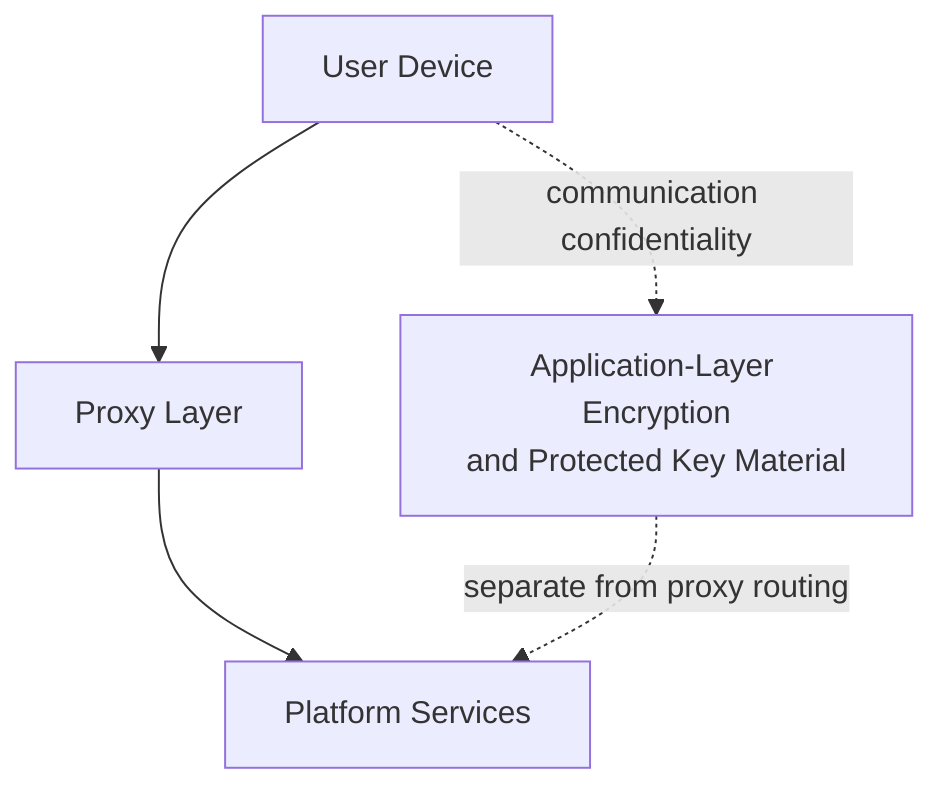

The Enigm proxy network is a privacy and traffic-separation layer within the Enigm ecosystem. It exists to reduce direct exposure between client devices and platform services while preserving application-layer security controls.

Proxy Network is separate from Enigm Server. Enigm Server provides dedicated private messaging environments; Proxy Network provides traffic separation for Enigm App and platform traffic flows where enabled.

## Overview

The proxy network is separate from end-to-end encryption, separate from Enigm Server, and separate from the optional VPN Service.

The proxy layer provides an additional privacy boundary between user devices and platform services. It can help reduce direct network exposure, lower confidence in simple traffic correlation, and support traffic-separation objectives according to platform policy.

The proxy network is part of Enigm's metadata-reduction model. It is designed to reduce direct network association between client devices and platform services while preserving the operational identifiers required for routing, authentication, availability, abuse prevention, and security monitoring.

Communication confidentiality remains dependent on application-layer encryption and protected key material. The proxy layer is not intended to replace encryption.

## Purpose

The proxy network is designed to:

- Reduce direct exposure between client devices and platform services.
- Provide an additional privacy boundary.
- Support traffic separation according to platform policy.
- Contribute to metadata reduction objectives.
- Increase difficulty for simple timing-based traffic correlation methods.
- Support policy-controlled network mediation without becoming a plaintext content access layer.

The proxy layer is not intended to replace Device Trust, endpoint security, secure messaging encryption, secure call session security, or user trust decisions.

## Traffic Separation

Traffic separation reduces direct association between a client device and platform services at the network path level.

Traffic routing decisions are performed according to platform policy. Public documentation does not disclose non-public path structure, path-selection behavior, infrastructure layout, or operational procedures.

Traffic separation can help reduce direct visibility, but it does not remove the need for:

- Application-layer encryption.
- Protected key material.
- Device Trust.
- Account authorization.
- Message expiration and lifecycle controls.
- Verification workflows.

## Metadata Reduction

The proxy network contributes to metadata reduction and traffic separation objectives.

Metadata reduction may include reducing direct exposure of:

- Client-to-service network relationships.
- Simple request timing patterns.
- Direct service access patterns.
- Some network-layer context visible to intermediate observers.

Metadata reduction is not metadata elimination. Some metadata may remain necessary for delivery, abuse handling, policy enforcement, availability, and security review.

Metadata handled inside the Enigm platform is encrypted according to the applicable product and storage domain. Operational identifiers required for routing or request handling should be short-lived or scoped where possible, purpose-limited, access-controlled, and separated from message plaintext, secure call content, media, attachments, user conversations, and private key material.

The proxy network is not documented as a claim that Enigm services never process operational identifiers. It is a privacy boundary intended to reduce exposure, lower confidence in simple correlation, and avoid unnecessary direct client-to-service visibility.

## Relationship With End-to-End Encryption

The proxy network is separate from end-to-end encryption.

End-to-end encryption protects message content at the application layer. The proxy layer mediates network paths and traffic separation. It must not be treated as a replacement for encryption or protected key material.

If the proxy layer is unavailable or disabled, secure messaging and secure calls should still rely on their app-level security models.

## Relationship With VPN

The proxy network is separate from the optional VPN Service.

The VPN Service is an optional transport privacy layer for the user device. The proxy layer is a platform-side mediation and traffic-separation layer. Both may contribute to privacy objectives, but they address different parts of the network model.

Using VPN Service does not remove the need for proxy-layer policy where the platform requires it. Using the proxy network does not remove the potential value of VPN Service transport protection where enabled.

## Traffic Analysis Considerations

The platform may employ traffic shaping, background network activity, batching, timing variation, or similar techniques intended to reduce the reliability of simple timing-based traffic correlation methods.

These techniques are intended to:

- Reduce direct timing correlation.
- Mitigate simple traffic-pattern matching.
- Increase difficulty for low-confidence traffic analysis.
- Lower confidence in simple observer assumptions.

They do not remove traffic-analysis risk. Strong adversarial traffic analysis may still use timing, volume, endpoint behavior, user behavior, or external signals.

Additional network activity should not be interpreted as proof of active user communications. Traffic shaping, proxy mediation, optional VPN Service usage, metadata minimization, and encrypted metadata handling are complementary controls.

## Security Limitations

Ver [Platform Limitations](/legal/limitations).

## Threat Model Considerations

The proxy network is relevant to network observation, traffic separation, metadata reduction, and simple traffic-correlation scenarios.

Relevant threat-model areas include network-policy misuse, traffic metadata exposure, account and app compromise, device lifecycle abuse, secure messaging compromise attempts, secure call compromise attempts, and loss of audit visibility.

Proxy Network public architecture remains high-level and documentation-safe. It does not expose non-public path structure, private network design, infrastructure labels, geographic deployment information, operational procedures, or implementation-sensitive details.
