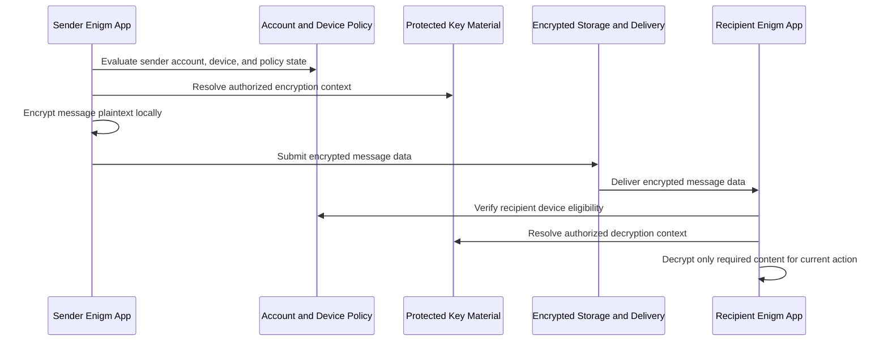

Enigm App provides secure text and multimedia messaging as an app-level security model. Messaging protection is centered in the client application, supported by Device Trust, protected key material, controlled message lifetime, and verification workflows.

## Overview

Enigm secure messaging is designed to protect message and attachment content while preserving enough lifecycle metadata for delivery, synchronization, expiration, and authorized audit workflows.

The model is based on these principles:

- Messages are end-to-end encrypted.
- Message plaintext is not intended to be accessible to server-side components.
- Server-side message storage, when required for delivery, stores encrypted message data only.
- Message access depends on trusted device association and protected key material.
- Multi-device messaging requires explicit trust establishment.
- Attachments follow the same confidentiality model as messages.
- Groups support advanced permission controls for forwarding, deletion, sending, and media handling when enabled by conversation policy.
- Secure media handling is designed to reduce plaintext exposure for files, images, videos, and other supported multimedia.
- Administrative controls must not grant access to message plaintext.
- Enigm OS can provide additional hardening, but Enigm secure messaging remains an Enigm App-level security model.

## End-to-End Encryption Model

Enigm messaging is designed so that plaintext message content is prepared and encrypted inside the sender-side Enigm App context before delivery.

At a high level:

1. Enigm App evaluates sender account state, sender device association, and applicable policy.
2. Recipient account and recipient device eligibility are resolved through authorized metadata.
3. Protected key material is used to establish an authorized encryption context.
4. Message plaintext is encrypted locally in Enigm App.
5. Encrypted message data is submitted for delivery.
6. Recipient-side Enigm App verifies device eligibility and protected key state.
7. Message content is decrypted locally only where permitted.

Server-side components should not require message plaintext to route, store, synchronize, or expire messages.

## Message Lifecycle

The message lifecycle is structured around client-side protection and device-aware authorization.

The lifecycle includes:

- Sender account and session evaluation.
- Sender Device Trust evaluation.
- Recipient device eligibility evaluation.
- Local encryption using protected key material.
- Encrypted delivery and synchronization.
- Recipient-side verification.
- Local decryption for authorized user action.
- Expiration or deletion according to user or conversation policy.

The client should retrieve and decrypt only the message content required for the current user action.

## Server-Side Encrypted Storage

Server-side message storage may be required for delivery, synchronization, offline retrieval, expiration coordination, or abuse-resistant lifecycle management.

When server-side storage is required, it should store encrypted message data only. Message plaintext is not intended to be accessible to server-side components.

Server-side systems may process limited metadata required for:

- Delivery state.
- Synchronization state.
- Expiration state.
- Conversation membership.
- Abuse handling.
- Audit-relevant lifecycle events.

This metadata should be minimized and separated from protected message content.

## Local Message Handling

Local message handling defines how Enigm App treats decrypted content after authorized retrieval.

Enigm App is designed so that:

- Decrypted message content is handled inside authorized app contexts.
- Decrypted message content should not be persistently stored on the device.
- The system should avoid unnecessary local persistence.
- Memory-only handling should be used for selected processing stages.
- Local caching, previews, search, backups, and enterprise retention controls must not silently bypass message confidentiality policy.

Secure viewers should handle message and attachment content without exporting plaintext to external apps. Where external sharing or export is allowed by user action or policy, that action is outside the normal protected-viewing model and should be treated as a disclosure boundary.

## Attachment Handling

Attachments must follow the same confidentiality model as messages.

Attachment handling is designed to:

- Support protected files, images, videos, and other supported media objects.
- Encrypt attachment content before transfer or storage.
- Store attachment data as encrypted material where server-side storage is required.
- Retrieve only attachment content required for the current user action.
- Decrypt attachment content locally only where permitted.
- Use secure viewers.
- Avoid plaintext export to external apps during normal protected viewing.
- Apply expiration and deletion policy to attachment availability.

Attachment metadata should be minimized to what is required for delivery, synchronization, expiration, and authorized review.

## Group Permissions

Group conversations support advanced permission controls when enabled by conversation policy.

Permission controls include:

- Sending eligibility.
- Forwarding restrictions.
- Deletion permissions.
- Media sending permissions.
- File sharing permissions.
- Member management permissions.
- Conversation visibility controls.

Group permissions are intended to support controlled communication spaces while preserving the end-to-end encryption model. Administrative or group-level controls must not create plaintext access for server-side systems or Enigm Command workflows.

Permission controls are evaluated as conversation policy. A participant's account state, Device Trust state, membership state, and conversation policy can affect whether that participant can send, forward, delete, or manage protected content.

Group permissions should be auditable at the policy and lifecycle level without exposing message plaintext, attachment plaintext, media plaintext, user conversations, or private key material.

## Sending Controls

Sending controls determine whether a participant is eligible to submit protected content into a conversation.

Sending controls can apply to:

- Text messages.
- Files.
- Images.
- Videos.
- Other supported multimedia.
- Conversation-specific protected content types.

Sending eligibility should evaluate account state, Device Trust, conversation membership, group policy, and applicable administrative policy. Sending controls do not change the end-to-end encryption model; protected content should still be encrypted before delivery and decrypted only on authorized devices.

## Forwarding Controls

Forwarding controls are designed to reduce unauthorized redistribution of protected content inside supported Enigm workflows.

Forwarding restrictions can limit whether users can forward:

- Messages.
- Files.
- Images.
- Videos.
- Other supported multimedia.

Forwarding controls reduce exposure inside the Enigm App workflow, but they cannot ensure control over content after authorized local rendering, user disclosure, external capture, compromised endpoints, or export paths outside Enigm controls.

## Deletion Controls

Deletion controls affect the lifecycle and availability of protected content.

Deletion workflows can apply to:

- User-initiated message deletion.
- User-initiated attachment deletion.
- Conversation-policy deletion.
- Group-policy deletion.
- Server-scoped encrypted content deletion where Enigm Server policy applies.
- Expiration-driven deletion.

Deletion controls operate on encrypted content objects, local lifecycle state, and conversation availability. Deletion does not imply that administrators can read message plaintext, attachment plaintext, media plaintext, user conversations, or private key material.

Deletion cannot ensure removal of content already viewed, exported, captured, disclosed by an authorized participant, or stored outside Enigm controls.

## Media Protection And Local Permissions

Enigm App secure media handling is designed to reduce unnecessary plaintext exposure during normal use.

Media protection includes:

- Secure viewing for supported files, images, and videos.
- Avoiding unnecessary local persistence.
- Restricting export paths where policy requires.
- Limiting forwarding where conversation policy requires.
- Applying message and attachment expiration.
- Presenting protected media only inside authorized app contexts.

Screen capture and screen recording protections are applied according to operating-system capability and device policy. These protections are intended to reduce accidental or unauthorized capture during normal app use, but they cannot ensure prevention against all capture methods, compromised devices, external cameras, or modified operating environments.

## Capture Resistance

Capture resistance is a local exposure-reduction control for protected message and media viewing.

According to device capability and policy, Enigm App applies controls intended to reduce:

- Screenshot capture.
- Screen recording.
- Preview leakage.
- Unnecessary plaintext export to external applications.
- Accidental exposure during normal protected viewing.

These controls are not equivalent to an assurance that content cannot be recorded. External cameras, compromised devices, malicious authorized users, operating-system bypasses, accessibility abuse, and modified environments remain outside the assurance boundary of normal app-level capture protection.

Capture resistance is a privacy and exposure-reduction layer that complements end-to-end encryption, Device Trust, protected key material, secure viewers, and message expiration.

## Message Expiration

Messages have a configurable lifetime and can expire according to user or conversation policy.

Expiration may apply to:

- Message content.
- Attachment content.
- Delivery references.
- Local decrypted state.
- Cached previews.
- Conversation lifecycle metadata.

Expiration is designed to reduce unnecessary long-term availability of protected content. Expiration does not necessarily remove every non-content metadata record, because delivery, audit, compliance, abuse handling, or legal workflows may require limited lifecycle records.

## Device Trust Requirements

Message access depends on trusted device association and protected key material.

Device Trust evaluates:

- Account association.
- Privacy-Preserving Device Handle.
- Device enrollment state.
- Device replacement state.
- Device revocation or retirement state.
- Device-associated protected key material.
- Local unlock state.
- OS security posture.
- Optional Trust Security Center posture where Enigm OS is deployed.
- Remote Attestation outcome when device-integrity evidence is required.

A valid account session does not automatically make a device eligible for message access. Revoked devices should lose future message synchronization and decryption eligibility according to lifecycle policy.

## Multi-Device Messaging

Multi-device messaging requires explicit trust establishment.

A newly enrolled device should be evaluated as a new trust participant, not as an automatic extension of an existing session. Multi-device workflows should evaluate:

- Account state.
- Device enrollment state.
- Device-associated protected key material.
- Conversation membership.
- Message expiration policy.
- Existing trusted device approval or managed approval.
- Enigm Command policy where managed administration applies.
- Optional Enigm OS Trust state where deployed.

Multi-device support must not silently copy private key material without an explicit trust workflow.

Historical message availability for newly enrolled devices depends on key lifecycle, message lifetime, recovery design, and policy.

## Verification Workflows

Verification workflows should allow users to confirm device or contact trust.

Verification may include:

- Contact or account verification.
- Device membership verification.
- Device replacement review.
- Key state verification.
- Conversation membership verification.
- Optional Trust Security Center posture where Enigm OS is deployed.
- Managed policy verification through Enigm Command.

Verification output should provide understandable status or decision categories without exposing private key material, cryptographic internals, protocol details, or protected message content.

## Metadata Minimization

Message metadata should be minimized.

The system should avoid unnecessary collection, retention, and exposure of metadata related to:

- Message delivery.
- Message read or retrieval state.
- Attachment lifecycle.
- Device correlation.
- Conversation membership.
- Expiration behavior.
- Audit lifecycle.

Where metadata is required, Privacy-Preserving Device Handles and other scoped identifiers should be preferred over direct public identifiers.

Administrative controls should expose lifecycle and policy evidence without exposing message plaintext.

## Traffic Analysis Resistance

The Enigm messaging architecture generates additional network activity that is not directly tied to active user conversations.

This mechanism is intended to reduce the reliability of simple traffic-correlation techniques that attempt to infer communication relationships from observable network patterns, including packet timing, message timing, traffic bursts, connection cadence, or similar signals.

The goal is not to claim identity-hiding assurances or resistance to advanced traffic analysis. The goal is to lower confidence in basic timing-correlation and communication-pattern analysis.

Traffic shaping is an additional privacy layer. Communication confidentiality continues to rely on end-to-end encryption and protected key material.

Additional network activity should not be interpreted as proof of active user communications. Network observers may still perform traffic analysis under certain circumstances, especially when they can combine timing, volume, endpoint behavior, user behavior, or external signals.

This mechanism is intended to:

- Reduce direct timing correlation.
- Mitigate simple communication-pattern inference.
- Lower confidence in basic observer assumptions.
- Increase difficulty for simple traffic-burst analysis.
- Make basic communication correlation less reliable.

Public documentation does not disclose cadence, timing characteristics, generation logic, runtime tuning details, or implementation-sensitive behavior.

### Relationship With Metadata Protection

Traffic shaping, metadata minimization, proxy infrastructure, and transport protections are complementary controls.

Metadata minimization reduces unnecessary metadata collection and exposure. Proxy infrastructure can provide an additional traffic-separation layer. Transport protections can reduce visibility from some network observers. Traffic shaping can make simple timing-based inference less reliable.

These controls do not replace end-to-end encryption, Device Trust, protected key material, message expiration, or verification workflows.

See [Platform Limitations](/legal/limitations).

## Threat Model References

Relevant threat-model areas include account and app compromise, device lifecycle abuse, secure messaging compromise attempts, Enigm Command abuse, Enigm OS policy bypass where deployed, network-policy misuse where supporting network components are enabled, and loss of audit visibility.
