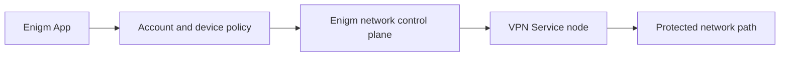

VPN Service is an Enigm App-associated network privacy and transport-protection component. It can reduce exposure on local networks, public Wi-Fi, and some intermediate network paths depending on user configuration and deployment policy.

VPN Service is separate from Enigm App end-to-end encryption, Device Trust, secure messaging, secure calls, Enigm Proxy, Enigm eSIM, Enigm Server, and endpoint security. It does not replace any of those controls.

## Service Model

VPN Service is authorized through Enigm workflows and associated with Enigm App policy. The app and supporting control plane determine whether VPN Service can be used, which locations are eligible, and whether a network path remains healthy enough for assignment.

Public documentation describes VPN Service at a trust-boundary level. It does not expose deployable endpoints, node IP addresses, private API contracts, administrative ports, non-public network identifiers, credentials, keys, routing tables, or operational procedures.

## Current Public Location Coverage

Current VPN Service public location coverage:

| Location | Public status scope |
| --- | --- |
| Amsterdam | Location availability |
| Brazil | Location availability |
| Germany | Location availability |
| Singapore | Location availability |
| Spain | Location availability |
| United Kingdom | Location availability |
| United States | Location availability |

Public status should stay limited to location and availability. It should not publish IP addresses, internal route state, backend telemetry, node identifiers, operational dashboards, or provider-specific details.

## Privacy Boundary

VPN Service should not log user traffic payloads, destinations, DNS query content, handshake details, per-peer activity records, or individual browsing activity.

Operational logs and health signals should be minimized, aggregated where possible, rotated, protected, and retained only for limited operational purposes. Capacity checks should rely on aggregate pressure signals rather than user identifiers.

VPN Service health and capacity information should not be treated as evidence that a specific user is active, browsing, messaging, or communicating with a specific contact.

## Security Boundary

VPN Service nodes should enforce isolation between users and constrain access to private, reserved, unsupported, or high-risk network destinations according to Enigm policy.

Temporary network protections can be applied when Enigm security evaluation identifies confirmed, contextual risk. Public documentation should describe these controls at a category level and avoid detection rules, internal tooling, provider names, blocklist mechanics, sensor identifiers, or bypass-relevant details.

VPN Service does not inspect Enigm message plaintext, secure call content, media, attachments, private key material, or protected conversations.

## Capacity And Availability

VPN Service capacity should be evaluated through aggregate system and network pressure signals. When a location or node approaches operational limits, assignment policy can stop sending new eligible sessions to that path while preserving existing user experience where possible.

Automatic capacity-aware server selection, client rejection, or assignment changes require backend and app integration. They should not be described as generally implemented unless that integration has been released.

Public availability information should distinguish location availability from app eligibility, device network conditions, local captive portals, user VPN conflicts, account policy, and regional legal or connectivity restrictions.

## Rapid Server Switching

Rapid VPN location changes are a client, backend, and service-lifecycle coordination problem. They should not be described as a server outage by default.

Public documentation should avoid internal mutation ordering, protocol errors, address reuse details, peer identifiers, and private recovery procedures. The safe public model is that VPN Service changes should be serialized per device, stale transitions should not override newer choices, and retries should remain bounded while the current operation is still valid.

## Release And Rollout

VPN Service release activity should use verified release inputs, integrity checks, canary observation, sequential rollout, health validation, and rollback capability.

Public documentation should not include operational commands, infrastructure credentials, administrative paths, provider-specific dashboards, maintenance procedures, or runbooks that would help reproduce or attack the service.

## Relationship With Other Components

VPN Service supports Enigm App network privacy and transport protection. Enigm Proxy remains the mandatory app-scoped proxy layer for Enigm App product traffic.

Enigm eSIM provides data-only mobile connectivity and can be combined with VPN Service. Enigm Server provides dedicated private messaging environments and is not a VPN node. Enigm OS can contribute device posture and network-policy signals when deployed, but VPN Service must not assume every user has Enigm OS.

Enigm Intelligence and security monitoring can contribute risk evaluation and defensive decisions without becoming plaintext access paths for protected communications.

## Limitations

VPN Service does not provide absolute anonymity, complete traffic-analysis resistance, endpoint compromise protection, or availability on every network.

Protocol compatibility should not be described as cryptographically restricted to the official Enigm App alone. Access should be governed through authorization, lifecycle, eligibility, and policy controls rather than protocol-only claims.

Network operators, local laws, captive portals, private DNS settings, VPN conflicts, device configuration, and regional connectivity conditions can affect VPN Service behavior.

## Related Documentation

- [App Network Privacy](/app/network-privacy)
- [Enigm Proxy](/app/enigm-proxy)
- [Privacy](/security/privacy)
- [Platform Limitations](/legal/limitations)
