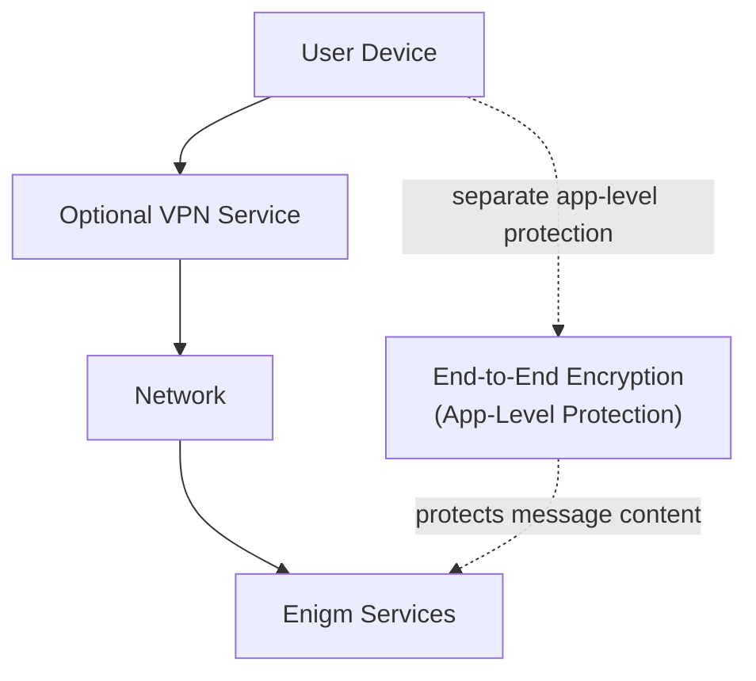

The Enigm VPN Service is an optional network privacy and transport protection layer connected to Enigm App usage. It is not required for Enigm App functionality, but it can provide additional network protection depending on user requirements and deployment policies.

The VPN Service is separate from Enigm Server. Enigm Server provides dedicated private messaging environments; the VPN Service provides optional transport protection.

## Overview

The VPN Service can be enabled or disabled through the Enigm ecosystem where the feature is available and permitted by policy.

The VPN Service is independent from message encryption and independent from Enigm Server. Enigm secure messaging and secure calls use app-level security models. VPN protection operates at the network transport layer and addresses different risks.

## Purpose

The VPN Service is designed to provide optional transport protection for network traffic. It can reduce visibility from intermediate network observers and can help protect users on untrusted local networks.

The VPN Service can help mitigate:

- Network observation.
- Untrusted local networks.
- Public Wi-Fi exposure.
- Certain metadata exposure scenarios.

The VPN Service does not replace end-to-end encryption, device security, user trust decisions, Enigm Server membership policy, or secure account and device lifecycle controls.

## Relationship With End-to-End Encryption

End-to-end encryption and VPN protection solve different problems.

End-to-end encryption is designed to protect message content at the application layer so that message plaintext is not intended to be accessible to server-side components or intermediate network observers.

The VPN Service is designed to protect transport context by reducing network-level visibility from local or intermediate observers.

The VPN Service does not decrypt, inspect, or define Enigm secure messaging content. Secure messaging and secure calling must remain protected even when the VPN Service is disabled.

## Network Privacy

The VPN Service can provide additional network privacy by reducing exposure to local network operators, public access networks, and certain intermediate observers.

Network privacy benefits may include:

- Reduced local network visibility.
- Reduced exposure on public Wi-Fi.
- Reduced visibility of some transport-level metadata.
- Policy-aligned network path protection where enabled.

The VPN Service does not remove all metadata exposure. Some metadata may remain necessary for network operation, account security, abuse handling, policy enforcement, or service availability.

## Transport Protection

The VPN Service is a transport protection layer. It can help protect traffic between the user device and network-facing services from certain network observation risks.

Transport protection is distinct from:

- Message content encryption.
- Device Trust.
- Account authentication.
- Call participant verification.
- User or contact trust decisions.

Transport protection should be evaluated as one layer in a defense-in-depth model, not as a replacement for app-level cryptographic protection.

## Device Trust Considerations

The VPN Service does not make compromised devices trustworthy.

Device Trust remains governed by:

- Device enrollment state.
- Device revocation state.
- Device association.
- Protected key material.
- Local unlock state.
- OS security posture.
- Optional Enigm OS Trust state where deployed.

If a device is compromised, VPN Service transport protection cannot prevent all local compromise risks.

## Optional Usage Model

The VPN Service is optional. Users may enable or disable it through the Enigm ecosystem when product configuration and deployment policy allow it.

Optional usage means:

- Enigm App functionality must not depend on VPN Service availability.
- Secure messaging must remain end-to-end encrypted whether the VPN Service is enabled or disabled.
- Secure calls must maintain their own session security model whether the VPN Service is enabled or disabled.
- Policy may require or restrict VPN Service use in managed deployments.

## Security Limitations

Ver [Platform Limitations](/legal/limitations).

## Threat Model Considerations

The VPN Service is relevant to network-observation and untrusted-network scenarios. It should be evaluated alongside the Enigm threat model areas for network-policy misuse, device lifecycle abuse, account and app compromise, secure messaging compromise attempts, secure call compromise attempts, and loss of audit visibility.

VPN-related controls should remain high-level in public documentation and should not expose routing behavior, deployment topology, implementation details, or operational procedures.
