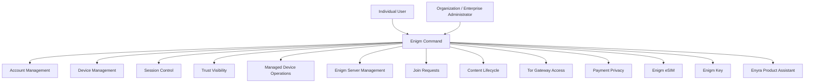

Enigm Command is the web control panel product in the Enigm ecosystem. It is the administrative and account-management surface for individual users, organizations, and enterprise administrators. It is responsible for account lifecycle, full account deletion, platform data deletion workflows, device lifecycle, connected-device visibility, active session control, security configuration, trust visibility, supported product purchase workflows, Enigm Server purchase and creation, dedicated server lifecycle, server ID join requests, server membership, server-scoped content lifecycle controls, Enigm eSIM purchase and management, Enigm Key lifecycle visibility, Tor Gateway access for selected web surfaces, Enyra Product Assistant, and managed device operations.

Enigm Command is not a messaging client. It must not provide access to message plaintext, secure call content, private key material, decrypted attachments, or implementation-sensitive communication state.

## Overview

Enigm Command provides workflows for individual users, organizations, and enterprise administrators to manage Enigm accounts, trusted devices, active sessions, security configuration, managed device capabilities, supported payment methods, Enigm Server, server ID join requests, server membership, server-scoped content lifecycle, Enigm eSIM purchase and lifecycle management, Enigm Key lifecycle visibility, Tor Gateway access to selected web surfaces, Active Defense review context, and security event visibility.

Enigm Command supports administrative visibility into security state, but security state visibility is not equivalent to message visibility.

Enigm Command also exposes Enyra Product Assistant capabilities for product guidance, user assistance, documentation guidance, configuration assistance, platform navigation, feature explanation, device assistance, and account assistance. This product-assistance mode is separate from Enyra security operations assistance in the Intelligence section.

## Product Lifecycle Management

Enigm Command is the control surface for supported product lifecycle operations across the Enigm ecosystem.

Product lifecycle workflows include:

- Enigm account lifecycle and deletion.
- Active session review and closure.
- Connected-device visibility and device removal.
- Payment workflows through cryptocurrency, credit card, and Code Coin payment methods.
- Enigm Server purchase, creation, region selection, join request approval, membership, content lifecycle, and deletion.
- Enigm eSIM purchase, activation lifecycle, account association, unlinking, deletion, and retirement.
- Enigm Key device visibility, loss handling, revocation, and replacement.
- Enigm OS managed-device lifecycle when the user activates managed-device mode.
- Enyra Product Assistant guidance for account, device, product, configuration, and navigation workflows.

Product lifecycle visibility is not protected content visibility. Enigm Command product workflows must remain separate from message plaintext, secure call content, media content, attachment plaintext, user conversations, and private key material.

## Payment Workflows

Enigm Command is the purchase and payment-management surface for supported Enigm products.

Supported payment workflows include:

- Purchase during Enigm Command enrollment.
- Purchase from within Enigm Command after enrollment.
- Cryptocurrency payments.
- Credit card payments.
- Code Coin payment-code redemption.
- Product activation and entitlement state review.
- Invoice request support.

All Enigm products can use the supported payment methods where the product is available for purchase or activation.

Standard payment enrollment is identity-minimizing. Enigm does not require email address, phone number, or identity document collection for normal payment enrollment. The payment workflow collects a purchase country selected by the user.

Payment state is commercial lifecycle state. It does not provide access to message plaintext, secure call content, media content, attachment plaintext, user conversations, private key material, or device-held protected key material.

## Account Management

Account management supports account lifecycle and account security workflows.

Enigm Command uses authorized Enigm account context for access to account and administrative workflows. Public documentation does not disclose authentication internals, session implementation, token formats, route structure, or operational access-control details.

Individual users use Enigm Command to manage their own account, devices, sessions, product lifecycle, and deletion workflows. Organizations and enterprise administrators use Enigm Command to manage scoped environments, approved users, devices, Enigm Server environments, Enigm eSIM lifecycle, Enigm Key visibility, and managed-device operations within their authorized administrative boundary.

Enigm Command account workflows include:

- Account status review.
- Account lifecycle state review.
- Account recovery support boundaries.
- Account policy assignment.
- Visibility and access configuration.
- Account deletion workflows.
- Data deletion workflows.
- Full account deletion.
- Platform data deletion where policy and legal boundaries allow.
- Session review.
- Security event review related to account activity.

Account recovery support must not weaken normal message confidentiality. Recovery support may help restore account access or support device replacement, but it must not provide administrative access to message plaintext.

## Device Management

Device management supports explicit device lifecycle control.

Enigm Command device workflows include:

- Device inventory review.
- Connected-device visibility.
- Review of all devices associated with the account.
- Trusted device visibility.
- Device enrollment review.
- Device revocation.
- Removal of unauthorized devices.
- Device removal from account trust.
- Device replacement.
- Device security reporting.
- Managed device capability review.
- Trust status review.
- Active Defense network-behavior finding review where authorized.

Device management and message access are separate trust domains. Administrative device actions may affect future trust decisions, but they must not decrypt messages or expose private key material.

## Trusted Device Lifecycle

Trusted device lifecycle controls help administrators and authorized users reason about which devices can participate in protected workflows.

Lifecycle states may include:

- Pending enrollment.
- Trusted.
- Restricted.
- Revoked.
- Replaced.
- Retired.

Device revocation should immediately affect future trust decisions. A revoked device should not continue receiving newly protected content according to lifecycle policy.

Device replacement should be treated as a new trust event rather than a silent continuation of the replaced device.

## Session Management

Session management supports visibility and control over active or recent account sessions.

Session workflows include:

- Active session review.
- Active session closure.
- Session restriction according to account or administrative policy.
- Session termination.
- Closing active sessions from devices no longer trusted by the user.
- Session-related security event visibility.
- Policy updates that affect session eligibility.

Session management does not provide access to message plaintext or secure call content.

## Managed Devices

Managed device capabilities are optional device-management features enabled for deployments or users that choose managed device operation.

When a user enables Enigm OS managed-device mode, Enigm Command acts as the management surface for that enrolled device.

Managed device capabilities provide:

- Additional device status signals.
- Managed device policy enforcement.
- Device security reporting.
- Device lifecycle operations.
- Remote device management features for enrolled managed devices.
- Additional Trust state visibility.

Managed device capabilities should remain separate from message confidentiality controls.

## Remote Wipe

Remote wipe capabilities are available only for enrolled managed devices where managed device operation is enabled.

Remote wipe is a device lifecycle and risk-reduction capability. It is not a mechanism for accessing message plaintext.

Remote wipe workflows should be authorized, auditable, and scoped to managed device policy. The exact effects of remote wipe depend on device state, connectivity, supported platform behavior, and managed device configuration.

## Enigm OS Managed Device Mode

Enigm OS managed-device mode is optional and user-enabled.

When the user activates managed-device mode on an Enigm OS device, Enigm Command can be used to manage the enrolled device lifecycle. This management surface is intended to provide visibility and control over device state, not access to protected communications.

Enigm Command managed-device workflows include:

- Enrolled Enigm OS device visibility.
- Device Trust status review.
- Trust Security Center posture visibility.
- Managed device lifecycle actions.
- Device revocation or replacement.
- Remote operations for enrolled managed devices.
- Remote wipe for enrolled managed devices.
- Device security reporting.

Managed-device mode must remain separate from Enigm App message confidentiality. Enigm Command device management does not provide access to message plaintext, secure call content, media, attachments, user conversations, or private key material.

## Enigm Server Management

Enigm Command supports Enigm Server purchase, creation, and administration.

Server management workflows include:

- Purchasing or activating Enigm Server.
- Creating dedicated private messaging environments.
- Assigning or reviewing server ownership inside the authorized Enigm Command boundary.
- Selecting a geographic deployment region.
- Managing dedicated server lifecycle.
- Displaying the server ID used by users to request access.
- Reviewing and accepting join requests.
- Removing approved users from the server environment.
- Managing server membership.
- Maintaining the simple administrator and user role model.
- Configuring visibility and access rules.
- Reviewing connected devices for the environment where authorized.
- Managing user access for dedicated servers.
- Applying server-scoped content lifecycle controls.
- Deleting server-scoped encrypted objects according to policy.
- Deleting server-scoped encrypted messages and multimedia according to policy.
- Deleting encrypted content generated by users within that server environment.
- Deleting all encrypted content belonging to a specific user within that server environment.
- Deleting all encrypted content within the dedicated server environment.
- Deleting the entire server environment.
- Supporting full server content deletion where ownership and policy allow.
- Reviewing environment security events.
- Managing environment lifecycle and deletion workflows.

Enigm Server management must preserve the separation between administrative control and protected communication confidentiality. Administrators can manage the lifecycle and availability of server-scoped encrypted content.

The server ID is a join-request locator, not an access credential. Enigm Command approval, account state, Device Trust, membership state, protected key material, and server policy remain required before a user can participate in the dedicated server environment.

Administrative deletion controls operate on encrypted content objects and lifecycle state. Deletion affects content availability and lifecycle. Administrative controls do not grant access to message plaintext, attachment plaintext, user communications, or private key material.

## Tor Gateway Access

Enigm Command can govern Tor Gateway lifecycle and policy for selected public web surfaces where the access path is enabled.

Tor Gateway access is intended to support privacy-oriented access paths for:

- Public web surfaces.

Tor Gateway access is not Enigm Server, not a messaging client, not an administrative interface, and not a general-purpose infrastructure access path. It must not be used for internal APIs, development systems, operational tooling, sensitive infrastructure management, or non-public service exposure.

## Enigm eSIM Management

Enigm Command supports Enigm eSIM purchase and lifecycle workflows.

Enigm eSIM management workflows include:

- Purchasing Enigm eSIM.
- Activating Enigm eSIM.
- Reviewing Enigm eSIM status.
- Managing activation lifecycle.
- Reviewing Enigm account association.
- Supporting user-initiated unlinking.
- Supporting user-initiated deletion or retirement.
- Applying policy where managed configuration exists.
- Supporting replacement or retirement workflows.

Enigm eSIM state is connectivity state. It does not provide access to message plaintext, call content, media content, attachments, user conversations, or private key material.

## Enigm Key Management

Enigm Command supports Enigm Key administration as an associated device when the user or deployment enables emergency-device workflows.

Enigm Key workflows include:

- Associated Enigm Key visibility.
- Device lifecycle visibility.
- Device loss handling.
- Device revocation.
- Device replacement.
- Emergency event visibility where authorized.

Enigm Key initial linking and emergency contact configuration are controlled from Enigm App. Enigm Command is not the initial linking surface or emergency contact configuration surface.

Emergency workflows must remain separate from normal message and call content. Enigm Command visibility must not become routine location tracking, emergency contact configuration, or emergency contact disclosure beyond authorized lifecycle and event visibility.

## Trust Status Integration

Enigm Command displays Trust status signals from Enigm App, Active Defense network-behavior findings, device lifecycle state, optional managed device capabilities, and optional Enigm OS posture.

Trust status may include:

- Device enrollment state.
- Device revocation state.
- Device replacement state.
- Managed device state.
- Enigm Server policy state.
- Enigm Server join request and membership state.
- Enigm Server content lifecycle state.
- Enigm eSIM lifecycle state.
- Enigm Key lifecycle state.
- Security event visibility.
- Active Defense network-behavior review context.
- Optional Trust Security Center posture.
- Remote Attestation outcome when device-integrity evidence is required.

Trust status is intended to support administrative review and decision-making. It does not provide access to protected message content.

## Enyra Product Assistant

Enyra Product Assistant in Enigm Command supports product and administrative guidance.

It may help authorized users with:

- Product guidance.
- User assistance.
- Documentation guidance.
- Configuration assistance.
- Platform navigation.
- Feature explanation.
- Device assistance.
- Account assistance.
- Managed device capability explanation.
- Enigm Command workflow orientation.

Product assistance should use product knowledge, documentation, configuration guidance, and user-facing support context. It should not require access to threat intelligence, security telemetry, protected message content, secure call content, or private key material.

If a request moves into security investigation, threat intelligence access, risk analysis, or defensive operations support, it belongs to Enyra Security Analyst workflows documented under Intelligence.

## Security Boundaries

Enigm Command has explicit security boundaries:

- Enigm Command does not provide access to message plaintext.
- Administrative capabilities do not bypass end-to-end encryption.
- Device management and message access are separate trust domains.
- Enigm Server management and message plaintext access are separate trust domains.
- Server-scoped lifecycle controls affect encrypted content availability and lifecycle, not content visibility or decryption.
- Enigm Server administrative authority does not provide cryptographic authority.
- Tor Gateway access is limited to selected web surfaces and does not expose internal infrastructure.
- Security state visibility is not equivalent to message visibility.
- Enigm Command actions must not expose private key material.
- Enigm Command workflows must not expose decrypted attachments or secure call content.
- Product assistance must not expand access beyond the user's authorized Enigm Command role.

Administrative workflows should be authenticated, authorized, scoped, and auditable.

## Privacy Considerations

Enigm Command should expose only the information required for administrative review, device lifecycle control, policy management, and security event visibility.

Privacy considerations include:

- Use Privacy-Preserving Device Handles for device correlation.
- Avoid exposing unnecessary identity metadata.
- Separate account state from message content.
- Separate device lifecycle state from message plaintext.
- Separate Enigm Server membership and server-scoped lifecycle state from message plaintext, attachment plaintext, user communications, and private key material.
- Separate Tor Gateway access metadata from protected communication content.
- Minimize security event metadata to what is required for review and audit.
- Limit Active Defense network-behavior finding visibility to authorized review contexts.
- Avoid exposing protected content in administrative views.

## Security Limitations

Ver [Platform Limitations](/legal/limitations).

## Threat Model References

Relevant threat-model areas include Enigm Command abuse, account and app compromise, device lifecycle abuse, Enigm OS policy bypass where deployed, managed device misuse, and loss of audit visibility.
