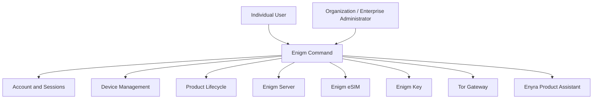

Enigm Command is the web control panel product in the Enigm ecosystem. It is the administrative and account-management surface for individual users, organizations, and enterprise administrators.

Enigm Command is not a messaging client. It must not provide access to message plaintext, secure call content, private key material, decrypted attachments, or implementation-sensitive communication state.

## Overview

Enigm Command provides authorized workflows for account lifecycle, connected-device visibility, active session control, product lifecycle management, payment workflows, Enigm Server administration, Enigm eSIM management, Enigm Key lifecycle visibility, Tor Gateway access for selected public web surfaces, Enyra Product Assistant, Active Defense review context, and managed-device operations.

Enigm Command supports administrative visibility into security state, but security state visibility is not equivalent to message visibility.

The diagram is conceptual. It shows administrative surfaces, not internal routes or operational topology.

## Core Responsibilities

Enigm Command is responsible for:

- Account lifecycle and deletion workflows.
- Platform data deletion workflows where policy and legal boundaries allow.
- Active session review and closure.
- Connected-device visibility and device removal.
- Device revocation and replacement workflows.
- Enigm OS managed-device lifecycle when the user enables managed-device mode.
- Supported product purchase, entitlement, and lifecycle workflows.
- Enigm Server purchase, creation, region selection, join request review, membership, content lifecycle, and deletion.
- Enigm eSIM purchase, activation lifecycle, account association, unlinking, deletion, and retirement.
- Enigm Key associated-device visibility, loss handling, revocation, and replacement.
- Tor Gateway lifecycle and policy for selected public web surfaces.
- Enyra Product Assistant guidance for account, device, product, configuration, and navigation workflows.

Product lifecycle visibility is not protected content visibility. Enigm Command product workflows must remain separate from message plaintext, secure call content, media content, attachment plaintext, user conversations, and private key material.

## Documentation Map

- [Product Lifecycle](/command/product-lifecycle) explains product purchase, activation, entitlement, and lifecycle workflows.
- [Device and Session Management](/command/device-session-management) explains account, device, session, managed-device, and remote-wipe boundaries.
- [Enyra Product Assistant](/command/product-assistant) explains product guidance and the boundary between product assistance and security intelligence.
- [Payment Privacy](/command/payments) explains payment methods, reduced identity linkage, Code Coin, invoices, and commercial boundaries.
- [Tor Gateway](/command/tor-gateway) explains selected onion access for public web surfaces.

## Security Boundaries

Enigm Command has explicit security boundaries:

- Enigm Command does not provide access to message plaintext.
- Administrative capabilities do not bypass end-to-end encryption.
- Device management and message access are separate trust domains.
- Enigm Server management and message plaintext access are separate trust domains.
- Server-scoped lifecycle controls affect encrypted content availability and lifecycle, not content visibility or decryption.
- Tor Gateway access is limited to selected public web surfaces and does not expose internal infrastructure.
- Security state visibility is not equivalent to message visibility.
- Enigm Command actions must not expose private key material.
- Product assistance must not expand access beyond the user's authorized Enigm Command role.

Administrative workflows should be authenticated, authorized, scoped, and auditable.

## Privacy Considerations

Enigm Command should expose only the information required for administrative review, device lifecycle control, policy management, product lifecycle, and security event visibility.

Privacy considerations include:

- Use Privacy-Preserving Device Handles for device correlation.
- Avoid exposing unnecessary identity metadata.
- Separate account state from message content.
- Separate device lifecycle state from message plaintext.
- Separate product lifecycle state from protected communications.
- Minimize security event metadata to what is required for review and audit.
- Limit Active Defense network-behavior finding visibility to authorized review contexts.
- Avoid exposing protected content in administrative views.

See [Platform Limitations](/legal/limitations).

## Threat Model References

Relevant threat-model areas include Enigm Command abuse, account and app compromise, device lifecycle abuse, Enigm OS policy bypass where deployed, managed device misuse, product lifecycle abuse, and loss of audit visibility.
