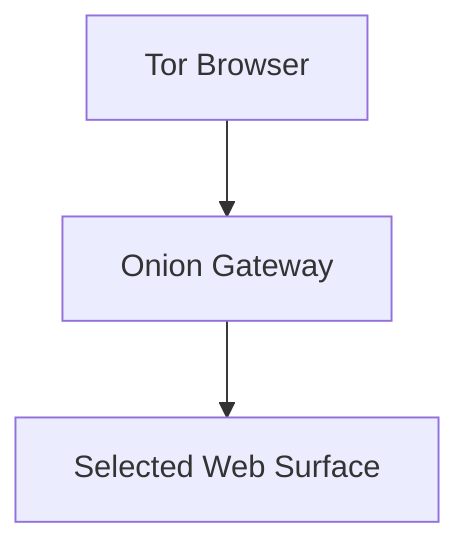

The Enigm Tor Gateway is a privacy-oriented access layer for selected public web surfaces. It is not the primary Enigm platform and is not intended to replace the main infrastructure.

The Tor Gateway exists to provide privacy-preserving access paths for supported public-facing services while preserving separation from sensitive platform services.

Tor Gateway is not Enigm Server. Enigm Server provides dedicated private messaging environments; Tor Gateway provides selected web-surface access paths.

The Tor Gateway is implemented in production for supported public-facing Enigm web surfaces.

## Overview

The Tor Gateway supports public web access through onion services for selected public-facing Enigm surfaces.

It is designed to reduce exposure of selected web access paths and to support users who choose Tor Browser. It does not define the core Enigm App security model, secure messaging model, secure call model, Enigm Command authorization model, or device-management model.

## Purpose

The Tor Gateway is intended to:

- Support privacy-preserving access paths for selected public-facing services.
- Reduce dependency on clearnet access paths for supported public web surfaces.
- Apply the principle of minimum exposure.
- Keep public web access separate from sensitive platform services.
- Support a read-oriented access model where appropriate.

The Tor Gateway is not intended to replace Enigm App, VPN Service, Proxy Network, Enigm eSIM connectivity, Enigm Command authorization, Enigm Server, secure messaging, secure calls, or Enigm OS.

## Onion Access Model

The onion access model provides public web access through onion services for supported surfaces.

At a high level:

1. A user chooses Tor Browser.
2. The user accesses a supported onion service.
3. The Onion Gateway exposes a selected public web surface.
4. Sensitive platform services remain outside the Tor Gateway access model.

Public documentation must not expose onion service configuration, private service layout, routing behavior, operational procedures, or deployment topology.

## Supported Service Categories

Supported service categories are limited to selected public-facing web surfaces.

Supported public onion surfaces include:

<CardGroup cols={2}>
  <Card title="Enigm Website" href="http://enigmkdls3b5fbjnkfi7rxzd4j7iz4z6ppk4pbhocyqolizyseyb33qd.onion">
    Public Enigm website access through the Tor Gateway.
  </Card>
  <Card title="Enigm Command" href="http://app.enigmkdls3b5fbjnkfi7rxzd4j7iz4z6ppk4pbhocyqolizyseyb33qd.onion">
    Public Enigm Command access path through the Tor Gateway.
  </Card>
  <Card title="Enigm Status" href="http://status.enigmkdls3b5fbjnkfi7rxzd4j7iz4z6ppk4pbhocyqolizyseyb33qd.onion">
    Public service-status access through the Tor Gateway.
  </Card>
  <Card title="Enigm Documentation" href="http://docs.enigmkdls3b5fbjnkfi7rxzd4j7iz4z6ppk4pbhocyqolizyseyb33qd.onion">
    Public documentation access through the Tor Gateway.
  </Card>
</CardGroup>

| Public surface | Clearnet address | Onion address |
| --- | --- | --- |
| Enigm Website | `enigm.io` | `http://enigmkdls3b5fbjnkfi7rxzd4j7iz4z6ppk4pbhocyqolizyseyb33qd.onion` |
| Enigm Command | `app.enigm.io` | `http://app.enigmkdls3b5fbjnkfi7rxzd4j7iz4z6ppk4pbhocyqolizyseyb33qd.onion` |
| Enigm Status | `status.enigm.io` | `http://status.enigmkdls3b5fbjnkfi7rxzd4j7iz4z6ppk4pbhocyqolizyseyb33qd.onion` |
| Enigm Documentation | `docs.enigm.io` | `http://docs.enigmkdls3b5fbjnkfi7rxzd4j7iz4z6ppk4pbhocyqolizyseyb33qd.onion` |

These onion addresses are public access paths for the listed surfaces only. They do not imply access to internal systems, operational tooling, private service topology, or protected platform workflows.

Supported categories include:

- Public documentation.
- Public security information.
- Public contact or disclosure information.
- Other public read-oriented resources approved for onion access.

The Tor Gateway is not intended for:

- Internal administrative interfaces.
- Sensitive internal services.
- Infrastructure management.
- Development systems.
- Internal APIs.
- Operational tooling.

## Security Boundaries

The Tor Gateway is a public access boundary, not a trust boundary for protected platform operations.

Security boundaries include:

- Public web surfaces are separated from sensitive platform services.
- Enigm Command public access remains subject to normal authentication, authorization, session policy, and critical-operation controls.
- Internal administrative workflows are excluded from the Tor Gateway access model.
- Internal platform-management and infrastructure-management workflows are excluded.
- Internal operational workflows are excluded.
- Account, device, messaging, and call workflows remain governed by their normal Enigm security boundaries. Tor Gateway changes the public access path for supported surfaces; it does not weaken authorization, content confidentiality, Device Trust, or end-to-end encryption.

The principle of minimum exposure applies: only public surfaces that need onion access should be exposed through the gateway.

## Privacy Considerations

The Tor Gateway provides additional privacy benefits for users who choose Tor Browser for supported public-facing Enigm web surfaces.

Privacy benefits may include:

- Reduced dependence on clearnet access paths for supported public surfaces.
- Additional separation between user network origin and selected public web access.
- Reduced exposure of some network-level access patterns.

The Tor Gateway does not ensure identity protection in every environment. User behavior, browser configuration, endpoint security, and external signals remain relevant.

## Relationship With Other Enigm Components

The Tor Gateway is one supporting component in the broader Enigm ecosystem.

Its relationship with other components:

- **Enigm App**: separate from app-level secure messaging, secure calls, and key management.
- **Enigm Command**: may expose a public access entry point through the Tor Gateway, but the Tor Gateway does not bypass Enigm Command authentication, authorization, session policy, or critical-operation controls.
- **Enigm Server**: separate dedicated private messaging environment product.
- **VPN Service**: separate transport privacy layer with different purpose.
- **Proxy Network**: separate traffic-separation layer for platform mediation.
- **Enigm eSIM**: separate mobile data connectivity component.
- **Enigm OS**: optional device-hardening layer, not required for Tor Gateway public web access.

## Threat Model Considerations

The Tor Gateway is relevant to public web access, minimum exposure, separation of public surfaces, and clearnet dependency reduction.

Relevant threat-model areas include public surface exposure, misconfiguration of public access boundaries, unintended exposure of sensitive workflows, endpoint compromise, user disclosure, and loss of audit visibility.

Threat modeling should verify that gateway-accessible surfaces are public-safe and do not expose administrative, development, internal, or operational workflows.

See [Platform Limitations](/legal/limitations).
