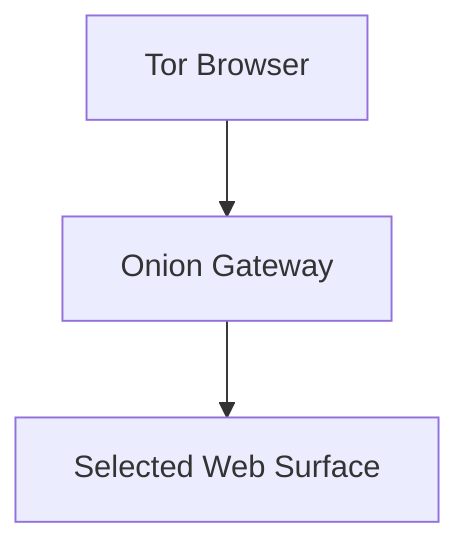

The Enigm Tor Gateway is a privacy-oriented access layer for selected public and administrative web surfaces. It is not the primary Enigm platform and is not intended to replace the main infrastructure.

The Tor Gateway exists to provide privacy-preserving access paths for supported public-facing services and selected Enigm Command access paths when enabled, while preserving separation from sensitive platform services.

Tor Gateway is not Enigm Server. Enigm Server provides dedicated private messaging environments; Tor Gateway provides selected web-surface access paths.

This document is intended for security auditors, enterprise customers, technical partners, and security engineers. It describes the public Tor Gateway architecture without exposing infrastructure relationships, deployment scale, private topology, non-public service names, sensitive routes, or implementation-sensitive details.

## Overview

The Tor Gateway supports public web access through onion services for selected public-facing Enigm surfaces and selected Enigm Command access paths when enabled.

It is designed to reduce exposure of selected web access paths and to support users who choose Tor Browser. It does not define the core Enigm App security model, secure messaging model, secure call model, Enigm Command authorization model, or device-management model.

## Purpose

The Tor Gateway is intended to:

- Support privacy-preserving access paths for selected public-facing services and selected Enigm Command access paths when enabled.
- Reduce dependency on clearnet access paths for supported public web surfaces.
- Apply the principle of minimum exposure.
- Keep public web access separate from sensitive platform services.
- Support a read-oriented access model where appropriate.

The Tor Gateway is not intended to replace Enigm App, VPN Service, Proxy Network, Enigm eSIM connectivity, Enigm Command authorization, Enigm Server, secure messaging, secure calls, or Enigm OS.

## Onion Access Model

The onion access model provides public web access through onion services for supported surfaces.

At a high level:

1. A user chooses Tor Browser.
2. The user accesses a supported onion service.
3. The Onion Gateway exposes a selected public or administrative web surface.
4. Sensitive platform services remain outside the Tor Gateway access model.

Public documentation must not expose onion service configuration, private service layout, routing behavior, operational procedures, or deployment topology.

## Supported Service Categories

Supported service categories are limited to selected public-facing web surfaces and selected Enigm Command access paths when enabled.

Examples of supported categories may include:

- Public documentation.
- Public security information.
- Public contact or disclosure information.
- Enigm Command access paths when enabled.
- Other public read-oriented resources approved for onion access.

The Tor Gateway is not intended for:

- Sensitive administrative interfaces outside the supported Enigm Command access model.
- Sensitive internal services.
- Infrastructure management.
- Development systems.
- Internal APIs.
- Operational tooling.

## Security Boundaries

The Tor Gateway is a public access boundary, not a trust boundary for protected platform operations.

Security boundaries include:

- Public web surfaces are separated from sensitive platform services.
- Administrative workflows are limited to selected Enigm Command access paths when enabled.
- Platform management workflows are excluded.
- Internal operational workflows are excluded.
- Sensitive account, device, messaging, and call workflows remain outside Tor Gateway unless explicitly documented as public-safe and authorized through Enigm Command.

The principle of minimum exposure applies: only public surfaces that need onion access should be exposed through the gateway.

## Privacy Considerations

The Tor Gateway can provide additional privacy benefits for users who choose Tor Browser.

Privacy benefits may include:

- Reduced dependence on clearnet access paths for supported public surfaces.
- Additional separation between user network origin and selected public web access.
- Reduced exposure of some network-level access patterns.

The Tor Gateway does not ensure identity protection in every environment. User behavior, browser configuration, endpoint security, and external signals remain relevant.

## Relationship With Other Enigm Components

The Tor Gateway is one supporting component in the broader Enigm ecosystem.

Its relationship with other components:

- **Enigm App**: separate from app-level secure messaging, secure calls, and key management.
- **Enigm Command**: supports selected web access paths when enabled; authorization remains governed by Enigm Command.
- **Enigm Server**: separate dedicated private messaging environment product.
- **VPN Service**: separate transport privacy layer with different purpose.
- **Proxy Network**: separate traffic-separation layer for platform mediation.
- **Enigm eSIM**: separate mobile data connectivity component.
- **Enigm OS**: optional device-hardening layer, not required for Tor Gateway public web access.

## Threat Model Considerations

The Tor Gateway is relevant to public web access, minimum exposure, separation of public surfaces, and clearnet dependency reduction.

Relevant threat-model areas include public surface exposure, misconfiguration of public access boundaries, unintended exposure of sensitive workflows, endpoint compromise, user disclosure, and loss of audit visibility.

Threat modeling should verify that gateway-accessible surfaces are public-safe and do not expose administrative, development, internal, or operational workflows.

## Security Limitations

The Tor Gateway does not protect against:

- Compromised endpoint devices.
- Unsafe browser configuration.
- User disclosure.
- Social engineering.
- Malicious content outside Enigm-controlled public surfaces.
- Misconfiguration that exposes a non-public workflow.
- Traffic analysis by sufficiently positioned observers.

The Tor Gateway does not make sensitive services public-safe. It must not be used as a path to sensitive administrative interfaces outside the supported Enigm Command access model, sensitive non-public services, infrastructure management, development systems, non-public service interfaces, or operational tooling.
