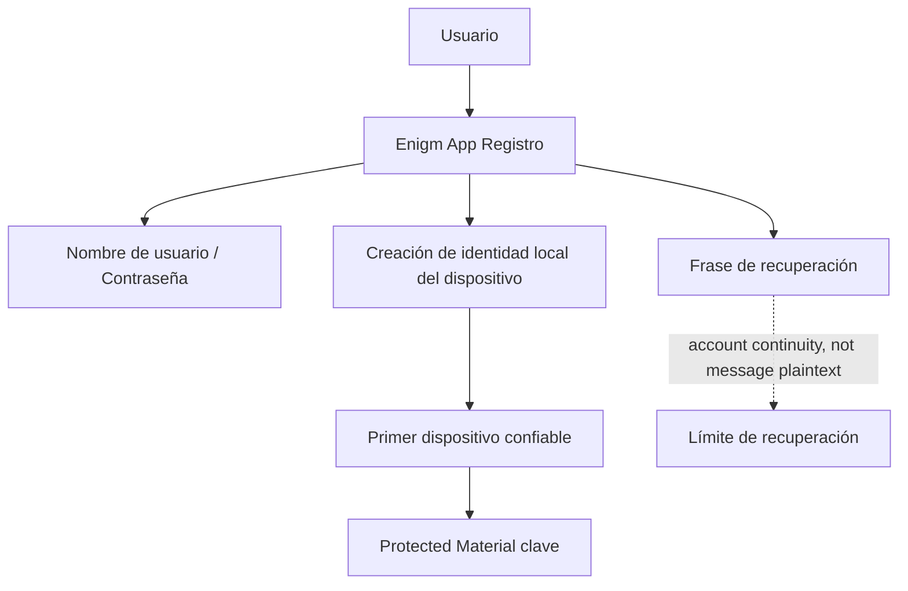

El modelo de cuenta Enigm es una arquitectura de seguridad para separar la identidad del usuario, Device Trust, el control del ciclo de vida administrativo y el contenido de los mensajes protegidos.

Enigm App es el producto principal orientado al usuario. El modelo de cuenta existe para admitir mensajería segura, llamadas seguras, flujos multi-dispositivo, límites de recuperación, administración del ciclo de vida del dispositivo y revisión de seguridad empresarial sin tratar una cuenta de usuario como equivalente a un único dispositivo físico.

## Resumen

Una cuenta Enigm representa la identidad del usuario y el contexto de la política a nivel de cuenta. Un dispositivo representa un contexto de ejecución independiente que debe asociarse explícitamente con la cuenta antes de que pueda participar en operaciones protegidas.

Esto significa:

- La incorporación y el registro de usuarios se gestionan a través de Enigm App.
- La autenticación de cuenta utiliza credenciales de nombre de usuario y contraseña.
- La recuperación se apoya a través de una frase de recuperación.
- La identidad se crea en el dispositivo durante el registro.
- Una cuenta Enigm no está vinculada a un dispositivo físico.
- Un dispositivo se puede registrar, revisar, revocar y reemplazar.
- Account Trust y Device Trust se evalúan por separado.
- Las operaciones administrativas del ciclo de vida se manejan a través de Enigm Command, donde se aplican los flujos de trabajo administrados.
- La administración de dispositivos Enigm OS opcional puede proporcionar señales de estado de confianza adicionales.
- El texto claro del mensaje permanece fuera del acceso al ciclo de vida administrativo.

## Identidad de la cuenta

La identidad de la cuenta proporciona el contexto a nivel de usuario para la autenticación, el ciclo de vida de la sesión, la autorización, el estado de recuperación y la asignación de políticas.

La identidad de la cuenta responde a preguntas como:

- ¿Qué cuenta de Enigm solicita acceso?
- ¿La sesión de la aplicación está activa y válida?
- ¿Qué política se aplica a la cuenta?
- ¿Qué dispositivos están asociados a la cuenta?
- ¿Qué límites de recuperación se aplican?

La identidad de la cuenta no establece automáticamente Device Trust, acceso a mensajes, elegibilidad de red o autoridad administrativa.

## Incorporación y registro de usuarios

El registro Enigm App está diseñado para establecer la identidad de la cuenta y el Device Trust inicial sin requerir identificadores públicos innecesarios.

El modelo de incorporación incluye:

- Credenciales de cuenta de nombre de usuario y contraseña.
- Generación de frases de recuperación.
- Creación de identidad local del dispositivo.
- Asociación explícita del primer dispositivo de confianza.
- Separación entre capacidad de recuperación y acceso normal a mensajes.

La creación de una cuenta Enigm estándar no requiere una email, un número de teléfono ni un documento de identidad. Esto apoya la minimización de la identidad y reduce la dependencia de los identificadores públicos.

El modelo de cuenta debe describirse como seudónimo y que minimiza la identidad, en lugar de ser un reclamo absoluto de borrado de identidad. El estado de la cuenta, el estado del dispositivo, los registros de pago, los eventos de seguridad, las obligaciones legales o el comportamiento del usuario aún pueden generar exposición fuera del modelo de registro estándar.

El registro debe tratarse como un flujo de trabajo sensible a la seguridad. Una identidad recién creada, el primer dispositivo asociado, el material de clave protegido y el manejo de la frase de recuperación establecen el límite de seguridad inicial de la cuenta.

El modelo de registro público es:

1. El usuario crea una cuenta Enigm en Enigm App.
2. El usuario establece las credenciales de nombre de usuario y contraseña.
3. Enigm App crea la identidad de la cuenta en el dispositivo.
4. Enigm App establece la primera asociación de dispositivo confiable.
5. Enigm App genera o presenta el flujo de trabajo de la frase de recuperación.
6. El material de claves Protected sigue regido por el modelo de gestión de claves vinculado al dispositivo.
7. La recuperación de la cuenta está separada del descifrado normal de mensajes.

## Asociación de dispositivos

La asociación de dispositivos es explícita y controlada. Un dispositivo debe estar asociado con una cuenta de Enigm antes de poder participar en mensajes seguros, llamadas seguras, sincronización de múltiples dispositivos o flujos de trabajo de dispositivos administrados.

La asociación de dispositivos admite:

- Alta de un nuevo dispositivo.
- Revisión del estado del dispositivo.
- Revocación de un dispositivo existente.
- Reemplazo de un dispositivo.
- Separación entre identidad de cuenta y Device Trust.
- Informes de estado de confianza opcionales desde Enigm OS.

## Ciclo de vida del dispositivo

El ciclo de vida del dispositivo Enigm es sensible a la seguridad y auditable.

Los estados del ciclo de vida incluyen:

- **Inscripción**: se agrega un dispositivo a una cuenta a través de un flujo autorizado.
- **Revisión**: se evalúa el ciclo de vida, la política o el estado de confianza de un dispositivo.
- **Activación**: un dispositivo se vuelve elegible para operaciones protegidas admitidas.
- **Reemplazo**: un nuevo dispositivo reemplaza a un dispositivo existente a través de un flujo autorizado.
- **Suspensión**: un dispositivo está restringido temporalmente.
- **Revocación**: un dispositivo se elimina de futuras operaciones protegidas.
- **Retiro**: un dispositivo se elimina de la gestión activa del ciclo de vida.

La revocación debería restringir el uso futuro del dispositivo para operaciones protegidas. El reemplazo debe tratarse como un nuevo evento de confianza y no como una continuación automática del dispositivo anterior.

## Account Trust y Device Trust

Account Trust y Device Trust son conceptos de seguridad separados.

Account Trust evalúa:

- Estado de autenticación.
- Ciclo de vida de la sesión.
- Estado del ciclo de vida de la cuenta.
- Estado de recuperación.
- Política a nivel de cuenta.
- Política administrativa.

Device Trust evalúa:

- Estado de inscripción.
- Revisar el estado.
- Estado de revocación.
- Estado de sustitución.
- Mango del dispositivo que preserva la privacidad.
- Estado de clave protegida asociada al dispositivo.
- Postura Trust Security Center opcional.
- Resultado Remote Attestation cuando se requiere evidencia de integridad del dispositivo.

Las operaciones Protected pueden requerir tanto un estado de cuenta confiable como un estado de dispositivo confiable.

## Ciclo de vida de la sesión

Los controles del ciclo de vida de la sesión determinan si una sesión de aplicación autenticada puede continuar realizando operaciones protegidas.

Las sesiones de Enigm App están limitadas a 6 horas. El estado del ciclo de vida de la sesión se evalúa por separado de Device Trust, el material de clave protegida, el estado de recuperación y la autorización administrativa.

La evaluación de la sesión debe considerar:

- Estado de autenticación de la cuenta.
- Estado de asociación del dispositivo.
- Estado de revocación del dispositivo.
- Cambios de política emitidos a través de Enigm Command.
- Cambios en el estado de recuperación.
- Opcional Enigm OS Señales de estado de confianza cuando se implementaron.

Una sesión no debe considerarse permanentemente válida si Device Trust cambia, comienza la recuperación de la cuenta o si la política administrativa restringe la cuenta o el dispositivo.

La caducidad o el cierre de la sesión no descifra mensajes, no exporta claves privadas ni elude la política de caducidad de mensajes. Limita el estado de acceso a la cuenta y la elegibilidad del flujo de trabajo protegido.

## Enigm Command Gestión del ciclo de vida

Enigm Command proporciona administración del ciclo de vida para la seguridad de cuentas y dispositivos en implementaciones administradas.

Enigm Command admite:

- Revisión del dispositivo.
- Revocación del dispositivo.
- Flujos de trabajo de reemplazo de dispositivos.
- Revisión y cierre de sesión activa.
- Flujos de trabajo completos de eliminación de cuentas.
- Flujos de trabajo de eliminación de datos de la plataforma.
- Asignación de póliza de cuenta.
- Configuración del modo de dispositivo administrado.
- Revisión de la postura de seguridad.
- Revisión de auditoría.

Las acciones administrativas no deben otorgar acceso al texto claro del mensaje, al material de clave privada, al contenido seguro de la llamada o al estado del protocolo sensible a la implementación.

## Modo de dispositivo administrado y borrado remoto

El modo de dispositivo administrado es una capacidad opcional para implementaciones donde el usuario habilita las capacidades del dispositivo administrado de Enigm.

Cuando las capacidades de los dispositivos administrados están habilitadas, los flujos de trabajo autorizados pueden admitir acciones de administración de dispositivos, como la aplicación de políticas, actualizaciones del ciclo de vida del dispositivo y borrado remoto.

El borrado remoto solo está disponible cuando el usuario habilita las capacidades del dispositivo administrado por Enigm. Debe tratarse como una operación de dispositivo administrado, no como una operación de cuenta general.

El borrado remoto no es un mecanismo para acceder al texto claro de los mensajes. Su propósito es el control del ciclo de vida de los dispositivos y la reducción de riesgos para los dispositivos administrados.

## Opcional Enigm OS Estado de confianza

Enigm OS puede proporcionar señales de estado de confianza adicionales cuando se implementa como una capa de dispositivo segura dedicada.

Las señales incluyen:

- Postura Trust Security Center.
- Estado de gestión del dispositivo.
- Estado de la política de red.
- Estado del modo de privacidad.
- Estado de verificación OTA.
- Resultado Remote Attestation cuando se requiere evidencia de integridad del dispositivo.

Estas señales pueden fortalecer las decisiones Device Trust. El modelo de cuenta Enigm sigue siendo válido cuando Enigm OS no está presente.

## Límites de recuperación de cuenta

Los flujos de recuperación deben diseñarse de modo que no debiliten la confidencialidad normal de los mensajes.

La recuperación ayuda a restaurar el acceso a la cuenta, reemplazar un dispositivo o restablecer la asociación del dispositivo. La recuperación no debe otorgar automáticamente acceso al texto claro del mensaje o al material de clave privada.

Este límite separa la continuidad del acceso a la cuenta del acceso al contenido del mensaje protegido.

La frase de recuperación es material de recuperación de cuenta, no un mecanismo para descifrar silenciosamente el historial de mensajes. Los flujos de trabajo de recuperación deben permanecer separados del descifrado de mensajes normal y del establecimiento de múltiples Device Trust.

## Minimización de metadatos de identidad

El modelo de cuenta debe minimizar la dependencia de identificadores públicos siempre que sea posible.

Enigm debe evitar exponer metadatos de identidad innecesarios en:

- Documentación pública.
- Registros de rutina.
- Auditoría de exportaciones.
- Enigm Command vistas.
- Registros del ciclo de vida del dispositivo.
- Soporte de flujos de trabajo.

Cuando se requiere correlación, se debe preferir Privacy-Preserving Device Handles a los identificadores públicos directos.

## Separación de identidad, dispositivo y contenido del mensaje

El modelo de cuenta separa:

- **Identidad**: el contexto de la política a nivel de usuario y cuenta.
- **Dispositivo**: el contexto de ejecución inscrito y su estado de confianza.
- **Contenido del mensaje**: contenido protegido manejado por flujos de trabajo de mensajería seguros.

Enigm Command puede gestionar la identidad y el estado del ciclo de vida del dispositivo. No debe convertirse en una superficie de acceso a texto claro de mensajes.

## Consideraciones de seguridad

### Inscripción de dispositivo

La inscripción de dispositivos debe ser explícita, autorizada y auditable. Un dispositivo recién inscrito no debería heredar automáticamente toda la confianza histórica.

### Revocación del dispositivo

La revocación del dispositivo debería restringir las operaciones protegidas futuras para ese dispositivo y debería afectar la elegibilidad de sesión, clave y sincronización de acuerdo con la política.

### Ciclo de vida de la sesión

El ciclo de vida de la sesión debe responder al estado de la cuenta, al estado del dispositivo, a los eventos de recuperación y a los cambios de política administrativa.

### Límites de recuperación de cuenta

La recuperación debe respaldar la continuidad sin debilitar la confidencialidad de los mensajes ni exponer material de clave privada.

### Enigm Command límites de seguridad

Enigm Command debe proporcionar control del ciclo de vida y de políticas, no acceso al texto claro del mensaje.

### Modo de dispositivo administrado

El modo de dispositivo administrado habilita capacidades adicionales de administración de dispositivos solo cuando el usuario habilita las capacidades de dispositivos administrados de Enigm.

### Informes de estado de confianza

### Identificadores que preservan la privacidad

Los identificadores que preservan la privacidad deben respaldar el ciclo de vida y la correlación de auditoría al tiempo que reducen la exposición innecesaria de los metadatos de identidad.

### Separación de identidad, dispositivo y contenido

La identidad, la asociación de dispositivos y el contenido del mensaje deben seguir siendo dominios de control separados.

## Límites de confianza

Los principales límites de confianza son:

- Usuario a la sesión de la cuenta Enigm App.
- Identidad de cuenta para asociación de dispositivo.
- Asociación de dispositivos a material de claves protegido.
- Device Trust para proteger mensajes y llamadas.
- Enigm Command a la cuenta y al ciclo de vida del dispositivo.
- Modo de dispositivo administrado para capacidad de borrado remoto.
- Opcional Enigm OS Estado de confianza en Device Trust.
- Flujo de trabajo de recuperación para el acceso normal a mensajes.

## Limitaciones

Ver [Limitaciones de la plataforma](/es/legal/limitations).

## Referencias de modelos de amenazas

Las áreas relevantes del modelo de amenazas incluyen el compromiso de cuentas y aplicaciones, abuso del ciclo de vida del dispositivo, abuso de Enigm Command, omisión de políticas Enigm OS donde se implementa, manipulación de inteligencia y pérdida de visibilidad de la auditoría.
