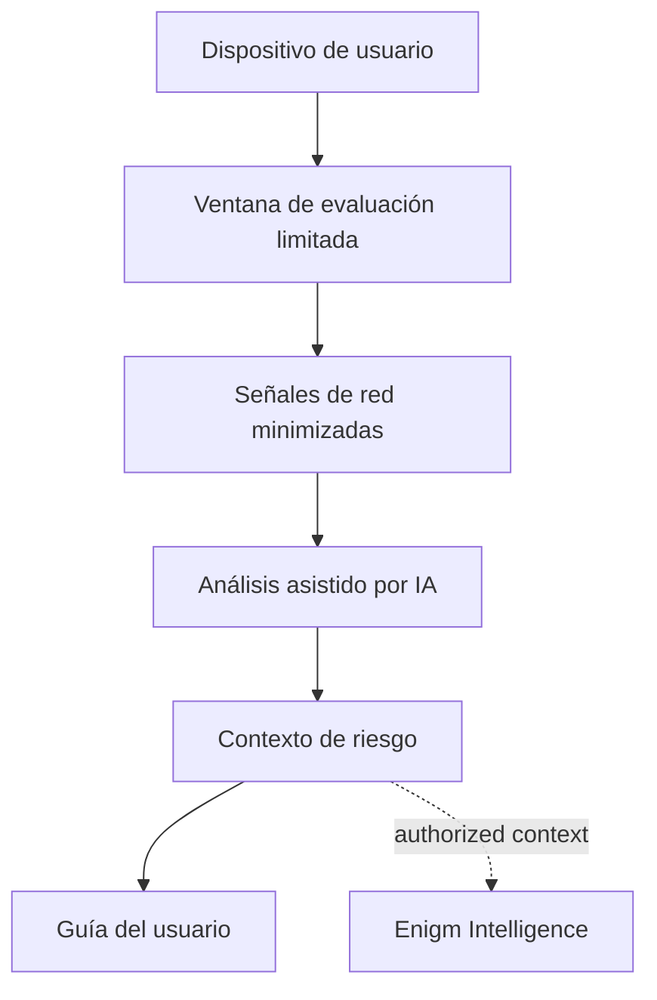

Active Defense es una capacidad de seguridad Enigm App diseñada para ayudar a los usuarios a evaluar el riesgo de spyware, malware y comportamiento sospechoso de la red móvil sin inspeccionar las comunicaciones protegidas.

No es una función de mensajería, ni una omisión administrativa, ni una garantía de que un dispositivo esté libre de riesgos. Active Defense existe para proporcionar visibilidad de seguridad que preserva la privacidad y respalda las decisiones de los usuarios, la evaluación de Device Trust y los flujos de trabajo de respuesta defensiva cuando la política lo permite.

## Resumen

Active Defense analiza el comportamiento de la red relevante para la seguridad desde el teléfono del usuario durante un período de evaluación limitado. El objetivo es identificar indicadores que puedan ser consistentes con malware móvil, software espía comercial, herramientas de vigilancia, comportamiento de comando y control o actividad similar a la exfiltración.

Active Defense está disponible en producción para un grupo de usuarios seleccionado.

Active Defense está diseñado como una capacidad no intrusiva:

- No requiere acceso root.
- No requiere acceso amplio al sistema de archivos.
- No descifra el tráfico de la capa de aplicación.
- No inspecciona el texto en claro de los mensajes, el contenido de las llamadas, los medios, los archivos adjuntos, los documentos o las conversaciones de los usuarios.
- Analiza señales técnicas minimizadas, comportamiento del flujo de red, características del protocolo y hallazgos de seguridad.

Active Defense es parte de Enigm App. Enigm OS puede proporcionar señales adicionales de integridad del dispositivo cuando se implementa, pero Active Defense sigue siendo una capacidad de seguridad a nivel de aplicación.

## Propósito

Active Defense está diseñado para evaluar el riesgo de malware móvil y el riesgo de actividad sospechosa de dispositivos sin inspeccionar las comunicaciones protegidas.

El objetivo es proporcionar un contexto de seguridad que preserve la privacidad y que pueda respaldar:

- Decisiones de seguridad del usuario.
- Evaluación Device Trust.
- Decisiones sobre el ciclo de vida de cuentas y dispositivos.
- Enigm Command revisar los flujos de trabajo cuando estén autorizados.
- Correlación Enigm Intelligence cuando la política lo permita.

Active Defense no es un sistema de extracción forense, ni un sistema de inspección de contenido, ni un mecanismo de acceso administrativo a comunicaciones protegidas.

## Señales de seguridad

Active Defense evalúa señales de seguridad minimizadas.

Las categorías de señales de seguridad pueden incluir:

- Estado de seguridad del dispositivo.
- Señales de integridad de la aplicación.
- Indicadores de riesgo de red.
- Indicadores de comportamiento sospechoso.
- Hallazgos de riesgo de malware.
- Hallazgos de seguridad.
- Contexto de riesgo del dispositivo.
- Características del flujo de la red.
- Protocolo y características de transporte.
- Señales de postura del dispositivo cuando estén disponibles.

Estas categorías están documentadas únicamente a nivel de arquitectura pública. La documentación pública no revela lógica de detección, reglas, umbrales, firmas, herramientas internas ni parámetros operativos.

## Qué Active Defense no inspecciona

Active Defense no debe inspeccionar:

- Mensaje en texto en claro.
- Llamar contenido.
- Contenido multimedia.
- Adjuntos.
- Conversaciones de usuarios.
- Claves privadas.
- Frases de recuperación en texto en claro.
- Material de clave privada mantenido en el dispositivo.

El contenido de Protected permanece fuera del modelo de análisis de Active Defense.

## Procesamiento en el dispositivo

Las evaluaciones Active Defense las inicia el usuario desde Enigm App. El usuario puede ver cuando el análisis está activo.

Active Defense está diseñado para procesar señales relevantes para la seguridad desde el dispositivo con el menor acceso necesario para la evaluación.

El procesamiento en el dispositivo debe priorizar:

- Señales técnicas minimizadas.
- Contexto de seguridad más que contenido.
- Evaluación de riesgos del dispositivo local cuando sea posible.
- Visibilidad del usuario cuando la actividad de evaluación está activa.
- Separación de comunicaciones protegidas y material de clave privada.

El procesamiento en el dispositivo no debe debilitar el cifrado de extremo a extremo Enigm App, el almacenamiento seguro, el material de claves protegido o los controles del ciclo de vida de los mensajes.

## Procesamiento en servidor

El análisis Active Defense se realiza en un entorno de análisis VPN controlado por Enigm.

Los datos de análisis están protegidos en tránsito y en reposo. El procesamiento en servidor sigue estando limitado a fines de seguridad y utiliza un contexto de seguridad minimizado. No debe requerir texto en claro del mensaje, contenido de la llamada, contenido multimedia, archivos adjuntos, conversaciones de usuarios o claves privadas.

Cuando los hallazgos de Active Defense se comparten con Enigm Intelligence o Enigm Command, el acceso debe permanecer dentro del alcance de la autorización y estar separado del contenido protegido.

## Minimización de telemetría

Se debe minimizar la telemetría Active Defense.

Minimización de telemetría significa:

- Prefiera el contexto de seguridad agregado a las observaciones sin procesar cuando sea posible.
- Evitar metadatos de identidad innecesarios.
- Utilice identificadores que preserven la privacidad cuando se requiera correlación de dispositivos.
- Separar los hallazgos del contenido protegido.
- Evite una retención amplia de observaciones de red sin procesar cuando el contexto de seguridad sea suficiente.

## Retención de datos

Active Defense no conserva los datos de análisis sin procesar una vez que se completa el flujo de trabajo de evaluación.

El estado Active Defense retenido se limita a encontrar metadatos y contexto de seguridad visible para el usuario, como si se detectó un comportamiento sospechoso, gravedad, categoría y recomendación.

El usuario controla si los resultados de Active Defense permanecen disponibles en la aplicación o se eliminan.

## Control de acceso

El acceso a los hallazgos de Active Defense debe restringirse a los flujos de trabajo de seguridad autorizados.

El control de acceso debe:

- Revisión del alcance por rol de usuario, contexto de cuenta, contexto de dispositivo y política.
- Preservar la separación de las comunicaciones protegidas.
- Proteger los hallazgos como información sensible a la seguridad.
- Evite ampliar el acceso a través de flujos de trabajo conversacionales, administrativos o de soporte.
- Asegúrese de que la visibilidad de Enigm Command no se convierta en visibilidad del contenido del mensaje.

## Objetivos de diseño

Active Defense está diseñado para:

- Apoyar la evaluación de riesgos de malware y spyware móvil.
- Identificar comportamientos sospechosos de la red durante ventanas de evaluación definidas.
- Detectar indicadores consistentes con actividad avanzada de software espía dirigido sin pretender una detección completa de ninguna familia específica.
- Proporcionar resultados de cara al usuario, contexto de gravedad y recomendaciones.
- Reducir la incertidumbre en torno a Device Trust.
- Preservar la confidencialidad del contenido durante el análisis de seguridad.
- Admite correlación Enigm Intelligence cuando esté autorizado y permitido por la política.
- Mejorar la privacidad ayudando a los usuarios a identificar las condiciones del dispositivo que pueden exponer las comunicaciones protegidas.

El objetivo es la reducción de riesgos y la visibilidad de la seguridad, no la determinación absoluta de un compromiso.

## Modelo de evaluación no intrusivo

Active Defense está diseñado en torno al análisis del comportamiento de la red en lugar de la inspección del contenido del dispositivo.

El modelo de evaluación se centra en:

- Metadatos de red y características de flujo.
- Temporización, recurrencia y comportamiento de ráfaga.
- Protocolo y características de transporte.
- Comportamiento de resolución de nombres.
- Indicadores de certificado e integridad del canal.
- Contexto destino-riesgo.
- Indicadores de canales encubiertos.
- Correlación multiseñal.

Active Defense debe evitar una inspección amplia del sistema de archivos, el descifrado de contenido o el acceso innecesario a datos privados de la aplicación. El modelo preferido es el análisis de señales de seguridad minimizado que respalda la evaluación del riesgo de malware y al mismo tiempo preserva la confidencialidad del contenido del usuario.

## Análisis del comportamiento de la red

El software espía móvil avanzado a menudo permanece invisible en el nivel de la interfaz de usuario, pero sus fases operativas aún pueden producir un comportamiento observable en la red. Active Defense está diseñado para evaluar esos patrones de comportamiento de la red sin leer contenido de carga útil cifrado.

Ejemplos de categorías de comportamiento incluyen:

- Balizamiento periódico o patrones de comunicación salientes recurrentes.
- El comportamiento del protocolo no coincide con la actividad esperada del dispositivo.
- Patrones de destino o enrutamiento que requieren revisión.
- Asimetría inusual de carga/descarga.
- Patrones de tráfico cifrados con entropía High asociados con canales no estándar.
- Comportamiento de DNS consistente con túneles, dominios generados o patrones de resolución inusuales.
- Anomalías en la cadena de certificados o en las huellas dactilares del transporte.
- Discrepancia entre protocolo y puerto o comportamiento similar al de un túnel.
- Temporización de ráfagas que puede ser coherente con la transferencia de datos por etapas.

Estas categorías están documentadas únicamente en un nivel alto. La documentación pública no revela reglas de detección, firmas, umbrales, fuentes de inteligencia, lógica de correlación ni parámetros operativos.

## Análisis de riesgos asistido por IA

Active Defense utiliza análisis asistido por IA para evaluar señales de comportamiento de la red y producir un contexto de seguridad.

La capa de IA está diseñada para admitir:

- Correlación multiseñal.
- Reconocimiento de patrones en categorías de comportamiento de red.
- Hallazgos basados ​​en la confianza.
- Clasificación de gravedad.
- Recomendaciones legibles por el usuario.
- Contexto de escalada para Enigm Intelligence cuando esté autorizado.

El análisis asistido por IA no determina de forma independiente la verdad de la plataforma. Los hallazgos deben tratarse como un contexto de seguridad que respalde la revisión del usuario, las decisiones Device Trust y los flujos de trabajo de investigación de seguridad.

## Modelo de análisis de amenazas

Active Defense evalúa categorías de comportamiento de seguridad en lugar de exponer la lógica de detección interna.

El análisis puede considerar:

- Comportamiento de la red asociado a patrones de comunicación sospechosos.
- Características del destino y protocolo.
- Comportamiento seguro de resolución de nombres.
- Anomalías dactiloscópicas en el transporte.
- Indicadores de certificado e integridad del canal.
- Comportamiento de conexión repetido o inusual.
- Características de temporización, volumen y ráfaga.
- Metadatos de tráfico cifrados donde no se requiere inspección para leer el contenido de la carga útil.
- Posibles indicadores de canales encubiertos.
- Señales de postura e integridad del dispositivo cuando estén disponibles.
- Hallazgos de seguridad producidos por las protecciones de la plataforma.
- Correlación entre múltiples indicadores de seguridad independientes.

Active Defense debe tratar los hallazgos individuales como contexto de seguridad. Una sola observación puede ser informativa, mientras que las observaciones relacionadas en múltiples categorías pueden aumentar la confianza en que la revisión del usuario es apropiada.

## Riesgo de malware y spyware

Active Defense tiene como objetivo ayudar a identificar patrones de riesgo asociados con malware móvil, spyware, stalkerware, herramientas de vigilancia comercial y spyware dirigido avanzado.

Ejemplos de categorías de riesgo incluyen:

- Comportamiento sospechoso de comunicación saliente.
- Temporización inusual de la red o recurrencia de la conexión.
- El comportamiento del protocolo no coincide con la actividad esperada del dispositivo.
- Posibles patrones de comunicación de comando y control.
- Posible comportamiento del tráfico similar a una exfiltración.
- Posible comportamiento de devolución de llamada posterior al compromiso después del acceso físico o la exposición del dispositivo.
- Degradación de la postura del dispositivo que puede afectar las decisiones de confianza.

Active Defense puede ayudar a identificar comportamientos consistentes con clases avanzadas de software espía. No debe interpretarse como una garantía de que se detectará cada familia de software espía, implante, cadena de explotación u operación de vigilancia dirigida.

## Flujos de trabajo de evaluación

Active Defense admite evaluaciones de seguridad iniciadas por el usuario.

Los modos de evaluación conceptual incluyen:

- **Evaluación bajo demanda**: iniciada por el usuario antes o después de una actividad sensible a la seguridad.
- **High-evaluación de revisión de riesgos**: iniciada por el usuario después de sospecha de incautación, manipulación, exposición o comportamiento inusual del dispositivo.

Los flujos de trabajo de evaluación deben diseñarse para:

- Mantener informado al usuario cuando el análisis esté activo.
- Evitar el acceso innecesario a contenidos privados.
- Producir hallazgos comprensibles.
- Separar las observaciones informativas de los hallazgos de mayor riesgo.
- Recomendar próximos pasos sin sacar conclusiones sin fundamento.

La duración de la evaluación y el manejo de informes son preocupaciones de configuración del producto. La documentación pública no publica valores de tiempo, parámetros de captura, umbrales de análisis ni detalles del flujo de trabajo operativo.

## Modelo de privacidad

Active Defense está diseñado para respaldar la privacidad en lugar de ampliar la vigilancia del usuario.

El modelo de privacidad se basa en:

- Minimización de datos.
- Limitación de finalidad.
- Confidencialidad del contenido.
- Asas del dispositivo que preservan la privacidad.
- Reducción de la exposición de la identidad.
- Contexto de seguridad en lugar de una amplia colección de contenido de usuario.

Active Defense no está diseñado para inspeccionar:

- Mensaje en texto en claro.
- Llamar contenido.
- Contenido multimedia.
- Adjuntos.
- Documentos.
- Conversaciones de usuarios.

El análisis de seguridad utiliza señales técnicas minimizadas y metadatos de búsqueda. Los datos del análisis Active Defense sin procesar no se conservan una vez que se completa el flujo de trabajo de evaluación.

## Relación con Enigm App

Enigm App sigue siendo el principal producto de cara al usuario. Active Defense amplía la aplicación con visibilidad de seguridad del comportamiento de la red que puede ayudar a los usuarios a tomar decisiones de privacidad y Device Trust.

Active Defense admite:

- Revisión de seguridad del dispositivo.
- Orientación del usuario tras hallazgos sospechosos.
- Decisiones sobre el ciclo de vida de cuentas y dispositivos.
- Evaluación multi-Device Trust.
- Informes de dispositivos administrados cuando estén habilitados.

Active Defense no otorga a los sistemas administrativos acceso al contenido del mensaje protegido ni al material de clave privada.

## Relación con Enigm OS

Cuando se implementa Enigm OS, Active Defense puede usar señales de confianza locales adicionales, como el estado de Trust Security Center, el estado de la política de red, el estado del dispositivo administrado, el estado del modo de privacidad y la postura de integridad del dispositivo.

Enigm OS es una capa endurecedora adicional. No reemplaza el cifrado de extremo a extremo Active Defense, Enigm App ni las decisiones de confianza del usuario.

## Relación con Enigm Intelligence

Los hallazgos de Active Defense pueden contribuir al contexto de seguridad de Enigm Intelligence cuando esté autorizado y permitido por la política.

Enigm Intelligence puede correlacionar los hallazgos de Active Defense con otras señales de seguridad para respaldar la investigación, la evaluación de riesgos, la respuesta defensiva y la visibilidad del usuario autorizado. La correlación debe preservar los controles de acceso, la minimización de datos y la confidencialidad del contenido.

Active Defense no es el Threat Intelligence Platform completo. Enigm Intelligence proporciona una correlación más amplia y una evaluación de riesgos en todo el ecosistema.

## Hallazgos y orientación para el usuario

Los hallazgos de Active Defense deben proporcionar una guía de seguridad clara sin exagerar la certeza.

Los hallazgos pueden incluir:

- Observaciones de red relevantes para seguridad.
- Comportamiento sospechoso que requiere revisión.
- Correlación multiseñal Higher-riesgo.
- Impacto Device Trust.
- Acción de usuario recomendada.
- Revisión de seguridad recomendada.

La orientación puede incluir:

- Revisión recomendada.
- Device Trust puede reducirse.
- El comportamiento de la red requiere atención.
- Se recomienda actualización o revisión de configuración.
- Considere revocar o reemplazar un dispositivo si se sospecha que está comprometido.
- Contactar con el soporte de seguridad a través de los canales designados cuando corresponda.

Los hallazgos deben distinguir entre fallas políticas confirmadas, indicadores sospechosos y observaciones informativas.

## Visibilidad del usuario

Active Defense debe proporcionar un contexto de seguridad visible para el usuario.

La salida de cara al usuario debe ser comprensible y debe distinguir:

- Observaciones de seguridad institucionales.
- Hallazgos sospechosos.
- Hallazgos de riesgo Higher.
- Revisión recomendada.
- Acción de usuario recomendada.

Active Defense debe evitar presentar los hallazgos como prueba absoluta de compromiso o ausencia de compromiso.

## Consideraciones de seguridad

- Active Defense debe operar con el mínimo acceso necesario para la evaluación.
- Los hallazgos deben protegerse como información sensible a la seguridad.
- Las señales originadas en el dispositivo pueden ser menos de confianza si el dispositivo ya está comprometido.
- La correlación de señales múltiples puede mejorar la confianza pero no elimina la incertidumbre.
- Los informes de dispositivos administrados deben permanecer separados del contenido de comunicación protegido.
- El análisis de seguridad no debe debilitar el cifrado de extremo a extremo ni la protección de claves.

## Consideraciones de privacidad

Active Defense admite el modelo de privacidad de Enigm al ayudar a identificar las condiciones del dispositivo que pueden exponer las comunicaciones privadas.

Las consideraciones de privacidad incluyen:

- Evite recopilar metadatos de identidad innecesarios.
- Evite la retención amplia de observaciones de seguridad sin procesar cuando el contexto de seguridad sea suficiente.
- Evite la inspección de contenido en busca de datos de mensajes, llamadas, medios, archivos adjuntos y conversaciones.
- Utilice identificadores que preserven la privacidad para la correlación cuenta-dispositivo cuando sea posible.
- Limitar el acceso a los hallazgos según la autorización y la política.

## Límites de confianza

Los límites primarios del confianza incluyen:

- Usuario a Enigm App.
- Enigm App a Active Defense.
- Active Defense para minimizar las señales de red y seguridad.
- Active Defense a señales de confianza Enigm OS opcionales.
- Active Defense a Enigm Intelligence cuando esté autorizado.
- Active Defense hallazgos para Enigm Command revisar los flujos de trabajo.

La visibilidad administrativa de los hallazgos de Active Defense no implica visibilidad del texto en claro del mensaje, el contenido de la llamada, los medios, los archivos adjuntos o el material de clave privada.

Ver [Limitaciones de la plataforma](/es/legal/limitations).

## Referencias al modelo de amenazas

Las áreas relevantes del modelo de amenazas incluyen el compromiso de los endpoints, el riesgo de software espía, el abuso del ciclo de vida del dispositivo, la apropiación de cuentas asistida por malware, la observación de la red, la exposición de metadatos, los usuarios maliciosos de confianza, la pérdida de integridad del dispositivo y la confiabilidad reducida de las señales de seguridad originadas en el dispositivo.
