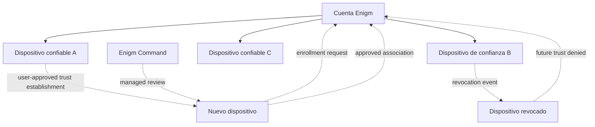

La compatibilidad con múltiples dispositivos en Enigm App es un problema de confianza y seguridad. Una cuenta Enigm puede estar asociada con múltiples dispositivos de confianza, pero cada dispositivo debe establecer confianza antes de recibir acceso a los recursos protegidos de la cuenta.

## Resumen

Una cuenta Enigm está separada de cualquier dispositivo físico. Un dispositivo se vuelve elegible para operaciones protegidas solo después de una inscripción explícita y establecimiento de confianza.

La arquitectura multidispositivo debe preservar:

- Seguridad de la cuenta.
- Confianza específica del dispositivo.
- Confidencialidad de mensajes.
- Comportamiento de revocación del dispositivo.
- Comportamiento de sustitución de dispositivos.
- Visibilidad administrativa sin acceso de texto claro a los mensajes.

Enigm OS puede contribuir con señales de integridad adicionales cuando se implemente, pero no es necesario para la arquitectura de múltiples dispositivos.

## Modelo de Device Trust

Device Trust y Account Trust son conceptos separados.

Account Trust evalúa la autenticación de la cuenta, el ciclo de vida de la sesión, la política de la cuenta y el estado de recuperación. Device Trust evalúa si un dispositivo específico está registrado, es confiable, revocado, reemplazado o restringido.

Device Trust considera:

- Estado de inscripción del dispositivo.
- Estado de asociación del dispositivo.
- Estado del dispositivo Protected.
- Estado de revocación del dispositivo.
- Estado de sustitución del dispositivo.
- Estado de desbloqueo local cuando sea relevante.
- Señales de estado de dispositivos gestionados opcionales.
- Señales de integridad Enigm OS opcionales cuando se implementen.

Una sesión de cuenta válida no establece automáticamente la confianza para un dispositivo recién introducido.

## Inscripción de dispositivo

La inscripción del dispositivo es explícita. Un nuevo dispositivo debe generar confianza antes de recibir acceso a los recursos de la cuenta protegida.

La inscripción debe verificar que el nuevo dispositivo esté autorizado para unirse al contexto de la cuenta. Los dispositivos de confianza existentes participan en los flujos de trabajo de inscripción cuando se utiliza el establecimiento de confianza aprobado por el usuario. Las implementaciones administradas también pueden usar la política Enigm Command para revisar o aprobar la inscripción.

La inscripción es sensible a la seguridad porque puede afectar:

- Acceso seguro a mensajería.
- Acceso seguro a llamadas.
- Sincronización multidispositivo.
- Material de claves protegidas asociadas al dispositivo.
- Decisiones futuras de confianza.
- Flujos de trabajo de revocación y sustitución.

## Asociación de dispositivos

La asociación de dispositivos vincula una cuenta de Enigm a un contexto de dispositivo confiable específico.

La asociación de dispositivos no debe tratarse como una actualización pasiva de metadatos. Es un evento sensible a la autorización que cambia qué dispositivos pueden participar en flujos de trabajo protegidos.

## Ciclo de vida del dispositivo confiable

Los dispositivos de confianza pasan por estados de ciclo de vida.

Los estados comunes del ciclo de vida incluyen:

- **Inscripción pendiente**: un dispositivo ha iniciado un flujo de trabajo de inscripción pero aún no es de confianza.
- **Confiable**: un dispositivo es elegible para operaciones protegidas admitidas.
- **Restringido**: un dispositivo tiene acceso reducido debido a una política, postura o estado de revisión.
- **Revocado**: ya no se confía en un dispositivo para futuras operaciones protegidas.
- **Reemplazado**: un dispositivo ha sido reemplazado por otro dispositivo.
- **Retirado**: un dispositivo se ha eliminado de la gestión activa del ciclo de vida.

Los eventos del ciclo de vida deben ser visibles a través de Enigm Command en implementaciones administradas.

## Revocación del dispositivo

La revocación del dispositivo debe afectar inmediatamente a futuras decisiones de confianza.

Un dispositivo revocado no debe seguir recibiendo contenido recién protegido. La revocación debería afectar:

- Elegibilidad futura para mensajería segura.
- Elegibilidad para futuras llamadas seguras.
- Futura sincronización multidispositivo.
- Acceso futuro a recursos de cuentas protegidas.
- Uso futuro del estado de clave protegida asociado al dispositivo.
- Estado del ciclo de vida Enigm Command.

La revocación no garantiza la eliminación del contenido ya recibido y descifrado en un dispositivo antes de la revocación. Esta es una limitación de seguridad de cualquier modelo en el que un punto final tuviera acceso autorizado previamente.

## Reemplazo del dispositivo

Se debe apoyar el reemplazo de dispositivos sin debilitar el modelo de confianza.

El reemplazo debe tratarse como un nuevo evento de confianza. Un dispositivo de reemplazo no debe heredar silenciosamente la plena confianza del dispositivo anterior sin un flujo de trabajo de confianza explícito.

Los flujos de trabajo de reemplazo deben tener en cuenta:

- Autenticación de cuenta.
- Estado anterior del dispositivo.
- Inscripción de nuevos dispositivos.
- Revocación o retiro del dispositivo anterior.
- Política de sincronización de mensajes.
- Ciclo de vida de la clave Protected.
- Revisión Enigm Command donde aplica la administración gestionada.

El reemplazo asistido por recuperación no debe otorgar automáticamente acceso de texto claro a los mensajes históricos.

## Consideraciones de seguridad para múltiples dispositivos

La operación multidispositivo debe preservar la confidencialidad de los mensajes.

Las consideraciones de seguridad incluyen:

- La inscripción del dispositivo debe ser explícita.
- Los nuevos dispositivos deben generar confianza antes de recibir recursos de la cuenta.
- La asociación de dispositivos es sensible a la seguridad.
- Los dispositivos de confianza existentes pueden participar en la inscripción cuando se utiliza el establecimiento de confianza aprobado por el usuario.
- Device Trust y Account Trust deben permanecer separados.
- Los dispositivos revocados no deben recibir contenido recién protegido.
- Los flujos multi-dispositivo no deben copiar silenciosamente material de clave privada sin un flujo de trabajo de confianza explícito.
- Las funciones administrativas no deben proporcionar acceso en texto claro a los mensajes.
- Las capacidades opcionales de dispositivos administrados pueden proporcionar señales de estado de dispositivos adicionales.
- Las señales de integridad opcionales Enigm OS pueden fortalecer las decisiones de confianza cuando se implementen.

## Integración con Enigm Command

Enigm Command proporciona visibilidad y administración del ciclo de vida de los dispositivos en implementaciones administradas.

Enigm Command puede admitir:

- Revisión de inventario de dispositivos.
- Revisión de matrícula.
- Acciones de revocación.
- Seguimiento de reposiciones.
- Revisión del estado del dispositivo administrado.
- Informes de estado de confianza.
- Revisión de auditoría.

Enigm Command no debe proporcionar acceso en texto claro a mensajes, material de clave privada, contenido de llamadas seguras o archivos adjuntos protegidos.

## Diagrama de arquitectura

Ver [Limitaciones de la plataforma](/es/legal/limitations).

## Referencias de modelos de amenazas

Las áreas relevantes del modelo de amenazas incluyen el compromiso de cuentas y aplicaciones, el abuso del ciclo de vida del dispositivo, los intentos de comprometer los mensajes seguros, los intentos de comprometer las llamadas seguras, el abuso de Enigm Command, la omisión de políticas Enigm OS cuando se implementan y la pérdida de visibilidad de la auditoría.
