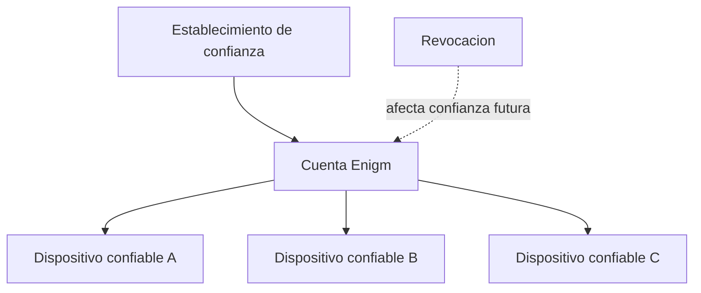

El soporte multi-dispositivo es un problema de confianza, no solo de conveniencia. Una cuenta Enigm puede asociarse a multiples dispositivos confiables.

## Overview

Los dispositivos nuevos deben establecer confianza antes de recibir acceso a recursos de cuenta o contenido protegido.

Account Trust y Device Trust son conceptos separados. Una cuenta autenticada no convierte automaticamente un dispositivo en confiable.

## Device Enrollment

El enrolamiento es explicito. Un dispositivo nuevo debe pasar por un flujo de autorización antes de incorporarse al contexto de cuenta.

Los dispositivos confiables existentes pueden participar en la incorporacion cuando el flujo lo permite.

## Device Association

La asociacion de dispositivo es una operación sensible. Debe preservar confidencialidad de mensajes y no copiar claves privadas de forma silenciosa.

## Trusted Device Lifecycle

El ciclo de vida incluye:

- Enrolamiento.
- Revisión.
- Uso normal.
- Reemplazo.
- Revocacion.

Los eventos deben ser visibles en Enigm Command cuando corresponda.

## Device Revocation

La revocacion debe afectar decisiones futuras de confianza de forma inmediata. Un dispositivo revocado no debe recibir nuevo contenido protegido.

## Device Replacement

El reemplazo debe permitir continuidad de cuenta sin debilitar el modelo de confianza ni convertir recuperacion en acceso a texto claro.

## Enigm Command Integration

Enigm Command proporciona visibilidad de dispositivos, sesiones, estado de confianza, revocacion y acciones de ciclo de vida.

La administración no proporciona acceso a mensajes, claves privadas, llamadas ni adjuntos.

Consulta [Platform Limitations](/es/legal/limitations).
