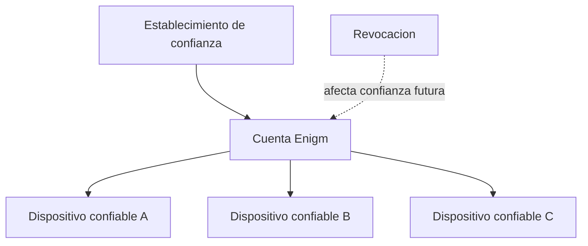

El soporte multi-dispositivo es un problema de confianza, no solo de conveniencia. Una cuenta Enigm puede asociarse a multiples dispositivos confiables.

## Resumen

Los dispositivos nuevos deben establecer confianza antes de recibir acceso a recursos de cuenta o contenido protegido.

Account Trust y Device Trust son conceptos separados. Una cuenta autenticada no convierte automáticamente un dispositivo en confiable.

## Alta de dispositivos

El enrolamiento es explicito. Un dispositivo nuevo debe pasar por un flujo de autorización antes de incorporarse al contexto de cuenta.

Los dispositivos confiables existentes pueden participar en la incorporación cuando el flujo lo permite.

## Asociación de dispositivos

La asociación de dispositivo es una operación sensible. Debe preservar confidencialidad de mensajes y no copiar claves privadas de forma silenciosa.

## Ciclo de vida de dispositivos de confianza

El ciclo de vida incluye:

- Enrolamiento.
- Revisión.
- Uso normal.
- Reemplazo.
- Revocacion.

Los eventos deben ser visibles en Enigm Command cuando corresponda.

## Revocación de dispositivos

La revocación debe afectar decisiones futuras de confianza de forma inmediata. Un dispositivo revocado no debe recibir nuevo contenido protegido.

## Sustitución de dispositivos

El reemplazo debe permitir continuidad de cuenta sin debilitar el modelo de confianza ni convertir recuperación en acceso a texto claro.

## Integración con Enigm Command

Enigm Command proporciona visibilidad de dispositivos, sesiones, estado de confianza, revocación y acciones de ciclo de vida.

La administración no proporciona acceso a mensajes, claves privadas, llamadas ni adjuntos.

Consulta [Limitaciones de plataforma](/es/legal/limitations).
