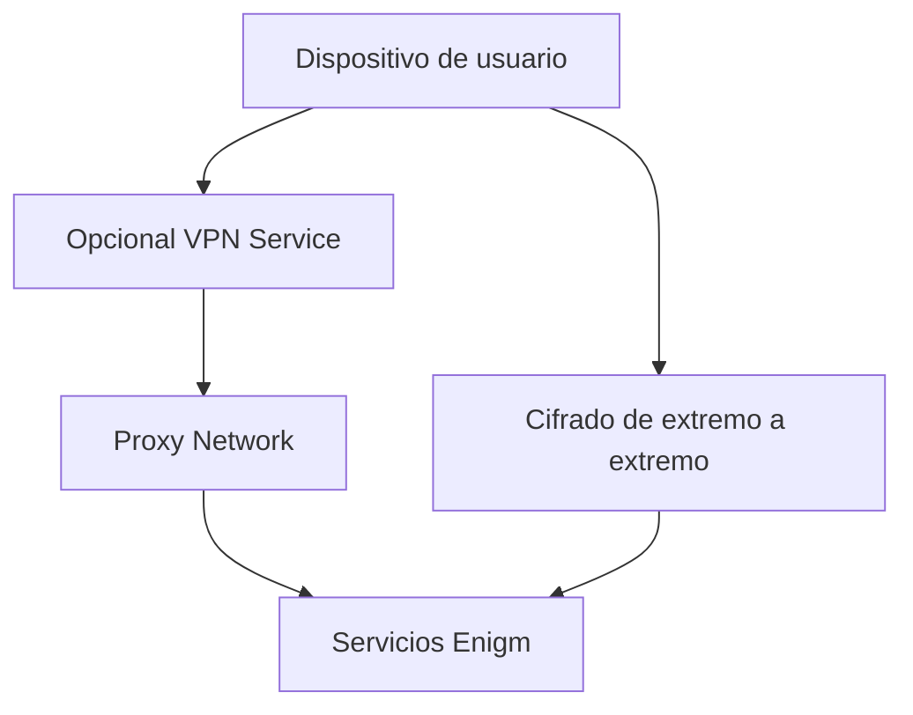

Enigm App puede utilizar capas de privacidad de red independientes del cifrado de extremo a extremo. Los controles VPN Service y Proxy Network reducen la exposición de la red, separan las rutas de tráfico y respaldan los objetivos de reducción de metadatos sin reemplazar Device Trust o el material de claves protegido.

## Resumen

Los controles de privacidad de la red abordan los riesgos de transporte y observación. No descifran ni reemplazan la mensajería segura de Enigm, las llamadas seguras ni la criptografía de la capa de aplicación.

## VPN Service

VPN Service es opcional y puede proporcionar privacidad de transporte adicional según los requisitos del usuario y la política de implementación. Puede reducir la visibilidad de la red desde redes locales, Wi-Fi público y algunos observadores intermedios.

La protección VPN y el cifrado de extremo a extremo resuelven diferentes problemas. La VPN no reemplaza el cifrado de mensajes, Device Trust, las decisiones de confianza del usuario ni la seguridad de los endpoints.

## Proxy Network

El Proxy Network proporciona un límite de privacidad y separación de tráfico entre los dispositivos del cliente y los servicios de la plataforma. Contribuye a la reducción de metadatos, reduce la exposición directa entre los clientes y los servicios backend y respalda la política de enrutamiento de la plataforma.

La confidencialidad de las comunicaciones sigue dependiendo del cifrado de la capa de aplicación, el material de claves protegido, la asociación de dispositivos de confianza y los flujos de trabajo de verificación.

## Consideraciones sobre el análisis de tráfico

Enigm App utiliza separación de tráfico, actividad de red en segundo plano, actividad de red aleatoria y técnicas de modelado de tráfico diseñadas para reducir la confianza en análisis simples de correlación de tiempos y patrones de comunicación.

Estos controles pueden hacer que la inferencia simple sea menos confiable, pero no garantizan el anonimato ni eliminan el análisis de tráfico avanzado.

## Actividad de red aleatoria

Enigm App los controles de privacidad de la red generan actividad de red adicional que no está directamente vinculada a las conversaciones activas de los usuarios. Este tráfico está diseñado para hacer que la simple observación de dos dispositivos sea menos útil cuando un observador intenta inferir si dos usuarios se están comunicando.

El objetivo es reducir la confianza en el análisis basado en:

- Temporización de paquetes.
- Temporización del mensaje.
- Ráfagas de tráfico.
- Frecuencia de conexión.
- Similitud entre dos patrones de tráfico de dispositivos.
- Inicio y finalización de la conversación.

Debido a que este control es parte del modelo de privacidad de la red Enigm App, la actividad de la red desde un dispositivo no debe interpretarse como prueba de que se está llevando a cabo una conversación específica. Del mismo modo, los patrones de tráfico coincidentes o no coincidentes entre dos dispositivos no deben tratarse como evidencia confiable de una relación de comunicación.

Esta es una capa de privacidad, no una capa de confidencialidad. La confidencialidad de las comunicaciones sigue dependiendo del cifrado de extremo a extremo, el material de claves protegido, la asociación de dispositivos de confianza y los flujos de trabajo de verificación.

La documentación pública no revela cadencia, lógica de generación, volumen de tráfico, valores de ajuste, comportamiento de programación ni parámetros operativos.

## Relación con la reducción de metadatos

La actividad de red aleatoria funciona junto con la minimización de metadatos, la separación de tráfico Proxy Network, la protección de transporte VPN Service opcional, Privacy-Preserving Device Handles y los límites de retención.

Estos controles están diseñados para reducir la exposición y la confianza en la inferencia básica de patrones de comunicación. No deben interpretarse como anonimato garantizado, imposible de rastrear o resistencia total al análisis de tráfico avanzado.

## Qué ayudan a mitigar estos controles

Los controles de privacidad de la red pueden reducir la exposición de redes locales no de confianza, Wi-Fi público, exposición directa al servicio, correlación de tiempo simple, inferencia de patrones de conversación y algunos escenarios de observación de metadatos.

## Lo que estos controles no mitigan

Los controles de privacidad de la red no protegen contra dispositivos endpoints comprometidos, malware con privilegios suficientes, ingeniería social, divulgación de usuarios, divulgación de mensajes por parte de participantes autorizados o contenido capturado después del descifrado local autorizado.

Ver [Limitaciones de la plataforma](/es/legal/limitations).
