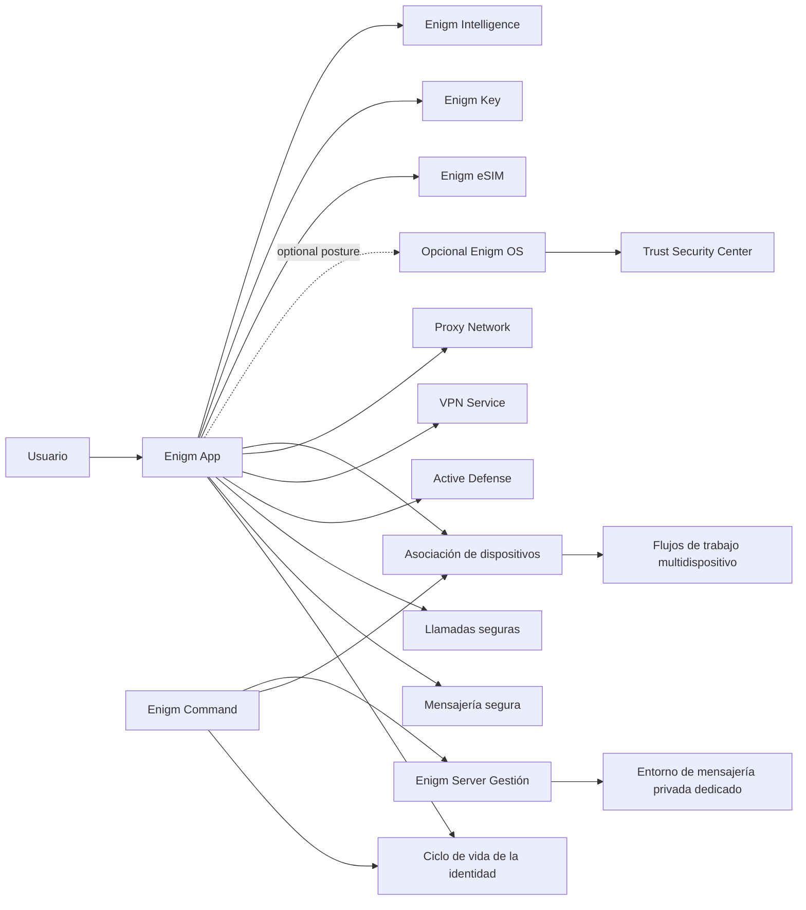

Enigm es el producto de mensajería privada del ecosistema Enigm. Se entrega a través de la aplicación orientada al usuario, razón por la cual esta sección utiliza la estructura de documentación de la aplicación.

Enigm es la interfaz principal a través de la cual los usuarios administran la incorporación, el registro, la identidad, la mensajería segura, las llamadas seguras, Active Defense, los dispositivos de confianza, los flujos multi-dispositivo, el uso opcional de VPN Service, el uso integrado de Proxy Network cuando esté habilitado y el acceso basado en políticas para respaldar los servicios de Enigm.

Enigm OS es una capa de dispositivo seguro dedicada opcional. Cuando está presente, puede contribuir con la postura Trust Security Center, el estado de administración del dispositivo, el estado de verificación OTA y las señales Remote Attestation. Enigm sigue siendo el producto central de mensajería privada; Enigm OS refuerza las implementaciones admitidas en lugar de reemplazar el producto de mensajería.

Los productos y componentes compatibles incluyen Enigm Command, Enigm Server, VPN Service, Proxy Network, Enigm eSIM, Enigm Key, Privacidad de pagos, Tor Gateway, Enigm Intelligence, Threat Intelligence Platform y Enyra. Estos amplían las políticas, la administración, los entornos de mensajería privada dedicados, las redes seguras, las alertas de emergencia, la visibilidad del riesgo de malware y la evaluación de riesgos en torno a Enigm.

## Resumen

Enigm coordina seis dominios de seguridad principales:

- **Ciclo de vida de la identidad**: creación de cuenta, autenticación, estado de sesión, estado de recuperación y política a nivel de cuenta.
- **Seguridad de las comunicaciones**: mensajería segura, llamadas seguras, flujos de trabajo de administración de claves, vencimiento de mensajes y manejo de contenido protegido.
- **Active Defense**: software espía móvil asistido por IA y análisis del comportamiento de la red sin inspeccionar las comunicaciones protegidas.
- **Asociación de dispositivos**: inscripción explícita, reemplazo, revocación y evaluación del ciclo de vida de los dispositivos vinculados a una cuenta.
- **Flujos de trabajo multidispositivo**: acceso controlado a la cuenta en múltiples dispositivos autorizados sin confiar automáticamente en los dispositivos recién introducidos.
- **Integración de plataforma**: política y visibilidad a través de Enigm Command, privacidad de red opcional a través de VPN Service, separación de tráfico a través de Proxy Network, conectividad de solo datos a través de Enigm eSIM en áreas de cobertura admitidas y señales de riesgo a través de Enigm Intelligence.

Para conocer el modelo criptográfico de todo el ecosistema, incluido el cifrado de extremo a extremo, la criptografía poscuántica, el ciclo de vida de las claves, el almacenamiento seguro, los flujos de trabajo de verificación y la criptografía OTA, consulte [Criptografía](/es/security/cryptography).

## Mensajería segura

La mensajería segura es un flujo de trabajo central Enigm App. El contenido del mensaje se prepara y protege en la aplicación antes de enviarlo a través de rutas autorizadas. La asociación de dispositivos, el estado de administración de claves, la política de vencimiento y la elegibilidad del destinatario se evalúan como parte del modelo de mensajería.

La mensajería segura de Enigm admite flujos de trabajo de texto y multimedia, incluidos mensajes, archivos, imágenes, videos y otros medios compatibles. La política de conversación y de grupo puede controlar el envío, el reenvío, la eliminación y el manejo de medios, preservando al mismo tiempo el modelo de cifrado de extremo a extremo.

El manejo seguro de medios está diseñado para reducir la exposición innecesaria del texto claro a través de visualización protegida, persistencia local limitada, caducidad y controles de resistencia a la captura de acuerdo con la capacidad y la política del dispositivo. Estos controles reducen la exposición durante el uso normal; no garantizan protección contra puntos finales comprometidos, grabaciones externas o divulgación intencional por parte de participantes autorizados.

La arquitectura de mensajería está documentada por separado en [Mensajería segura](/es/app/secure-messaging).

## Incorporación y registro

La incorporación de Enigm App está diseñada para establecer la identidad y Device Trust al tiempo que minimiza la dependencia de los identificadores públicos.

El modelo de registro incluye:

- Autenticación de nombre de usuario y contraseña.
- Generación y manejo de frases de recuperación.
- Creación de identidad local del dispositivo.
- Asociación inicial de dispositivo confiable.
- Separación entre recuperación de cuenta y acceso a mensajes protegidos.

La creación de una cuenta Enigm estándar no requiere una email, un número de teléfono ni un documento de identidad. Esto apoya la minimización de la identidad y reduce la exposición innecesaria de la identidad.

Las sesiones de Enigm App están limitadas a 6 horas. El estado de la sesión se evalúa por separado de Device Trust, el material de clave protegido, el estado de recuperación y la autorización administrativa.

## Llamadas seguras

Las llamadas seguras se tratan como flujos de trabajo de comunicación protegidos en tiempo real. El establecimiento de la llamada debe evaluar el estado de la cuenta, la asociación del dispositivo, el estado de la política y el contexto de red admitido.

La modulación de voz está documentada como una característica de privacidad cuando la habilita el usuario o la política. Su objetivo es reducir el reconocimiento directo de la voz durante las llamadas admitidas, no reclamar resistencia contra todos los métodos de identificación de voz.

## Active Defense

Active Defense es una capacidad Enigm App diseñada para ayudar a los usuarios a evaluar el riesgo de malware, spyware y comportamiento sospechoso de la red en dispositivos móviles.

Active Defense analiza señales de comportamiento de red minimizadas en ventanas de evaluación limitadas. Su objetivo es respaldar la orientación del usuario, las decisiones Device Trust, la visibilidad del dispositivo administrado cuando esté habilitada y la correlación Enigm Intelligence cuando esté autorizada.

Active Defense no está destinado a inspeccionar el texto claro de los mensajes, el contenido de las llamadas, los medios, los archivos adjuntos, los documentos o las conversaciones de los usuarios.

El modelo Active Defense está documentado por separado en [Active Defense](/es/app/active-defense).

## Asociación de dispositivos

Enigm App no trata la identidad y Device Trust como el mismo concepto. Una cuenta de usuario puede ser válida mientras que un dispositivo específico no sea elegible para una operación protegida.

## Ciclo de vida de la identidad

El ciclo de vida de la identidad incluye autenticación de cuenta, estado de sesión, estado de recuperación, estado de política administrativa y asociación de dispositivos. Enigm App utiliza el contexto de identidad como entrada para la autorización; no considera que la autenticación por sí sola sea suficiente para cada operación protegida.

Las operaciones administrativas del ciclo de vida están disponibles a través de Enigm Command cuando una implementación empresarial o administrada requiere asignación de políticas, revisión de dispositivos o evidencia de auditoría.

## Flujos de trabajo multidispositivo

Los flujos multi-dispositivo admiten el uso de cuentas en dispositivos asociados explícitamente. Un dispositivo recién introducido debe evaluarse como un nuevo evento de confianza, no como una extensión automática de una sesión existente.

Los flujos multi-dispositivo pueden implicar:

- Inscripción de dispositivos.
- Reemplazo de dispositivos.
- Revocación del dispositivo.
- Actualizaciones clave del ciclo de vida.
- Actualizaciones de elegibilidad de conversaciones o llamadas.
- Flujos de trabajo de recuperación separados del acceso normal a mensajes.

## Integración con Enigm Command

Enigm Command es el producto de panel de control web para usuarios individuales, organizaciones y administradores empresariales. Admite política de cuentas, visibilidad de dispositivos conectados, cierre activo de sesiones, eliminación no autorizada de dispositivos, revocación de dispositivos, flujos de trabajo de eliminación de datos de la plataforma, flujos de trabajo de eliminación completa de cuentas, compra de Enigm Server y creación, revisión de solicitud de unión de ID del servidor, administración de membresía del servidor, controles del ciclo de vida del contenido con alcance del servidor, acceso Tor Gateway a superficies web seleccionadas, administración de Enigm eSIM de compras y ciclo de vida, visibilidad de Enigm Key del ciclo de vida del dispositivo, modo Enigm OS de dispositivo administrado cuando lo habilita el usuario, Asistente de producto Enyra, visibilidad de implementación, revisión de auditoría y revisión de la postura de seguridad.

Enigm Command no debe exponer el contenido del mensaje protegido, el contenido de la llamada, el material de la clave privada ni el estado del protocolo sensible a la implementación.

## Integración con Enigm OS opcional

Cuando se implementa Enigm OS, Enigm App consume señales Device Trust adicionales, incluida la postura Trust Security Center, el estado de administración del dispositivo, el estado del modo de privacidad, el estado de la política de red, el estado de verificación OTA y los resultados Remote Attestation.

Las señales Enigm OS son aditivas. La seguridad de Enigm App no debe asumir que cada implementación utiliza Enigm OS.

## Integración con VPN Service y Proxy Network

VPN Service y Proxy Network son compatibles con los componentes de privacidad de red y separación de tráfico de Enigm App. VPN Service proporciona privacidad de red opcional y protección de transporte. Proxy Network reduce la exposición directa entre los clientes de la aplicación y los servicios de la plataforma cuando estén habilitados.

VPN Service y Proxy Network están separados de Enigm Server y del cifrado de extremo a extremo Enigm App. No definen el modelo de seguridad de la aplicación, no reemplazan Device Trust ni brindan acceso al texto claro de los mensajes.

El uso del servicio de red debe estar autorizado, tener en cuenta las políticas y ser auditable cuando sea relevante para la seguridad. El contenido de la comunicación Protected debe permanecer separado de los registros de políticas de red de rutina.

## Integración con Enigm eSIM

Enigm eSIM proporciona conectividad móvil solo de datos para dispositivos compatibles en áreas de cobertura compatibles. Se compra y gestiona a través de Enigm Command, se vincula a la cuenta Enigm del usuario para la gestión del ciclo de vida y el usuario puede desvincularlo, eliminarlo o retirarlo.

La conectividad Enigm eSIM se puede combinar con el uso de VPN Service y Proxy Network. No reemplaza el cifrado de extremo a extremo Enigm App, Device Trust, la mensajería segura, las llamadas seguras ni el material de claves protegido.

## Integración con Enigm Server

Enigm Server proporciona entornos de mensajería privados dedicados para usuarios aprobados de Enigm.

Los usuarios solicitan acceso a un entorno Enigm Server utilizando la ID del servidor compartida por el administrador. Enigm App accede a los entornos Enigm Server cuando el estado de la cuenta, Device Trust, la aprobación del administrador, la política de membresía y la política del servidor lo permiten. Enigm Server no reemplaza la mensajería segura, las llamadas seguras, el material de claves protegido, el cifrado de extremo a extremo ni el Device Trust.

La administración del servidor controla la membresía, el ciclo de vida y la disponibilidad del contenido cifrado en el ámbito del servidor. Los controles de eliminación administrativa operan sobre objetos de contenido cifrados y el estado del ciclo de vida. No otorgan acceso al texto claro del mensaje, al texto claro del archivo adjunto, a las comunicaciones del usuario, al material de clave privada o a la autoridad criptográfica.

## Integración con Enigm Key

Enigm Key es un dispositivo de conectividad de emergencia física asociado con la cuenta Enigm de un usuario.

Enigm App admite Enigm Key vinculación inicial, sincronización, configuración de contactos de emergencia, visibilidad de eventos de emergencia, revisión del ciclo de vida del dispositivo, revocación y flujos de trabajo de reemplazo. La vinculación inicial y la configuración del contacto de emergencia se controlan desde Enigm App.

Enigm Key los flujos de trabajo de emergencia deben permanecer controlados por el usuario, vinculados a eventos y separados del contenido normal de mensajes o llamadas. Durante un flujo de trabajo de emergencia activo, se pretende que la ubicación compartida continúe hasta que el usuario cancele el flujo de trabajo de envío de emergencia.

Cuando está inactivo, Enigm Key debe permanecer inactivo para reducir la exposición innecesaria de la ubicación y la actividad de la red.

## Consideraciones de seguridad

- Enigm es la principal superficie de seguridad de cara al usuario.
- Account Trust y Device Trust se evalúan por separado.
- La asociación de dispositivos debe ser explícita y auditable.
- La mensajería y las llamadas seguras deben depender del material de clave protegido y del estado autorizado del dispositivo.
- Active Defense debería mejorar la visibilidad del riesgo del dispositivo sin debilitar la confidencialidad del contenido o la privacidad del usuario.
- Las acciones Enigm Command deben estar autenticadas, autorizadas y auditables.
- La postura opcional Enigm OS puede fortalecer las decisiones Device Trust cuando se implementen.
- VPN Service y Proxy Network deben admitir la privacidad de la red y la reducción de metadatos sin requerir la divulgación de contenido protegido.
- Enigm Server debe admitir la membresía del servidor y los controles del ciclo de vida del contenido cifrado en el ámbito del servidor sin convertirse en una superficie de texto claro, archivo adjunto, comunicación de usuario o acceso a clave privada.
- Enigm Key debe utilizar comunicación cifrada y autenticada y manejo de datos de emergencia vinculados a eventos.

## Consideraciones de privacidad

Enigm App debe minimizar la recopilación y separar el contenido protegido de los metadatos operativos por dominio de confianza.

## Límites de confianza

Los principales límites de confianza son:

- Usuario a Enigm App
- Enigm App al estado de identidad de la cuenta
- Enigm App al estado de asociación del dispositivo
- Enigm App para proteger mensajes y llamadas seguras
- Hallazgos de Enigm App a Active Defense
- Política de Enigm App a Enigm Command
- Enigm App a la postura Enigm OS opcional
- Enigm App a VPN Service y Proxy Network
- Política de membresía y servidor de Enigm App a Enigm Server
- Conectividad Enigm App a Enigm eSIM
- Enigm App a Enigm Key flujos de trabajo de emergencia
- Resultados Enigm App a Enigm Intelligence

## Diagrama de arquitectura

## Limitaciones

Ver [Limitaciones de la plataforma](/es/legal/limitations).

## Referencias de modelos de amenazas

Las áreas relevantes del modelo de amenazas incluyen el compromiso de cuentas y aplicaciones, el abuso del ciclo de vida del dispositivo, la omisión de la política Enigm OS cuando se implementa, el uso indebido de la política de red, la manipulación de la inteligencia, el abuso Enigm Command y la pérdida de visibilidad de la auditoría.
