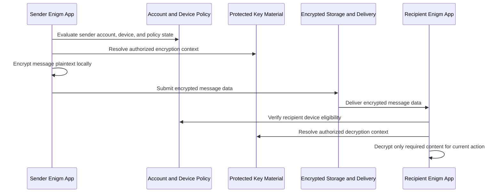

Enigm App proporciona mensajes de texto y multimedia seguros como modelo de seguridad a nivel de aplicación. La protección de la mensajería se centra en la aplicación del cliente y está respaldada por Device Trust, material de clave protegido, duración controlada del mensaje y flujos de trabajo de verificación.

## Resumen

La mensajería segura de Enigm está diseñada para proteger el contenido de mensajes y archivos adjuntos, al tiempo que conserva suficientes metadatos del ciclo de vida para la entrega, sincronización, caducidad y flujos de trabajo de auditoría autorizados.

El modelo se basa en estos principios:

- Los mensajes están cifrados de extremo a extremo.
- El texto claro del mensaje no está diseñado para que los componentes del lado del servidor puedan acceder a él.
- El almacenamiento de mensajes del lado del servidor, cuando es necesario para la entrega, almacena únicamente datos de mensajes cifrados.
- El acceso a los mensajes depende de la asociación de dispositivos de confianza y del material de claves protegido.
- La mensajería multidispositivo requiere el establecimiento de una confianza explícita.
- Los archivos adjuntos siguen el mismo modelo de confidencialidad que los mensajes.
- Los grupos admiten controles de permisos avanzados para reenviar, eliminar, enviar y manejar medios cuando lo habilita la política de conversación.
- El manejo seguro de medios está diseñado para reducir la exposición del texto claro para archivos, imágenes, videos y otros medios multimedia compatibles.
- Los controles administrativos no deben otorgar acceso al texto claro del mensaje.
- Enigm OS puede proporcionar protección adicional, pero la mensajería segura de Enigm sigue siendo un modelo de seguridad de nivel Enigm App.

## Modelo de cifrado de extremo a extremo

La mensajería Enigm está diseñada para que el contenido del mensaje de texto claro se prepare y se cifre dentro del contexto Enigm App del lado del remitente antes de la entrega.

Esta página describe el modelo de seguridad de mensajería. La arquitectura criptográfica más amplia de Enigm, que incluye criptografía poscuántica, ciclo de vida de claves, almacenamiento seguro, confianza vinculada a dispositivos y flujos de trabajo de verificación, está documentada en [Criptografía](/es/security/cryptography).

A alto nivel:

1. Enigm App evalúa el estado de la cuenta del remitente, la asociación del dispositivo del remitente y la política aplicable.
2. La elegibilidad de la cuenta del destinatario y del dispositivo del destinatario se resuelve a través de metadatos autorizados.
3. El material de clave Protected se utiliza para establecer un contexto de cifrado autorizado.
4. El texto claro del mensaje se cifra localmente en Enigm App.
5. Los datos del mensaje cifrado se envían para su entrega.
6. El Enigm App del lado del destinatario verifica la elegibilidad del dispositivo y el estado de la clave protegida.
7. El contenido del mensaje se descifra localmente sólo cuando esté permitido.

Los componentes del lado del servidor no deberían requerir texto claro de mensajes para enrutar, almacenar, sincronizar o caducar mensajes.

## Ciclo de vida del mensaje

El ciclo de vida del mensaje se estructura en torno a la protección del lado del cliente y la autorización basada en el dispositivo.

El ciclo de vida incluye:

- Evaluación de cuenta y sesión del remitente.
- Evaluación del remitente Device Trust.
- Evaluación de elegibilidad del dispositivo del destinatario.
- Cifrado local mediante material de claves protegidas.
- Entrega cifrada y sincronización.
- Verificación del lado del destinatario.
- Descifrado local para la acción del usuario autorizado.
- Caducidad o eliminación según política de usuario o conversación.

El cliente debe recuperar y descifrar sólo el contenido del mensaje requerido para la acción actual del usuario.

## Almacenamiento cifrado del lado del servidor

Es posible que se requiera almacenamiento de mensajes del lado del servidor para la entrega, sincronización, recuperación fuera de línea, coordinación de caducidad o gestión del ciclo de vida resistente al abuso.

Cuando se requiere almacenamiento del lado del servidor, este debe almacenar únicamente datos de mensajes cifrados. El texto claro del mensaje no está diseñado para que los componentes del lado del servidor puedan acceder a él.

Los sistemas del lado del servidor pueden procesar metadatos limitados necesarios para:

- Estado de entrega.
- Estado de sincronización.
- Estado de caducidad.
- Membresía de conversación.
- Manejo de abusos.
- Eventos del ciclo de vida relevantes para la auditoría.

Estos metadatos deben minimizarse y separarse del contenido del mensaje protegido.

## Manejo de mensajes locales

El manejo de mensajes locales define cómo Enigm App trata el contenido descifrado después de la recuperación autorizada.

Enigm App está diseñado para que:

- El contenido del mensaje descifrado se maneja dentro de contextos de aplicaciones autorizados.
- El contenido del mensaje descifrado no debe almacenarse de forma persistente en el dispositivo.
- El sistema debe evitar la persistencia local innecesaria.
- Se debe utilizar el manejo de solo memoria para etapas de procesamiento seleccionadas.
- El almacenamiento en caché local, las vistas previas, la búsqueda, las copias de seguridad y los controles de retención empresarial no deben eludir silenciosamente la política de confidencialidad de mensajes.

Los visores seguros deben manejar el contenido de mensajes y archivos adjuntos sin exportar texto claro a aplicaciones externas. Cuando la acción o política del usuario permite compartir o exportar externamente, esa acción está fuera del modelo normal de visualización protegida y debe tratarse como un límite de divulgación.

## Manejo de archivos adjuntos

Los archivos adjuntos deben seguir el mismo modelo de confidencialidad que los mensajes.

El manejo de accesorios está diseñado para:

- Admite archivos protegidos, imágenes, videos y otros objetos multimedia compatibles.
- Cifre el contenido del archivo adjunto antes de transferirlo o almacenarlo.
- Almacene los datos adjuntos como material cifrado donde se requiere almacenamiento del lado del servidor.
- Recuperar sólo el contenido adjunto necesario para la acción actual del usuario.
- Descifre el contenido del archivo adjunto localmente solo cuando esté permitido.
- Utilice visores seguros.
- Evite la exportación de texto claro a aplicaciones externas durante la visualización protegida normal.
- Aplicar política de caducidad y eliminación a la disponibilidad de archivos adjuntos.

Los metadatos de los archivos adjuntos deben minimizarse a lo que se requiere para la entrega, sincronización, vencimiento y revisión autorizada.

## Permisos de grupo

Las conversaciones grupales admiten controles de permisos avanzados cuando lo habilita la política de conversación.

Los controles de permisos incluyen:

- Envío de elegibilidad.
- Restricciones de reenvío.
- Permisos de eliminación.
- Permisos de envío de medios.
- Permisos para compartir archivos.
- Permisos de gestión de miembros.
- Controles de visibilidad de la conversación.

Los permisos de grupo están destinados a admitir espacios de comunicación controlados y al mismo tiempo preservar el modelo de cifrado de un extremo a otro. Los controles administrativos o a nivel de grupo no deben crear acceso a texto claro para sistemas del lado del servidor o flujos de trabajo Enigm Command.

Los controles de permisos se evalúan como política de conversación. El estado de la cuenta de un participante, el estado Device Trust, el estado de membresía y la política de conversación pueden afectar si ese participante puede enviar, reenviar, eliminar o administrar contenido protegido.

Los permisos de grupo deben poder auditarse a nivel de política y ciclo de vida sin exponer el texto claro del mensaje, el texto claro de los archivos adjuntos, el texto claro de los medios, las conversaciones de los usuarios o el material de clave privada.

## Controles de envío

Los controles de envío determinan si un participante es elegible para enviar contenido protegido a una conversación.

Los controles de envío pueden aplicarse a:

- Mensajes de texto.
- Archivos.
- Imágenes.
- Vídeos.
- Otros multimedia compatibles.
- Tipos de contenido protegido específicos de la conversación.

La elegibilidad para el envío debe evaluar el estado de la cuenta, Device Trust, la membresía de la conversación, la política de grupo y la política administrativa aplicable. Los controles de envío no cambian el modelo de cifrado de un extremo a otro; El contenido protegido aún debe cifrarse antes de la entrega y descifrarse solo en dispositivos autorizados.

## Controles de reenvío

Los controles de reenvío están diseñados para reducir la redistribución no autorizada de contenido protegido dentro de los flujos de trabajo compatibles con Enigm.

Las restricciones de reenvío pueden limitar si los usuarios pueden reenviar:

- Mensajes.
- Archivos.
- Imágenes.
- Vídeos.
- Otros multimedia compatibles.

Los controles de reenvío reducen la exposición dentro del flujo de trabajo Enigm App, pero no pueden garantizar el control sobre el contenido después de la representación local autorizada, la divulgación del usuario, la captura externa, los puntos finales comprometidos o las rutas de exportación fuera de los controles de Enigm.

## Controles de eliminación

Los controles de eliminación afectan el ciclo de vida y la disponibilidad del contenido protegido.

Los flujos de trabajo de eliminación pueden aplicarse a:

- Eliminación de mensajes iniciados por el usuario.
- Eliminación de archivos adjuntos iniciada por el usuario.
- Eliminación de política de conversación.
- Eliminación de política de grupo.
- Eliminación de contenido cifrado en el ámbito del servidor donde se aplica la política Enigm Server.
- Eliminación por vencimiento.

Los controles de eliminación operan sobre objetos de contenido cifrados, estado del ciclo de vida local y disponibilidad de la conversación. La eliminación no implica que los administradores puedan leer el texto claro de los mensajes, el texto claro de los archivos adjuntos, el texto claro de los medios, las conversaciones de los usuarios o el material de clave privada.

La eliminación no puede garantizar la eliminación del contenido ya visto, exportado, capturado, divulgado por un participante autorizado o almacenado fuera de los controles de Enigm.

## Protección de medios y permisos locales

Enigm App el manejo seguro de medios está diseñado para reducir la exposición innecesaria de texto claro durante el uso normal.

La protección de medios incluye:

- Visualización segura de archivos, imágenes y vídeos compatibles.
- Evitar persistencias locales innecesarias.
- Restringir las rutas de exportación cuando la política lo requiera.
- Limitar el reenvío cuando la política de conversación lo requiera.
- Aplicar caducidad de mensajes y archivos adjuntos.
- Presentar medios protegidos solo dentro de contextos de aplicaciones autorizados.

Las protecciones de captura y grabación de pantalla se aplican según la capacidad del sistema operativo y la política del dispositivo. Estas protecciones están destinadas a reducir la captura accidental o no autorizada durante el uso normal de la aplicación, pero no pueden garantizar la prevención contra todos los métodos de captura, dispositivos comprometidos, cámaras externas o entornos operativos modificados.

## Resistencia a la captura

La resistencia a la captura es un control local de reducción de la exposición para la visualización de mensajes y medios protegidos.

Según la capacidad y la política del dispositivo, Enigm App aplica controles destinados a reducir:

- Captura de pantalla.
- Grabación de pantalla.
- Vista previa de fugas.
- Exportación innecesaria de texto claro a aplicaciones externas.
- Exposición accidental durante la visualización normal protegida.

Estos controles no equivalen a una garantía de que el contenido no pueda grabarse. Las cámaras externas, los dispositivos comprometidos, los usuarios autorizados maliciosos, las omisiones del sistema operativo, el abuso de accesibilidad y los entornos modificados permanecen fuera del límite de garantía de la protección de captura normal a nivel de aplicación.

La resistencia a la captura es una capa de privacidad y reducción de la exposición que complementa el cifrado de extremo a extremo, Device Trust, el material de clave protegido, los visores seguros y la caducidad de mensajes.

## Caducidad del mensaje

Los mensajes tienen una vida útil configurable y pueden caducar según la política del usuario o de la conversación.

La caducidad puede aplicarse a:

- Contenido del mensaje.
- Contenido del archivo adjunto.
- Referencias de entrega.
- Estado descifrado local.
- Vistas previas en caché.
- Metadatos del ciclo de vida de la conversación.

La caducidad está diseñada para reducir la disponibilidad innecesaria a largo plazo del contenido protegido. La caducidad no elimina necesariamente todos los registros de metadatos que no sean de contenido, porque la entrega, la auditoría, el cumplimiento, el manejo de abusos o los flujos de trabajo legales pueden requerir registros de ciclo de vida limitados.

## Requisitos de Device Trust

El acceso a los mensajes depende de la asociación de dispositivos de confianza y del material de claves protegido.

Device Trust evalúa:

- Asociación de cuentas.
- Mango del dispositivo que preserva la privacidad.
- Estado de inscripción del dispositivo.
- Estado de sustitución del dispositivo.
- Estado de revocación o retiro del dispositivo.
- Material de claves protegidas asociadas al dispositivo.
- Estado de desbloqueo local.
- Postura de seguridad del sistema operativo.
- Postura Trust Security Center opcional donde se despliega Enigm OS.
- Resultado Remote Attestation cuando se requiere evidencia de integridad del dispositivo.

Una sesión de cuenta válida no hace que un dispositivo sea automáticamente elegible para acceder a mensajes. Los dispositivos revocados deberían perder la elegibilidad para la sincronización y el descifrado de mensajes en el futuro según la política del ciclo de vida.

## Mensajería multidispositivo

La mensajería multidispositivo requiere el establecimiento de una confianza explícita.

Un dispositivo recién inscrito debe evaluarse como un nuevo participante de confianza, no como una extensión automática de una sesión existente. Los flujos multi-dispositivo deben evaluar:

- Estado de la cuenta.
- Estado de inscripción del dispositivo.
- Material de claves protegidas asociadas al dispositivo.
- Membresía de conversación.
- Política de caducidad de mensajes.
- Aprobación de dispositivo confiable existente o aprobación administrada.
- Política Enigm Command donde se aplica la administración gestionada.
- Opcional Enigm OS Estado de confianza donde se implementó.

El soporte multidispositivo no debe copiar silenciosamente material de clave privada sin un flujo de trabajo de confianza explícito.

La disponibilidad histórica de mensajes para dispositivos recién inscritos depende del ciclo de vida de la clave, la vida útil del mensaje, el diseño de recuperación y la política.

## Flujos de trabajo de verificación

Los flujos de trabajo de verificación deberían permitir a los usuarios confirmar la confianza del dispositivo o contacto.

La verificación puede incluir:

- Verificación de contacto o cuenta.
- Verificación de membresía del dispositivo.
- Revisión de reemplazo de dispositivos.
- Verificación del estado clave.
- Verificación de membresía de conversación.
- Postura Trust Security Center opcional donde se despliega Enigm OS.
- Verificación de políticas gestionadas a través de Enigm Command.

Los resultados de la verificación deben proporcionar categorías de decisión o estado comprensibles sin exponer material de clave privada, componentes criptográficos internos, detalles de protocolo o contenido de mensajes protegidos.

## Minimización de metadatos

Los metadatos del mensaje deben minimizarse.

El sistema debe evitar la recopilación, retención y exposición innecesaria de metadatos relacionados con:

- Entrega de mensajes.
- Estado de lectura o recuperación del mensaje.
- Ciclo de vida del archivo adjunto.
- Device correlation.
- Membresía de conversación.
- Comportamiento de caducidad.
- Auditoría del ciclo de vida.

Cuando se requieran metadatos, se debe preferir Privacy-Preserving Device Handles y otros identificadores de alcance a los identificadores públicos directos.

Los controles administrativos deben exponer evidencia de políticas y ciclo de vida sin exponer el texto claro de los mensajes.

## Resistencia al análisis de tráfico

La arquitectura de mensajería de Enigm genera actividad de red adicional que no está directamente vinculada a las conversaciones activas de los usuarios.

Este mecanismo tiene como objetivo reducir la confiabilidad de técnicas simples de correlación de tráfico que intentan inferir relaciones de comunicación a partir de patrones de red observables, incluida la sincronización de paquetes, la sincronización de mensajes, ráfagas de tráfico, cadencia de conexión o señales similares.

El objetivo no es pretender garantías de ocultación de identidad o resistencia al análisis de tráfico avanzado. El objetivo es reducir la confianza en el análisis básico de correlación temporal y patrones de comunicación.

La configuración del tráfico es una capa de privacidad adicional. La confidencialidad de las comunicaciones sigue dependiendo del cifrado de extremo a extremo y del material de claves protegido.

La actividad adicional de la red no debe interpretarse como prueba de comunicaciones activas del usuario. Los observadores de la red aún pueden realizar análisis de tráfico en determinadas circunstancias, especialmente cuando pueden combinar tiempos, volumen, comportamiento de los terminales, comportamiento del usuario o señales externas.

Este mecanismo tiene como objetivo:

- Reducir la correlación temporal directa.
- Mitigar la inferencia simple de patrones de comunicación.
- Lower confianza en los supuestos básicos del observador.
- Aumentar la dificultad para análisis simples de ráfagas de tráfico.
- Hacer que la correlación de comunicación básica sea menos confiable.

La documentación pública no revela cadencia, características de tiempo, lógica de generación, detalles de ajuste del tiempo de ejecución ni comportamiento sensible a la implementación.

### Relación con la protección de metadatos

La configuración del tráfico, la minimización de metadatos, la infraestructura de proxy y las protecciones de transporte son controles complementarios.

La minimización de metadatos reduce la recopilación y exposición innecesaria de metadatos. La infraestructura de proxy puede proporcionar una capa adicional de separación del tráfico. Las protecciones de transporte pueden reducir la visibilidad de algunos observadores de la red. La configuración del tráfico puede hacer que la inferencia simple basada en el tiempo sea menos confiable.

Estos controles no reemplazan el cifrado de extremo a extremo, Device Trust, el material de clave protegido, la caducidad de mensajes ni los flujos de trabajo de verificación.

Ver [Limitaciones de la plataforma](/es/legal/limitations).

## Referencias de modelos de amenazas

Las áreas relevantes del modelo de amenazas incluyen el compromiso de cuentas y aplicaciones, el abuso del ciclo de vida del dispositivo, los intentos de comprometer la mensajería segura, el abuso de Enigm Command, la omisión de políticas Enigm OS cuando se implementan, el uso indebido de políticas de red cuando los componentes de red de soporte están habilitados y la pérdida de visibilidad de la auditoría.
