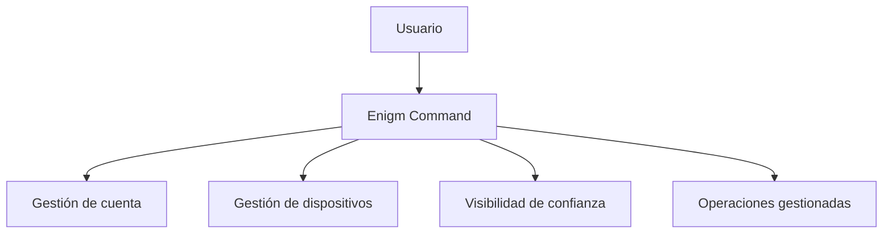

Enigm Command es el panel web de control del ecosistema Enigm. Gestióna cuentas, sesiones, dispositivos, productos, pagos, Enigm Server, Enigm eSIM, Enigm Key, Tor Gateway, Enyra Product Assistant y operaciónes de dispositivo gestionado.

Enigm Command no es un cliente de mensajería. No proporciona acceso a mensajes, llamadas, adjuntos, multimedia, claves privadas ni conversaciones en texto claro.

## Overview

Enigm Command proporciona:

- Gestión de cuenta y eliminación de cuenta.
- Visibilidad de dispositivos conectados.
- Cierre de sesiones.
- Revocacion o eliminación de dispositivos no autorizados.
- Gestión de Enigm Server.
- Gestión de Enigm eSIM.
- Visibilidad de Enigm Key.
- Pagos y ciclo de vida de producto.
- Trust status y eventos de seguridad.
- Enyra Product Assistant para guia de producto.

## Account Management

Enigm Command permite gestionar ciclo de vida de cuenta, eliminación completa de cuenta, sesiones activas, configuración de seguridad y estado de productos.

Si Enigm cierra una cuenta o el usuario solicita eliminación, la cuenta se elimina de forma inmediata dentro de los límites operativos documentados.

## Device Management

Enigm Command permite ver dispositivos conectados, cerrar sesiones, eliminar dispositivos no autorizados, revocar confianza y gestionar dispositivos Enigm OS cuando el usuario habilita modo gestionado.

La gestión de dispositivo no implica acceso a contenido protegido.

## Enyra Product Assistant

Enigm Command expone Enyra Product Assistant para guia de producto, asistencia de usuario, documentación, configuración, navegacion de plataforma, ayuda de dispositivo y ayuda de cuenta.

Este modo es distinto de Enyra en Intelligence, que actúa como capa de seguridad, correlación y análisis de eventos.

## Server And Product Lifecycle

Enigm Command permite comprar y crear Enigm Server, revisar solicitudes de unión por ID de servidor, gestionar membresia, elegir region disponible, administrar Enigm eSIM, gestionar Enigm Key y revisar productos asociados.

Los pagos soportados incluyen cripto, tarjeta de credito y Code Coin.

## Security Boundaries

Enigm Command puede gestionar ciclo de vida y disponibilidad. No debe convertirse en autoridad criptográfica ni superficie de lectura.

La visibilidad de estado de seguridad no equivale a visibilidad de mensajes.

Consulta [Platform Limitations](/es/legal/limitations).
