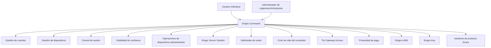

Enigm Command es el producto de panel de control web en el ecosistema Enigm. Es la superficie administrativa y de gestión de cuentas para usuarios individuales, organizaciones y administradores empresariales. Es responsable del ciclo de vida de la cuenta, la eliminación completa de la cuenta, los flujos de trabajo de eliminación de datos de la plataforma, el ciclo de vida del dispositivo, la visibilidad del dispositivo conectado, el control de la sesión activa, la configuración de seguridad, la visibilidad de la confianza, los flujos de trabajo de compra de productos admitidos, la compra y creación de Enigm Server, el ciclo de vida del servidor dedicado, las solicitudes de unión de ID del servidor, la membresía del servidor, los controles del ciclo de vida del contenido en el ámbito del servidor, la compra y gestión de Enigm eSIM, la visibilidad del ciclo de vida de Enigm Key, acceso Tor Gateway a superficies web seleccionadas, Asistente de producto Enyra y operaciones de dispositivos gestionados.

Enigm Command no es un cliente de mensajería. No debe proporcionar acceso al texto claro del mensaje, al contenido seguro de la llamada, al material de clave privada, a los archivos adjuntos descifrados ni al estado de la comunicación sensible a la implementación.

## Resumen

Enigm Command proporciona flujos de trabajo para usuarios individuales, organizaciones y administradores empresariales para administrar cuentas de Enigm, dispositivos de confianza, sesiones activas, configuración de seguridad, capacidades de dispositivos administrados, métodos de pago admitidos, Enigm Server, solicitudes de unión de ID del servidor, membresía del servidor, ciclo de vida del contenido con alcance del servidor, administración de Enigm eSIM del ciclo de vida y compras, visibilidad de Enigm Key del ciclo de vida, acceso Tor Gateway a superficies web seleccionadas, Active Defense revisar el contexto y la visibilidad del evento de seguridad.

Enigm Command admite la visibilidad administrativa del estado de seguridad, pero la visibilidad del estado de seguridad no es equivalente a la visibilidad de los mensajes.

Enigm Command también expone las capacidades del Asistente de producto Enyra para orientación sobre productos, asistencia al usuario, orientación sobre documentación, asistencia para la configuración, navegación por la plataforma, explicación de funciones, asistencia para dispositivos y asistencia para cuentas. Este modo de asistencia al producto es independiente de la asistencia a operaciones de seguridad Enyra en la sección Inteligencia.

## Gestión del ciclo de vida del producto

Enigm Command es la superficie de control para las operaciones del ciclo de vida del producto admitidas en todo el ecosistema Enigm.

Los flujos de trabajo del ciclo de vida del producto incluyen:

- Ciclo de vida y eliminación de la cuenta Enigm.
- Revisión y cierre de sesión activa.
- Visibilidad del dispositivo conectado y eliminación de dispositivos.
- Flujos de trabajo de pago a través de criptomonedas, tarjetas de crédito y métodos de pago Code Coin.
- compra de Enigm Server, creación, selección de región, aprobación de solicitud de unión, membresía, ciclo de vida del contenido y eliminación.
- Enigm eSIM compra, ciclo de vida de activación, asociación de cuenta, desvinculación, eliminación y retiro.
- visibilidad de Enigm Key del dispositivo, manejo de pérdidas, revocación y reemplazo.
- Enigm OS ciclo de vida del dispositivo administrado cuando el usuario activa el modo de dispositivo administrado.
- guía del Asistente de producto Enyra para flujos de trabajo de cuenta, dispositivo, producto, configuración y navegación.

La visibilidad del ciclo de vida del producto no es visibilidad del contenido protegido. Los flujos de trabajo del producto Enigm Command deben permanecer separados del texto claro de los mensajes, el contenido de llamadas seguras, el contenido multimedia, el texto claro de los archivos adjuntos, las conversaciones de los usuarios y el material de clave privada.

## Flujos de trabajo de pago

Enigm Command es la superficie de gestión de compras y pagos para productos Enigm compatibles.

Los flujos de trabajo de pago admitidos incluyen:

- Compra durante la inscripción Enigm Command.
- Compra desde Enigm Command después de la inscripción.
- Pagos en criptomonedas.
- Pagos con tarjeta de crédito.
- Code Coin canje de código de pago.
- Revisión del estado de activación y derechos del producto.
- Soporte de solicitud de facturas.

Todos los productos Enigm pueden utilizar los métodos de pago admitidos donde el producto está disponible para compra o activación.

La inscripción de pago estándar minimiza la identidad. Enigm no requiere la recopilación de email, número de teléfono o documento de identidad para la inscripción de pago normal. El flujo de trabajo de pago recopila un país de compra seleccionado por el usuario.

El estado de pago es el estado del ciclo de vida comercial. No proporciona acceso al texto claro de mensajes, contenido de llamadas seguras, contenido multimedia, texto claro de archivos adjuntos, conversaciones de usuarios, material de clave privada o material de clave protegida en el dispositivo.

## Gestión de cuentas

La administración de cuentas respalda el ciclo de vida de la cuenta y los flujos de trabajo de seguridad de la cuenta.

Enigm Command utiliza el contexto de cuenta autorizado de Enigm para acceder a la cuenta y a los flujos de trabajo administrativos. La documentación pública no revela los aspectos internos de la autenticación, la implementación de la sesión, los formatos de los tokens, la estructura de la ruta ni los detalles operativos del control de acceso.

Los usuarios individuales utilizan Enigm Command para administrar su propia cuenta, dispositivos, sesiones, ciclo de vida del producto y flujos de trabajo de eliminación. Las organizaciones y los administradores empresariales utilizan Enigm Command para administrar entornos de alcance, usuarios aprobados, dispositivos, entornos Enigm Server, ciclo de vida Enigm eSIM, visibilidad Enigm Key y operaciones de dispositivos gestionados dentro de sus límites administrativos autorizados.

Los flujos de trabajo de la cuenta Enigm Command incluyen:

- Revisión del estado de la cuenta.
- Revisión del estado del ciclo de vida de la cuenta.
- Límites de soporte de recuperación de cuenta.
- Asignación de póliza de cuenta.
- Configuración de visibilidad y acceso.
- Flujos de trabajo de eliminación de cuentas.
- Flujos de trabajo de eliminación de datos.
- Eliminación completa de la cuenta.
- Eliminación de datos de la plataforma cuando las políticas y los límites legales lo permitan.
- Revisión de la sesión.
- Revisión de eventos de seguridad relacionados con la actividad de la cuenta.

El soporte de recuperación de cuentas no debe debilitar la confidencialidad normal de los mensajes. El soporte de recuperación puede ayudar a restaurar el acceso a la cuenta o respaldar el reemplazo del dispositivo, pero no debe proporcionar acceso administrativo al texto claro de los mensajes.

## Gestión de dispositivos

La administración de dispositivos admite el control explícito del ciclo de vida del dispositivo.

Los flujos de trabajo del dispositivo Enigm Command incluyen:

- Revisión de inventario de dispositivos.
- Visibilidad del dispositivo conectado.
- Revisión de todos los dispositivos asociados a la cuenta.
- Visibilidad del dispositivo confiable.
- Revisión de inscripción de dispositivos.
- Revocación del dispositivo.
- Eliminación de dispositivos no autorizados.
- Eliminación del dispositivo de la cuenta confiable.
- Reemplazo de dispositivos.
- Informes de seguridad del dispositivo.
- Revisión de la capacidad del dispositivo administrado.
- Revisión del estado de confianza.
- Active Defense revisión de búsqueda de comportamiento de red cuando esté autorizada.

La administración de dispositivos y el acceso a mensajes son dominios de confianza separados. Las acciones administrativas del dispositivo pueden afectar futuras decisiones de confianza, pero no deben descifrar mensajes ni exponer material de clave privada.

## Ciclo de vida del dispositivo confiable

Los controles de confianza del ciclo de vida de los dispositivos ayudan a los administradores y usuarios autorizados a razonar sobre qué dispositivos pueden participar en flujos de trabajo protegidos.

Los estados del ciclo de vida pueden incluir:

- Pendiente de inscripción.
- Confiable.
- Restringido.
- Revocado.
- Reemplazado.
- Jubilado.

La revocación del dispositivo debería afectar inmediatamente a futuras decisiones de confianza. Un dispositivo revocado no debería seguir recibiendo contenido recién protegido según la política de ciclo de vida.

El reemplazo del dispositivo debe tratarse como un nuevo evento de confianza en lugar de una continuación silenciosa del dispositivo reemplazado.

## Gestión de sesiones

La gestión de sesiones admite visibilidad y control sobre sesiones de cuentas activas o recientes.

Los flujos de trabajo de la sesión incluyen:

- Revisión de sesión activa.
- Cierre activo de sesión.
- Restricción de sesión según cuenta o política administrativa.
- Terminación de la sesión.
- Cerrar sesiones activas desde dispositivos que el usuario ya no confía.
- Visibilidad de eventos de seguridad relacionados con la sesión.
- Actualizaciones de políticas que afectan la elegibilidad de la sesión.

La gestión de sesiones no proporciona acceso al texto claro de los mensajes ni al contenido seguro de las llamadas.

## Dispositivos administrados

Las capacidades de dispositivos administrados son funciones opcionales de administración de dispositivos habilitadas para implementaciones o usuarios que eligen la operación de dispositivos administrados.

Cuando un usuario habilita el modo de dispositivo administrado Enigm OS, Enigm Command actúa como superficie de administración para ese dispositivo registrado.

Las capacidades del dispositivo administrado proporcionan:

- Señales adicionales de estado del dispositivo.
- Aplicación de políticas de dispositivos administrados.
- Informes de seguridad del dispositivo.
- Operaciones del ciclo de vida del dispositivo.
- Funciones de administración remota de dispositivos para dispositivos administrados inscritos.
- Visibilidad adicional del estado de confianza.

Las capacidades de los dispositivos administrados deben permanecer separadas de los controles de confidencialidad de los mensajes.

## Borrado remoto

Las capacidades de borrado remoto están disponibles solo para dispositivos administrados inscritos donde la operación de dispositivos administrados está habilitada.

El borrado remoto es una capacidad de reducción de riesgos y del ciclo de vida del dispositivo. No es un mecanismo para acceder al texto claro de los mensajes.

Los flujos de trabajo de borrado remoto deben estar autorizados, ser auditables y estar sujetos a la política de dispositivos administrados. Los efectos exactos del borrado remoto dependen del estado del dispositivo, la conectividad, el comportamiento de la plataforma admitida y la configuración del dispositivo administrado.

## Enigm OS Modo de dispositivo administrado

Enigm OS el modo de dispositivo administrado es opcional y está habilitado por el usuario.

Cuando el usuario activa el modo de dispositivo administrado en un dispositivo Enigm OS, se puede usar Enigm Command para administrar el ciclo de vida del dispositivo registrado. Esta superficie de administración está destinada a proporcionar visibilidad y control sobre el estado del dispositivo, no acceso a comunicaciones protegidas.

Los flujos de trabajo de dispositivos administrados Enigm Command incluyen:

- Visibilidad del dispositivo Enigm OS inscrito.
- Revisión del estado Device Trust.
- Trust Security Center visibilidad postural.
- Acciones de ciclo de vida de dispositivos gestionados.
- Revocación o sustitución del dispositivo.
- Operaciones remotas para dispositivos administrados inscritos.
- Borrado remoto de dispositivos administrados inscritos.
- Informes de seguridad del dispositivo.

El modo de dispositivo administrado debe permanecer separado de la confidencialidad del mensaje Enigm App. La administración de dispositivos Enigm Command no brinda acceso a texto claro de mensajes, contenido de llamadas seguras, medios, archivos adjuntos, conversaciones de usuarios ni material de clave privada.

## Enigm Server Gestión

Enigm Command admite la compra, creación y administración de Enigm Server.

Los flujos de trabajo de administración del servidor incluyen:

- Comprar o activar Enigm Server.
- Creación de entornos de mensajería privados dedicados.
- Asignar o revisar la propiedad del servidor dentro del límite autorizado Enigm Command.
- Seleccionar una región de implementación geográfica.
- Gestión del ciclo de vida del servidor dedicado.
- Visualización del ID del servidor utilizado por los usuarios para solicitar acceso.
- Revisar y aceptar solicitudes de incorporación.
- Eliminar usuarios aprobados del entorno del servidor.
- Gestión de membresía del servidor.
- Mantener el modelo de rol simple de administrador y usuario.
- Configuración de reglas de visibilidad y acceso.
- Revisión de los dispositivos conectados para el entorno donde estén autorizados.
- Gestión de acceso de usuarios para servidores dedicados.
- Aplicar controles del ciclo de vida del contenido en el ámbito del servidor.
- Eliminar objetos cifrados en el ámbito del servidor según la política.
- Eliminar mensajes cifrados y multimedia en el ámbito del servidor de acuerdo con la política.
- Eliminar contenido cifrado generado por los usuarios dentro de ese entorno de servidor.
- Eliminar todo el contenido cifrado que pertenece a un usuario específico dentro de ese entorno de servidor.
- Eliminar todo el contenido cifrado dentro del entorno del servidor dedicado.
- Eliminación de todo el entorno del servidor.
- Admitir la eliminación completa del contenido del servidor cuando la propiedad y la política lo permitan.
- Revisión de eventos de seguridad del entorno.
- Gestión del ciclo de vida del entorno y flujos de trabajo de eliminación.

La dirección de Enigm Server debe preservar la separación entre el control administrativo y la confidencialidad de las comunicaciones protegidas. Los administradores pueden gestionar el ciclo de vida y la disponibilidad del contenido cifrado en el ámbito del servidor.

El ID del servidor es un localizador de solicitudes de unión, no una credencial de acceso. La aprobación de Enigm Command, el estado de la cuenta, el Device Trust, el estado de membresía, el material de clave protegido y la política del servidor siguen siendo necesarios antes de que un usuario pueda participar en el entorno del servidor dedicado.

Los controles de eliminación administrativa operan sobre objetos de contenido cifrados y el estado del ciclo de vida. La eliminación afecta la disponibilidad y el ciclo de vida del contenido. Los controles administrativos no otorgan acceso al texto claro del mensaje, al texto claro del archivo adjunto, a las comunicaciones del usuario ni al material de clave privada.

## Tor Gateway Acceso

Enigm Command rige el ciclo de vida y la política de Tor Gateway para las superficies web públicas compatibles.

El acceso Tor Gateway está destinado a admitir rutas de acceso orientadas a la privacidad para:

- Superficies web públicas.

El acceso Tor Gateway no es Enigm Server, ni un cliente de mensajería, ni una interfaz administrativa, ni una ruta de acceso a infraestructura de propósito general. No debe utilizarse para API internas, sistemas de desarrollo, herramientas operativas, gestión de infraestructura sensible o exposición a servicios no públicos.

## Enigm eSIM Gestión

Enigm Command admite flujos de trabajo de compra y ciclo de vida de Enigm eSIM.

Los flujos de trabajo de gestión de Enigm eSIM incluyen:

- Compras Enigm eSIM.
- Activando Enigm eSIM.
- Revisando el estado de Enigm eSIM.
- Gestión del ciclo de vida de activación.
- Revisión de asociación de cuentas de Enigm.
- Admite la desvinculación iniciada por el usuario.
- Admite la eliminación o retirada iniciada por el usuario.
- Aplicar política donde exista configuración administrada.
- Apoyar los flujos de trabajo de reemplazo o retiro.

El estado Enigm eSIM es el estado de conectividad. No proporciona acceso al texto claro de los mensajes, al contenido de las llamadas, al contenido multimedia, a los archivos adjuntos, a las conversaciones de los usuarios ni al material de clave privada.

## Enigm Key Gestión

Enigm Command admite la administración de Enigm Key como dispositivo asociado cuando el usuario o la implementación habilita flujos de trabajo de dispositivos de emergencia.

Los flujos de trabajo Enigm Key incluyen:

- Visibilidad Enigm Key asociada.
- Visibilidad del ciclo de vida del dispositivo.
- Manejo de pérdida de dispositivos.
- Revocación del dispositivo.
- Reemplazo de dispositivos.
- Visibilidad de eventos de emergencia donde esté autorizado.

El enlace inicial de Enigm Key y la configuración del contacto de emergencia se controlan desde Enigm App. Enigm Command no es la superficie de enlace inicial ni la superficie de configuración de contacto de emergencia.

Los flujos de trabajo de emergencia deben permanecer separados del contenido normal de mensajes y llamadas. La visibilidad Enigm Command no debe convertirse en seguimiento de ubicación de rutina, configuración de contactos de emergencia o divulgación de contactos de emergencia más allá del ciclo de vida autorizado y la visibilidad de eventos.

## Integración del estado de confianza

Enigm Command muestra señales de estado de confianza de Enigm App, Active Defense hallazgos de comportamiento de red, estado del ciclo de vida del dispositivo, capacidades opcionales del dispositivo administrado y postura opcional de Enigm OS.

El estado del fideicomiso puede incluir:

- Estado de inscripción del dispositivo.
- Estado de revocación del dispositivo.
- Estado de sustitución del dispositivo.
- Estado del dispositivo administrado.
- Estado de la política Enigm Server.
- Enigm Server solicitud de unión y estado de membresía.
- Enigm Server estado del ciclo de vida del contenido.
- Enigm eSIM estado del ciclo de vida.
- Enigm Key estado del ciclo de vida.
- Visibilidad de eventos de seguridad.
- Active Defense contexto de revisión del comportamiento de la red.
- Postura Trust Security Center opcional.
- Resultado Remote Attestation cuando se requiere evidencia de integridad del dispositivo.

El estatus de fideicomiso tiene como objetivo apoyar la revisión administrativa y la toma de decisiones. No proporciona acceso al contenido de mensajes protegidos.

## Asistente de producto Enyra

Asistente de producto Enyra en Enigm Command brinda orientación administrativa y de productos.

Puede ayudar a los usuarios autorizados con:

- Orientación del producto.
- Asistencia al usuario.
- Orientación de documentación.
- Asistencia de configuración.
- Navegación en plataforma.
- Explicación de funciones.
- Asistencia del dispositivo.
- Asistencia de cuenta.
- Explicación de la capacidad del dispositivo administrado.
- Enigm Command orientación del flujo de trabajo.

La asistencia del producto debe utilizar el conocimiento del producto, la documentación, la guía de configuración y el contexto de soporte de cara al usuario. No debería requerir acceso a inteligencia sobre amenazas, telemetría de seguridad, contenido de mensajes protegidos, contenido de llamadas seguras o material de clave privada.

Si una solicitud pasa a investigación de seguridad, acceso a inteligencia de amenazas, análisis de riesgos o soporte de operaciones defensivas, pertenece a los flujos de trabajo de inteligencia de seguridad Enyra documentados en Inteligencia.

## Límites de seguridad

Enigm Command tiene límites de seguridad explícitos:

- Enigm Command no proporciona acceso al texto claro del mensaje.
- Las capacidades administrativas no evitan el cifrado de extremo a extremo.
- La administración de dispositivos y el acceso a mensajes son dominios de confianza separados.
- La administración de Enigm Server y el acceso a texto claro de mensajes son dominios de confianza separados.
- Los controles del ciclo de vida del servidor afectan la disponibilidad y el ciclo de vida del contenido cifrado, no la visibilidad ni el descifrado del contenido.
- La autoridad administrativa Enigm Server no proporciona autoridad criptográfica.
- El acceso Tor Gateway está limitado a superficies web seleccionadas y no expone la infraestructura interna.
- La visibilidad del estado de seguridad no es equivalente a la visibilidad de los mensajes.
- Las acciones Enigm Command no deben exponer material de clave privada.
- Los flujos de trabajo Enigm Command no deben exponer archivos adjuntos descifrados ni contenido de llamadas seguras.
- La asistencia del producto no debe ampliar el acceso más allá del rol Enigm Command autorizado del usuario.

Los flujos de trabajo administrativos deben estar autenticados, autorizados, delimitados y auditables.

## Consideraciones de privacidad

Enigm Command debe exponer solo la información necesaria para la revisión administrativa, el control del ciclo de vida del dispositivo, la gestión de políticas y la visibilidad de eventos de seguridad.

Las consideraciones de privacidad incluyen:

- Utilice Privacy-Preserving Device Handles para la correlación de dispositivos.
- Evite exponer metadatos de identidad innecesarios.
- Separe el estado de la cuenta del contenido del mensaje.
- Separe el estado del ciclo de vida del dispositivo del texto claro del mensaje.
- Separe la membresía Enigm Server y el estado del ciclo de vida del ámbito del servidor del texto claro del mensaje, el texto claro del archivo adjunto, las comunicaciones del usuario y el material de clave privada.
- Separar los metadatos de acceso Tor Gateway del contenido de comunicación protegido.
- Minimizar los metadatos de eventos de seguridad a lo que se requiere para revisión y auditoría.
- Limitar la visibilidad de los hallazgos del comportamiento de la red Active Defense a contextos de revisión autorizados.
- Evite exponer contenido protegido en vistas administrativas.

Ver [Limitaciones de la plataforma](/es/legal/limitations).

## Referencias de modelos de amenazas

Las áreas relevantes del modelo de amenazas incluyen abuso de Enigm Command, compromiso de cuentas y aplicaciones, abuso del ciclo de vida del dispositivo, omisión de políticas de Enigm OS en el lugar de implementación, uso indebido de dispositivos administrados y pérdida de visibilidad de la auditoría.
