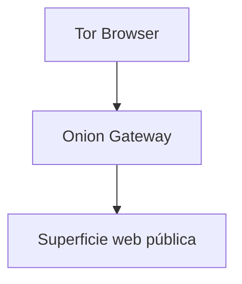

Tor Gateway es una capa de acceso orientada a privacidad para superficies web públicas selecciónadas.

No es la plataforma principal de Enigm, no sustituye la infraestructura principal y no está destinado a interfaces administrativas o servicios sensibles.

## Overview

Tor Gateway proporciona rutas de acceso mediante onion services para usuarios que eligen Tor Browser.

## Purpose

El objetivo es reducir dependencia de rutas clearnet para superficies públicas compatibles y aplicar el principio de minima exposición.

## Supported Service Categories

Tor Gateway se limita a superficies públicas, principalmente de consulta o acceso web soportado. No se utiliza para:

- Interfaces administrativas.
- Servicios internos.
- Gestión de infraestructura.
- Sistemas de desarrollo.
- APIs internas.
- Herramientas operativas.

## Security Boundaries

Tor Gateway se separa de Enigm Command, Enigm Server, mensajería segura, llamadas, Enigm OS y sistemas internos.

No afirma anonimato garantizado ni imposibilidad de monitorización.

Consulta [Platform Limitations](/es/legal/limitations).
