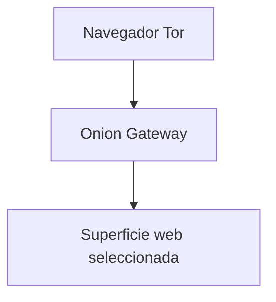

Enigm Tor Gateway es una capa de acceso orientada a la privacidad para superficies web públicas seleccionadas. No es la plataforma principal de Enigm y no pretende reemplazar la infraestructura principal.

El Tor Gateway existe para proporcionar rutas de acceso que preservan la privacidad para los servicios públicos admitidos y, al mismo tiempo, preserva la separación de los servicios de plataforma sensibles.

Tor Gateway no es Enigm Server. Enigm Server proporciona entornos de mensajería privados dedicados; Tor Gateway proporciona rutas de acceso a la superficie web seleccionadas.

El Tor Gateway se implementa en producción para superficies web Enigm públicas compatibles.

## Resumen

El Tor Gateway admite el acceso web público a través de servicios onion para superficies Enigm orientadas al público seleccionadas.

Está diseñado para reducir la exposición de rutas de acceso web seleccionadas y para ayudar a los usuarios que eligen el Navegador Tor. No define el modelo de seguridad central Enigm App, el modelo de mensajería segura, el modelo de llamada segura, el modelo de autorización Enigm Command ni el modelo de gestión de dispositivos.

## Propósito

El Tor Gateway está diseñado para:

- Admitir rutas de acceso que preserven la privacidad para servicios públicos seleccionados.
- Reducir la dependencia de las rutas de acceso a clearnet para las superficies web públicas compatibles.
- Aplicar el principio de mínima exposición.
- Mantenga el acceso web público separado de los servicios confidenciales de la plataforma.
- Apoyar un modelo de acceso orientado a la lectura cuando corresponda.

El Tor Gateway no está diseñado para reemplazar la conectividad Enigm App, VPN Service, Proxy Network, Enigm eSIM, la autorización Enigm Command, Enigm Server, mensajería segura, llamadas seguras o Enigm OS.

## Modelo de acceso onion

El modelo de acceso onion proporciona acceso web público mediante servicios onion para superficies compatibles.

A alto nivel:

1. Un usuario elige el Navegador Tor.
2. El usuario accede a un servicio onion compatible.
3. Onion Gateway expone una superficie web pública seleccionada.
4. Los servicios de plataforma sensibles permanecen fuera del modelo de acceso Tor Gateway.

La documentación pública no debe exponer la configuración del servicio onion, el diseño del servicio privado, el comportamiento de enrutamiento, los procedimientos operativos o la topología de implementación.

## Categorías de servicios admitidos

Las categorías de servicios admitidos se limitan a determinadas superficies web públicas.

Ejemplos de categorías admitidas pueden incluir:

- Documentación pública.
- Información de seguridad pública.
- Información de contacto o divulgación pública.
- Otros recursos públicos orientados a la lectura aprobados para acceso onion.

El Tor Gateway no está diseñado para:

- Interfaces administrativas.
- Servicios internos sensibles.
- Gestión de infraestructuras.
- Sistemas de desarrollo.
- API internas.
- Utillaje operativo.

## Límites de seguridad

El Tor Gateway es un límite de acceso público, no un límite de confianza para operaciones de plataforma protegida.

Los límites de seguridad incluyen:

- Las superficies web públicas están separadas de los servicios de plataforma sensibles.
- Los flujos de trabajo administrativos están excluidos del modelo de acceso Tor Gateway.
- Se excluyen los flujos de trabajo de gestión de la plataforma.
- Se excluyen los flujos de trabajo operativos internos.
- Los flujos de trabajo confidenciales de cuentas, dispositivos, mensajes y llamadas permanecen fuera de Tor Gateway.

Se aplica el principio de exposición mínima: solo las superficies públicas que necesitan acceso onion deben quedar expuestas a través de el gateway.

## Consideraciones de privacidad

El Tor Gateway proporciona beneficios de privacidad adicionales para los usuarios que eligen el navegador Tor para las superficies web públicas compatibles de Enigm.

Los beneficios de privacidad pueden incluir:

- Reducción de la dependencia de las rutas de acceso a clearnet para superficies públicas compatibles.
- Separación adicional entre el origen de la red del usuario y el acceso web público seleccionado.
- Reducción de la exposición de algunos patrones de acceso a nivel de red.

El Tor Gateway no garantiza la protección de la identidad en todos los entornos. El comportamiento del usuario, la configuración del navegador, la seguridad de los endpoints y las señales externas siguen siendo relevantes.

## Relación con otros componentes de Enigm

El Tor Gateway es un componente de apoyo en el ecosistema Enigm más amplio.

Su relación con otros componentes:

- **Enigm App**: independiente de mensajería segura a nivel de aplicación, llamadas seguras y administración de claves.
- **Enigm Command**: puede regir el ciclo de vida de Tor Gateway o la configuración de políticas, pero Tor Gateway no es una superficie de acceso administrativo para Enigm Command.
- **Enigm Server**: producto de entorno de mensajería privada dedicado e independiente.
- **VPN Service**: capa de privacidad de transporte separada con diferente propósito.
- **Proxy Network**: capa de separación de tráfico separada para la mediación de plataforma.
- **Enigm eSIM**: componente de conectividad de datos móviles independiente.
- **Enigm OS**: capa opcional de protección del dispositivo, no necesaria para el acceso web público Tor Gateway.

## Consideraciones sobre el modelo de amenazas

El Tor Gateway es relevante para el acceso web público, la exposición mínima, la separación de superficies públicas y la reducción de la dependencia de clearnet.

Las áreas relevantes del modelo de amenazas incluyen la exposición de la superficie pública, la configuración incorrecta de los límites de acceso público, la exposición no intencionada de flujos de trabajo confidenciales, el compromiso de los endpoints, la divulgación de los usuarios y la pérdida de visibilidad de la auditoría.

El modelado de amenazas debe verificar que las superficies accesibles a las puertas de enlace sean seguras para el público y no expongan flujos de trabajo administrativos, de desarrollo, internos u operativos.

Ver [Limitaciones de la plataforma](/es/legal/limitations).
