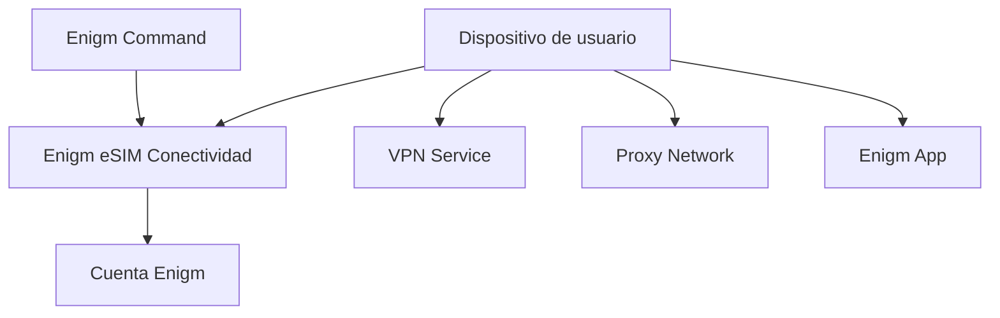

Enigm eSIM es el producto de conectividad privada en el ecosistema Enigm. Se centra en la conectividad de datos móviles orientada a la privacidad en áreas de cobertura admitidas y se puede combinar con otros controles de privacidad y seguridad de Enigm.

## Resumen

El servicio Enigm eSIM proporciona conectividad de datos móviles como componente de plataforma de soporte en todas las áreas de cobertura admitidas. Es solo de datos y no proporciona la funcionalidad tradicional de llamadas de voz ni SMS.

Enigm eSIM se compra y gestiona a través de Enigm Command. El ciclo de vida de la eSIM está vinculado a la cuenta Enigm del usuario y el usuario puede eliminarlo o desvincularlo.

Enigm proporciona Enigm eSIM como un servicio de gestión del ciclo de vida y facilitación comercial. Enigm no es un operador de red móvil, un operador de red móvil virtual, un operador de telecomunicaciones, un operador de red de acceso por radio ni un emisor directo de la conectividad del operador subyacente. La infraestructura del operador, la operación de la red del operador, el acceso de radio, el transporte de tráfico, la asignación de IP, el comportamiento de roaming y los registros de conectividad de la capa del operador son operados por un proveedor de infraestructura de telecomunicaciones independiente.

Enigm eSIM está separado de la criptografía Enigm App, del cifrado de extremo a extremo y de la funcionalidad VPN.

La conectividad móvil y la confidencialidad de los mensajes son problemas de seguridad diferentes. La conectividad Enigm eSIM puede afectar la forma en que un dispositivo llega a las redes, pero no define cómo se cifra el contenido del mensaje ni cómo se confía en los dispositivos para enviar mensajes seguros.

## Propósito

El servicio Enigm eSIM está diseñado para reducir la dependencia de los flujos de trabajo de identidad móviles tradicionales dentro del flujo de gestión del ciclo de vida y compras del lado de Enigm, al tiempo que proporciona conectividad de datos móviles.

El flujo de trabajo de gestión del ciclo de vida y compras del lado de Enigm no recopila:

- Verificación KYC.
- Dirección de email.
- Número de teléfono.
- Documento de identidad.

El Enigm eSIM puede ayudar a mitigar:

- Ciertos escenarios de exposición de la identidad móvil.
- Dependencia de los flujos de trabajo tradicionales de suscriptores.
- Algunas formas de visibilidad de la red.

El servicio Enigm eSIM no reemplaza la mensajería segura, el cifrado de extremo a extremo, Device Trust, la protección de transporte VPN, la separación de tráfico Proxy Network ni los controles de seguridad de cuentas.

## Compra y activación

La compra y activación de Enigm eSIM se realiza a través de Enigm Command.

Los flujos de trabajo de compra y gestión del ciclo de vida están diseñados en torno a un modelo que minimiza la identidad:

- Los usuarios pueden comprar Enigm eSIM desde Enigm Command.
- Los usuarios pueden administrar el estado del ciclo de vida de Enigm eSIM desde Enigm Command.
- El flujo de trabajo del lado de Enigm no recopila verificación KYC, email, número de teléfono ni documento de identidad.
- El país de compra seleccionado por el usuario se maneja como metadatos del ciclo de vida comercial.
- El estado del ciclo de vida Enigm eSIM está vinculado a la cuenta Enigm del usuario para su administración, eliminación, desvinculación y soporte.

El estado de activación es el estado del ciclo de vida de la conectividad. No proporciona acceso al texto claro de mensajes, contenido de llamadas seguras, contenido multimedia, texto claro de archivos adjuntos, conversaciones de usuarios, material de clave protegida o material de clave privada.

Los requisitos de operadores externos, roaming o específicos de jurisdicción pueden variar fuera del flujo de trabajo de gestión del ciclo de vida y compras del lado de Enigm. Los usuarios y las organizaciones siguen siendo responsables de evaluar los requisitos locales de telecomunicaciones y registro de identidad.

## Descargo de responsabilidad del operador externo

Enigm eSIM depende de un operador externo confiable y de un proveedor de infraestructura de telecomunicaciones independiente para el servicio de datos móviles subyacente.

Enigm no opera la red de operadores y no controla:

- Infraestructura de acceso radioeléctrico.
- Enrutamiento de redes móviles.
- Comportamiento de itinerancia del operador.
- Asignación de direcciones IP por parte de la red del operador.
- Transporte de paquetes en la capa portadora.
- Registros de la red del operador.
- Sistemas de autenticación de operadores.
- Sistemas de registro regulatorio de telecomunicaciones.

La función de Enigm se limita a la facilitación comercial, la asociación de cuentas de Enigm, la visibilidad del ciclo de vida, el estado de compra y derecho, los flujos de trabajo de eliminación o retiro iniciados por el usuario y la coordinación de soporte para servicios Enigm eSIM elegibles.

Esta separación es importante para la revisión legal, técnica y de auditoría. Enigm eSIM no debe interpretarse como evidencia de que Enigm es un MNO, MVNO, operador de telecomunicaciones, operador de red de acceso por radio o emisor del perfil de telecomunicaciones subyacente.

## Disponibilidad de datos de la capa de operador

Enigm no recibe registros de tráfico de capa de operador del proveedor independiente de infraestructura de telecomunicaciones como parte de la operación normal de Enigm eSIM.

Los registros de la capa portadora incluyen:

- Registros de tráfico de la red móvil.
- Registros de asignación de IP del lado del operador.
- Registros de acceso radio.
- Registros de enrutamiento de paquetes.
- Registros de conexión del operador.
- Registros de itinerancia del operador.
- Registros de uso de la red mantenidos por el operador.

Debido a que Enigm no opera la red del operador y no recibe esos registros de la capa del operador, Enigm no puede proporcionar registros de tráfico de la red del operador, registros de asignación de IP del operador, registros de conexión del operador o registros de telecomunicaciones del lado del operador en respuesta a solicitudes de revisión legal, regulatoria, de soporte o empresarial.

Enigm solo puede revisar los datos del ciclo de vida retenidos por Enigm, como el estado de compra, el estado de los derechos, la asociación de la cuenta de Enigm, el estado de activación Enigm eSIM, el estado de desvinculación, el estado de eliminación y los registros de soporte retenidos según el modelo de retención documentado.

## Cumplimiento de telecomunicaciones locales

> **Aviso de cumplimiento:** Enigm eSIM los usuarios son responsables de comprender y cumplir con los requisitos de telecomunicaciones, registro de identidad, importación, exportación, sanciones, uso legal y uso de red que se aplican en las jurisdicciones donde compran, activan o usan conectividad de datos móviles. Enigm no brinda asesoramiento legal, no declara que el uso de Enigm eSIM sea legal en todas las jurisdicciones y no asume responsabilidad por el uso indebido, el uso prohibido o el incumplimiento de los requisitos de telecomunicaciones locales por parte del usuario.

Los requisitos normativos locales pueden variar según el país, la región, el operador, la clase de dispositivo, el estado del usuario y el caso de uso. Los usuarios y las organizaciones deben evaluar las obligaciones locales antes de utilizar Enigm eSIM en entornos regulados.

## Separación de capas de seguridad

Enigm App y Enigm eSIM operan en capas de seguridad separadas.

Enigm App proporciona controles de seguridad a nivel de aplicación, como cifrado de extremo a extremo, material de claves protegido, mensajería segura, llamadas seguras, Device Trust y flujos de trabajo de verificación.

Enigm eSIM proporciona conectividad de datos móviles a través de un proveedor de infraestructura de telecomunicaciones independiente. La capa de conectividad del operador transporta el tráfico de la red; no define el cifrado de mensajes Enigm App, no recibe material de clave privada Enigm App, no proporciona acceso de texto claro a los mensajes Enigm App y no debilita el cifrado de extremo a extremo Enigm App.

Esta separación significa que la confidencialidad de las comunicaciones Enigm App sigue regida por el modelo de seguridad Enigm App, no por el proveedor de conectividad de la capa de operador.

## Conectividad de datos móviles

El servicio Enigm eSIM proporciona conectividad de datos móviles para dispositivos compatibles con eSIM en áreas de cobertura compatibles.

La conectividad de datos móviles admite:

- Acceso a la red para Enigm App.
- Acceso a la red para uso opcional de VPN.
- Acceso a la red para uso de Proxy Network cuando esté habilitado.
- Acceso a la red para otros componentes compatibles de la plataforma Enigm.
- Comportamiento de conectividad consciente de políticas donde se aplica la configuración administrada.

El comportamiento de la conectividad debe entenderse como una capacidad de transporte y acceso, no como un mecanismo de confidencialidad de los mensajes.

## Modelo de solo datos

Enigm eSIM está documentado como un producto de conectividad únicamente de datos.

El modelo de producto público es:

- Conectividad de datos móviles.
- Acceso a Internet para dispositivos compatibles.
- Sin servicio de voz tradicional.
- Sin servicio de SMS tradicional.
- No hay dependencia del número de teléfono para la creación de cuentas Enigm.

La comunicación de voz y video dentro de Enigm debe utilizar flujos de trabajo de llamadas seguros Enigm App, no servicios de voz móviles heredados. La mensajería segura debe utilizar flujos de trabajo de mensajería seguros Enigm App, no SMS.

## Asociación de cuentas

Enigm eSIM está asociado con la cuenta Enigm del usuario para la gestión del ciclo de vida.

La asociación de cuentas admite:

- Estado de derecho del producto.
- Estado de activación.
- Revisión del ciclo de vida de la conectividad.
- Desvinculación iniciada por el usuario.
- Eliminación o retiro iniciado por el usuario.
- Soporte y revisión de seguridad cuando sea necesario.

La asociación de cuenta no convierte Enigm eSIM en un producto de verificación de identidad. La identidad de la cuenta de Enigm, Device Trust, el material clave protegido y la confidencialidad de los mensajes siguen siendo dominios de confianza separados.

## Gestión del ciclo de vida

Enigm eSIM la gestión del ciclo de vida se proporciona a través de Enigm Command.

Los flujos de trabajo del ciclo de vida incluyen:

- Compra o activación.
- Revisión del estado de activación.
- Revisión de asociación de cuentas de Enigm.
- Revisión del uso del dispositivo cuando sea necesario para soporte o política.
- Desvinculación iniciada por el usuario.
- Eliminación o retiro iniciado por el usuario.
- Sustitución o jubilación.
- Asignación de políticas donde se aplica la configuración administrada.
- Visibilidad del estado de la conectividad.
- Soporte de flujos de trabajo para dispositivos elegibles.

La visibilidad del ciclo de vida debe seguir centrándose en la conectividad y el estado de las políticas. No debe convertirse en una superficie de visibilidad de mensajes, llamadas, medios, archivos adjuntos o conversaciones.

Eliminar o retirar un Enigm eSIM elimina el servicio del funcionamiento normal del ciclo de vida de Enigm, sujeto únicamente a restricciones legales, de seguridad u operativas.

## Relación con Enigm App

Enigm App sigue siendo responsable de las funciones de seguridad a nivel de aplicación, como mensajería segura, llamadas seguras, administración de claves, asociación de dispositivos, flujos de trabajo de verificación y caducidad de mensajes.

El servicio Enigm eSIM está vinculado a la cuenta Enigm del usuario para la gestión del ciclo de vida. No reemplaza el material de claves protegido, el almacenamiento seguro del dispositivo, el cifrado de extremo a extremo ni las decisiones Device Trust.

El proveedor independiente de infraestructura de telecomunicaciones que permite la conectividad de datos a nivel de operador no participa en la administración de claves Enigm App, el cifrado de mensajes, el cifrado seguro de llamadas, Device Trust, la recuperación de cuentas ni las decisiones sobre el ciclo de vida del contenido protegido.

Enigm App debe permanecer seguro según su modelo a nivel de aplicación, ya sea que se utilice o no la conectividad Enigm eSIM.

## Relación con VPN

El servicio Enigm eSIM está separado de la funcionalidad VPN y de la separación de tráfico Proxy Network.

Enigm eSIM proporciona conectividad de datos móviles. VPN Service proporciona una capa de privacidad de transporte opcional cuando está habilitada. Proxy Network proporciona separación del tráfico cuando está habilitado. Estos componentes se pueden combinar, pero abordan diferentes partes del modelo de seguridad.

El uso de Enigm eSIM no implica protección VPN ni mediación de proxy. El uso de VPN Service o Proxy Network no cambia la necesidad de evaluar Device Trust, el cifrado de la capa de aplicación y la confidencialidad de los mensajes por separado.

## Relación con Enigm Command

Enigm Command proporciona flujos de trabajo de compra, activación, revisión del ciclo de vida, eliminación y retiro de Enigm eSIM.

Los flujos de trabajo Enigm Command incluyen:

- Compras Enigm eSIM.
- Activando Enigm eSIM.
- Revisando el estado de Enigm eSIM.
- Gestión del ciclo de vida de activación.
- Revisión de asociación de cuentas de Enigm.
- Admite flujos de trabajo de desvinculación, eliminación, reemplazo o retiro.
- Aplicación de la política de conectividad gestionada.

La gestión administrativa Enigm eSIM debe permanecer separada del contenido de comunicación protegido y del material de clave privada.

## Consideraciones de privacidad

El servicio Enigm eSIM respalda los objetivos de privacidad al reducir la dependencia de los flujos de trabajo de identidad móviles tradicionales.

El flujo de trabajo de eSIM del lado de Enigm minimiza la identidad porque no recopila verificación KYC, email, número de teléfono ni documento de identidad.

Las consideraciones de privacidad incluyen:

- Limitar la exposición de los datos del ciclo de vida de la conectividad móvil.
- Evite exponer metadatos de identidad innecesarios.
- Separe el estado de conectividad del contenido del mensaje.
- Mantener la visibilidad administrativa centrada en el ciclo de vida y el estado de la política.
- Evite tratar el estado de la conectividad como prueba de actividad del mensaje.

El servicio Enigm eSIM es una capa de conectividad orientada a la privacidad, no un reclamo de borrado de identidad. Las redes externas, el comportamiento de los dispositivos, los flujos de pago, las obligaciones legales y el comportamiento del usuario aún pueden crear exposición fuera del modelo de ciclo de vida Enigm eSIM.

## Consideraciones sobre metadatos

La conectividad móvil requiere algunos metadatos para funcionar. El servicio Enigm eSIM debe minimizar la recopilación y exposición de metadatos siempre que sea posible.

Los metadatos pueden estar relacionados con:

- Estado de conectividad.
- Ciclo de vida de activación o desactivación.
- Asociación de cuentas Enigm.
- Soporte del dispositivo o estado de compatibilidad cuando sea necesario.
- Estado de la política.
- Soporte y auditoría de eventos del ciclo de vida.

Los metadatos relacionados con la conectividad deben permanecer separados del contenido de mensajes seguros, el contenido de llamadas seguras, el material de clave privada y los archivos adjuntos protegidos.

Los metadatos de la red de capa de operador permanecen fuera de la visibilidad operativa normal de Enigm cuando son generados y retenidos por el proveedor independiente de infraestructura de telecomunicaciones. Los metadatos retenidos por Enigm se limitan al ciclo de vida de Enigm eSIM, derechos, asociación de cuentas, eliminación, soporte y registros de seguridad descritos en esta documentación.

Ver [Limitaciones de la plataforma](/es/legal/limitations).

## Consideraciones sobre el modelo de amenazas

El servicio Enigm eSIM es relevante para escenarios de conectividad móvil, exposición de identidad móvil, visibilidad de red y acceso al transporte.

Las áreas relevantes del modelo de amenazas incluyen el uso indebido de políticas de red, el compromiso de cuentas y aplicaciones, el abuso del ciclo de vida del dispositivo, los intentos de comprometer la mensajería segura, los intentos de comprometer las llamadas seguras y la pérdida de visibilidad de la auditoría.

Esta documentación excluye intencionalmente las relaciones de conectividad con terceros, los acuerdos comerciales, los backends de activación, la topología de implementación y el comportamiento sensible a la implementación.
