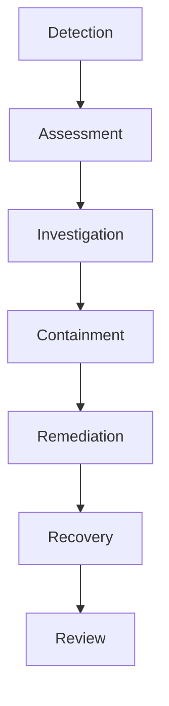

Operaciones y resiliencia describe cómo Enigm mantiene visibilidad operativa, respuesta a incidentes y continuidad de funciones críticas.

## Monitorización

La monitorización proporciona visibilidad de salud de servicio, estado operativo y postura de seguridad.

No está destinada a inspeccionar mensajes, llamadas, medios o conversaciones.

## Respuesta a incidentes

Enigm mantiene capacidad estructurada de respuesta a incidentes para detección, evaluación, investigacion, contencion, remediacion, recuperación y revisión.

## Copia de seguridad y recuperación

Backup y recovery existen para continuidad de funciones críticas, no como archivo masivo de comunicaciones de usuario.

El alcance se limita a componentes necesarios para continuidad, seguridad y recuperación.

## Validación de seguridad

Ver [Gobernanza de seguridad](/es/security/governance).

Consulta [Limitaciones de plataforma](/es/legal/limitations).
