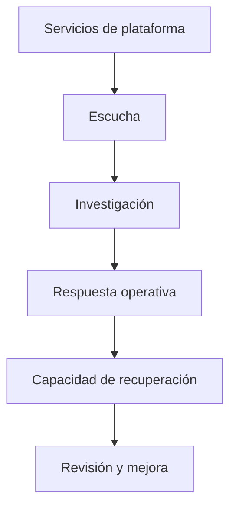

Las operaciones de infraestructura de Enigm están diseñadas para respaldar la confiabilidad del servicio, la visibilidad de la seguridad, la continuidad del negocio y la recuperación controlada sin exponer las comunicaciones del usuario ni la topología operativa.

## Resumen

Las operaciones y la resiliencia cubren tres capacidades relacionadas:

- Monitorización del estado del servicio, estado operativo y visibilidad de la seguridad.
- Respuesta a incidentes para evaluación, contención, remediación, recuperación y revisión.
- Backup y recuperación para continuidad de funciones críticas de la plataforma.

## Monitorización

La supervisión proporciona visibilidad del estado del servicio, la integridad operativa, la postura de seguridad y el comportamiento anómalo. Admite revisión de disponibilidad, detección de incidentes, investigación, identificación de riesgos y conciencia operativa.

El monitorización de seguridad puede observar eventos de seguridad, señales de integridad, anomalías operativas, indicadores de riesgo y resultados defensivos. El seguimiento es un control de visibilidad; Enigm Intelligence proporciona una correlación más profunda y un contexto de seguridad.

## Respuesta a incidentes

Enigm mantiene una capacidad estructurada de respuesta a incidentes destinada a reducir el impacto, proteger a los usuarios, restaurar la integridad del servicio, mejorar la visibilidad y respaldar la mejora continua.

El ciclo de vida del incidente se conceptualiza como detección, evaluación, investigación, contención, remediación, recuperación y revisión. La comunicación debe equilibrar la transparencia, la precisión, la protección del usuario y la seguridad operativa.

## Copia de seguridad y recuperación

La copia de seguridad y la recuperación existen para respaldar la continuidad de las funciones críticas de la plataforma. Enigm no opera un modelo amplio de respaldo de archivos para las comunicaciones de los usuarios.

El alcance de la copia de seguridad se minimiza intencionalmente y se centra en la continuidad del servicio, la seguridad y el estado crítico de la plataforma para la recuperación, como el estado de identidad, el estado crítico de la plataforma, los registros operativos esenciales y la información crítica para la recuperación. Los flujos de trabajo de recuperación no están destinados a eludir el cifrado de extremo a extremo ni a proporcionar acceso de texto claro al contenido protegido del usuario.

## Consideraciones de privacidad

Los datos de operaciones tienen como alcance los requisitos de confiabilidad, seguridad, prevención de fraude, prevención de abuso, legales y de recuperación. La monitorización y la recuperación no están destinadas a inspeccionar mensajes, medios, llamadas, archivos adjuntos o conversaciones de usuarios.

Los registros operativos deben minimizarse, cifrarse cuando el dominio correspondiente lo admita, controlar el acceso, conservarse de acuerdo con el propósito documentado y eliminarse cuando ya no sean necesarios.

## Relación con la Gobernanza

La validación continua, la evaluación periódica, las pruebas contradictorias, la gobernanza del cumplimiento y la revisión independiente están documentadas en [Gobernanza de seguridad](/es/security/governance).

Ver [Limitaciones de la plataforma](/es/legal/limitations).
