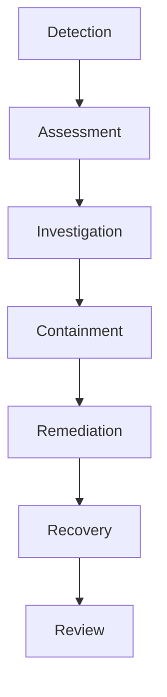

Operations And Resilience describe cómo Enigm mantiene visibilidad operativa, respuesta a incidentes y continuidad de funciónes críticas.

## Monitoring

La monitorización proporciona visibilidad de salud de servicio, estado operativo y postura de seguridad.

No está destinada a inspeccionar mensajes, llamadas, medios o conversaciones.

## Incident Response

Enigm mantiene capacidad estructurada de respuesta a incidentes para detección, evaluación, investigacion, contencion, remediacion, recuperacion y revisión.

## Backup And Recovery

Backup y recovery existen para continuidad de funciónes críticas, no cómo archivo masivo de comunicaciones de usuario.

El alcance se limita a componentes necesarios para continuidad, seguridad y recuperacion.

## Security Validation

Ver [Security Governance](/es/security/governance).

Consulta [Platform Limitations](/es/legal/limitations).
