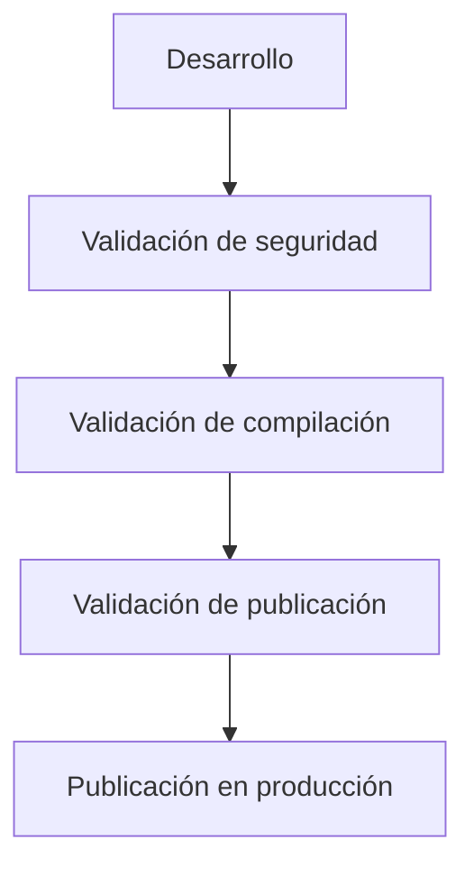

Enigm sigue un ciclo de vida de desarrollo de software centrado en la seguridad diseñado para reducir el riesgo de la cadena de suministro de software, mejorar la calidad del código, respaldar procesos seguros de publicación y preservar el diseño de plataforma orientado a la privacidad.

## Resumen

Enigm Secure SDLC define las capacidades y controles de seguridad utilizados para guiar el software desde el desarrollo hasta el versión de producción.

El ciclo de vida está diseñado para respaldar:

- Reducción de riesgos de software.
- Mejora de la calidad del código.
- Liberación de integridad.
- Detección temprana de vulnerabilidades.
- Protección de los activos de desarrollo.
- Gobernanza de liberación segura.

El diagrama es conceptual y describe las etapas de validación del ciclo de vida a nivel de arquitectura pública.

## Objetivos de seguridad

El SDLC seguro está diseñado para:

- Reducir el riesgo del software.
- Mejorar la integridad de la liberación.
- Detectar vulnerabilidades tempranamente.
- Proteger los activos de desarrollo.
- Mejorar la seguridad operativa.
- Admite autorización de liberación segura.
- Apoyar el despliegue de producción controlada.
- Preservar los requisitos de privacidad, minimización de datos y confidencialidad del contenido durante los cambios de productos y plataformas.

El objetivo es la reducción de riesgos y la mejora continua a lo largo del ciclo de vida del software.

## Principios de seguridad del desarrollo

La seguridad del desarrollo de Enigm se guía por:

- Defensa en profundidad.
- Mínimo privilegio.
- Valores predeterminados seguros.
- Separación de funciones.
- Verificación antes del versión.
- Validación continua.
- Revisión de cambios.
- Autorización de liberación controlada.

Estos principios tienen como objetivo reducir la probabilidad de que código inseguro, configuración insegura o cambios no autorizados lleguen a producción.

## Seguridad del código fuente

El proceso de desarrollo incluye controles para la seguridad del código fuente.

Los controles conceptuales incluyen:

- Análisis de código automatizado.
- Revisión por pares.
- Revisión de seguridad.
- Validación de cambios.

Los controles de seguridad del código fuente tienen como objetivo identificar defectos, patrones inseguros y cambios sensibles a la seguridad antes de su publicación.

## Seguridad de dependencias

Las dependencias de terceros se revisan, monitorean y evalúan para determinar el impacto en la seguridad.

La seguridad de la dependencia se centra en:

- Identificación de dependencias vulnerables.
- Revisión del riesgo de dependencia.
- Reducir la exposición innecesaria a la dependencia.
- Apoyar la remediación cuando se identifican problemas de seguridad.
- Preservar la conciencia del impacto de la dependencia en el riesgo de liberación.

La seguridad de la dependencia reduce el riesgo de la cadena de suministro pero no lo elimina.

## Protección de materiales sensibles

Secure SDLC incluye controles diseñados para evitar la exposición accidental de material de credenciales confidencial.

La protección de materiales sensibles se centra en:

- Reducir la probabilidad de exposición de credenciales sensibles.
- Evitar que se almacene material confidencial en el código fuente.
- Respaldar la revisión de cambios que puedan afectar el manejo de credenciales.
- Limitar el acceso a activos de desarrollo sensibles.
- Fomentar la rotación y la remediación cuando se sospecha exposición.

La protección sensible de materiales es un control del ciclo de vida y debe estar respaldada por una disciplina operativa.

## Seguridad de la compilación

Los procesos de compilación están diseñados para respaldar la integridad, la trazabilidad y los flujos de trabajo de liberación controlada.

La seguridad de la construcción se centra en:

- Validación de entradas de compilación.
- Integridad de artefactos de compilación.
- Trazabilidad entre cambios y artefactos de publicación.
- Separación entre producción de compilación y autorización de publicación.
- Promoción controlada hacia la validación del versión.

La seguridad de la compilación no reemplaza la firma de la versión ni la validación de la producción.

## Seguridad de versiones

Los versións de producción requieren validación y autorización antes de su publicación.

La seguridad de la versión incluye:

- Validación de publicación.
- Autorización de liberación.
- Controles de integridad de versión.
- Publicación controlada.
- Revisión de la preparación para la implementación.

La seguridad de la versión se relaciona directamente con:

- Firma de comunicados.
- Seguridad OTA.
- Controles de producción.

La firma de la autorización establece la autenticidad de la autorización. La seguridad de OTA protege la entrega, la elegibilidad y la verificación del dispositivo. Las controles de producción definen la postura de seguridad de producción esperada.

## Gestión de vulnerabilidades

La plataforma admite la gestión de vulnerabilidades como parte de Secure SDLC.

La gestión de vulnerabilidades incluye:

- Identificación de vulnerabilidades.
- Evaluación de riesgos.
- Priorización.
- Flujos de trabajo de remediación.
- Verificación de la remediación.

La gestión de vulnerabilidades tiene como objetivo reducir la exposición y mejorar la respuesta a problemas de seguridad conocidos durante todo el ciclo de vida del software.

## Monitorización de seguridad

La visibilidad de la seguridad se extiende a lo largo del ciclo de vida del software y del entorno operativo.

El monitorización de seguridad puede respaldar:

- Visibilidad de eventos relevantes para la seguridad.
- Revisión de los resultados de seguridad relacionados con el versión.
- Identificación de actividad sospechosa.
- Soporte a la respuesta a la vulnerabilidad.
- Soporte para visibilidad de incidentes.

El seguimiento es un control de visibilidad defensivo. No reemplaza el desarrollo, la revisión o la validación de versións seguros.

Ver [Gobernanza de seguridad](/es/security/governance).

## Respuesta a incidentes

Los incidentes de seguridad se evalúan, investigan y abordan mediante procedimientos de respuesta controlados.

La respuesta a incidentes admite:

- Triaje de eventos.
- Evaluación de impacto.
- Reducción de riesgos.
- Coordinación de remediación.
- Lecciones aprendidas.

La respuesta a incidentes tiene como objetivo reducir el impacto y mejorar los controles futuros cuando ocurran problemas de seguridad.

## Mejora continua

Los controles de seguridad se revisan y perfeccionan continuamente.

La mejora continua incluye:

- Revisar los resultados de seguridad.
- Actualizar los controles cuando cambian los riesgos.
- Mejora de la cobertura de validación.
- Refinar las expectativas de preparación para el versión.
- Fortalecimiento de las prácticas de seguridad del desarrollo.

El SDLC seguro debería evolucionar a medida que evolucionan los productos Enigm, los controles de plataforma y las condiciones de amenazas.

Ver [Limitaciones de la plataforma](/es/legal/limitations).
