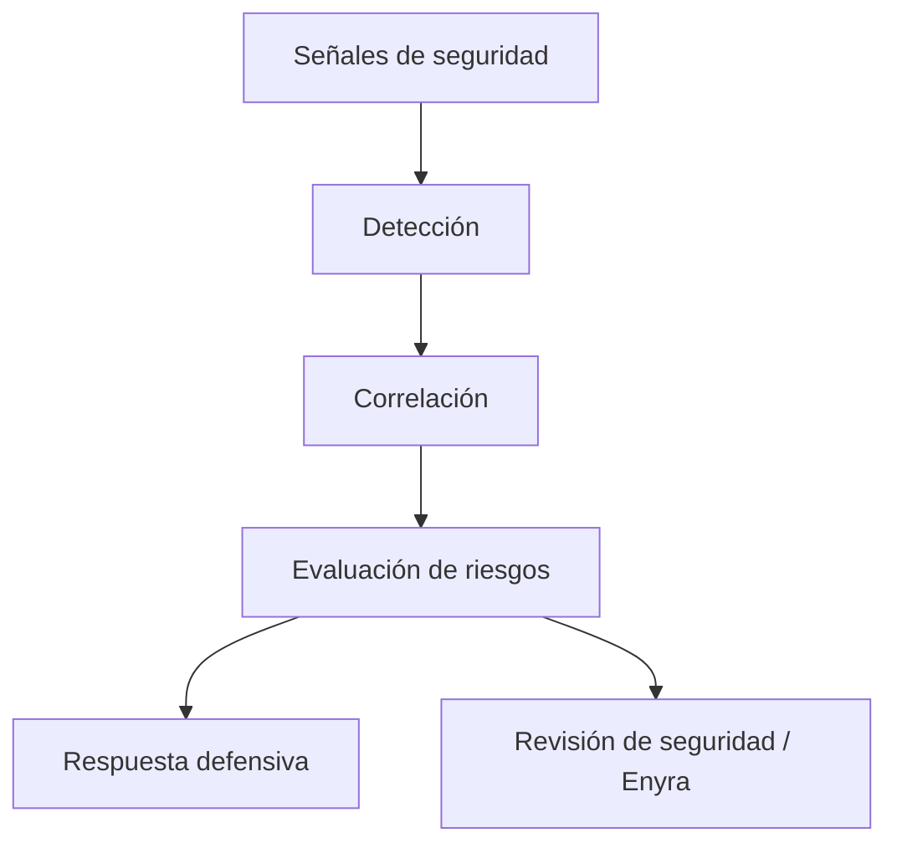

Enigm Intelligence transforma las observaciones de seguridad en un contexto defensivo para flujos de trabajo de seguridad de nivel superior. Está diseñado para respaldar la visibilidad de amenazas, la priorización de riesgos, la investigación y las decisiones de reducción de riesgos sin convertir las comunicaciones de los usuarios en entradas de seguridad.

## Resumen

El modelo de detección y respuesta tiene cuatro responsabilidades:

- Convertir señales de seguridad en contexto estructurado.
- Correlacionar actividades relacionadas entre dominios de seguridad.
- Clasificar el riesgo para la priorización operativa.
- Apoyar controles defensivos proporcionados y revisión de seguridad autorizada.

## Procesamiento de señales

Las señales de seguridad tienen como alcance la protección de la plataforma, la integridad del servicio, Device Trust, la monitorización y las operaciones defensivas. Pueden incluir telemetría de seguridad, señales de integridad, eventos de plataforma, observaciones de monitorización, resultados de control defensivo, cambios en el estado de confianza y actualización o implementación del contexto de seguridad.

Las señales se normalizan en una representación consistente para que las observaciones relacionadas se puedan comparar, correlacionar, resumir y revisar. La normalización admite la generación confiable de contextos de seguridad sin exponer reglas internas, umbrales o lógica de detección.

## Detección y correlación

La detección identifica la actividad relevante para la seguridad para su revisión y correlación. Un solo evento puede tener un significado limitado por sí solo, mientras que las observaciones relacionadas a lo largo del tiempo, las superficies de infraestructura, las clases de dispositivos o los dominios de seguridad pueden proporcionar un contexto más sólido.

La correlación está diseñada para mejorar la comprensión de la actividad potencialmente relacionada. Apoya la evaluación e investigación de riesgos, pero no debe tratarse como una verdad de plataforma final sin contexto y revisión autorizada cuando sea necesario.

## Evaluación de riesgos

La evaluación de riesgos convierte el contexto de seguridad en priorización operativa. Las clasificaciones conceptuales incluyen Low, Medium, High y Critical.

La evaluación de riesgos puede considerar la gravedad, el contexto, la recurrencia, la actividad transversal, la confianza, los cambios de integridad, el historial defensivo y las observaciones históricas relevantes. Las clasificaciones representan apoyo a las decisiones más que certeza; no prueban atribución, intención o compromiso por sí solos.

## Respuesta defensiva

El modelo de respuesta defensiva respalda la visibilidad, la investigación, la notificación, las restricciones de acceso, los controles de tráfico, el filtrado protector y las medidas defensivas temporales. No toda observación resulta en una acción de control.

Las acciones defensivas están diseñadas para equilibrar la seguridad, la confiabilidad, la privacidad y la estabilidad operativa. Las acciones sensibles deben seguir regidas por requisitos de autorización, políticas y revisión. La automatización respalda los flujos de trabajo de seguridad; no reemplaza la gobernanza de la seguridad.

## Relación con Enyra

Enyra consume el contexto de seguridad producido por Enigm Intelligence. Admite correlación de seguridad, resumen de eventos, explicación de riesgos, recuperación de contexto y revisión de actividades defensivas.

Enyra no reemplaza los sistemas de detección, los sistemas de correlación, la evaluación de riesgos ni los mecanismos de aplicación. Opera como una capa de análisis asistida por IA sobre el contexto de seguridad, no como una fuente de verdad sobre la plataforma.

## Consideraciones de privacidad

El modelo de detección y respuesta está diseñado en torno a la minimización y agregación cuando sea posible. No está diseñado para inspeccionar el contenido de mensajes, llamadas, medios, archivos adjuntos, documentos o conversaciones de usuarios.

Los controles de privacidad incluyen recopilación de señales con alcance, metadatos de identidad minimizados, separación entre visibilidad de seguridad y confidencialidad de mensajes, controles de acceso autorizado y preferencia por el contexto de seguridad sobre la inspección de contenido.

Ver [Limitaciones de la plataforma](/es/legal/limitations).
