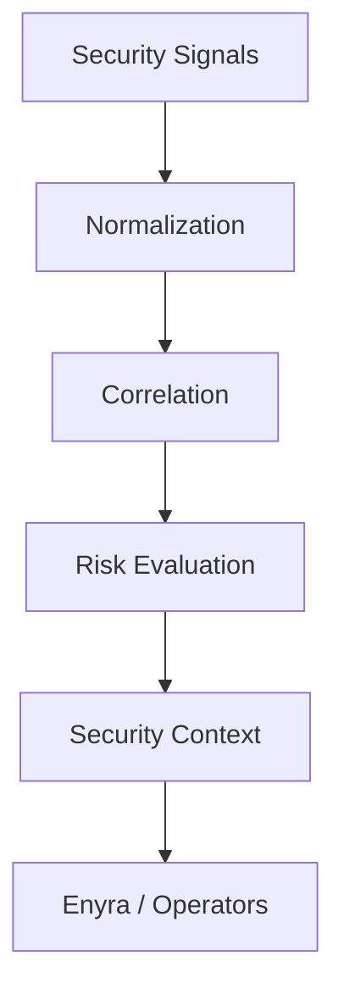

Detección y respuesta transforma observaciones de seguridad en contexto util para operadores y sistemas defensivos.

## Pipeline de detección

El pipeline incluye:

- Signal collection.
- Signal normalization.
- Event correlation.
- Risk evaluation.
- Generación de contexto de seguridad.
- Defensive decision support.

## Modelo de riesgo

El modelo de riesgo es un marco de soporte de decisiones. Puede considerar severidad, contexto, recurrencia, actividad cross-surface e historial.

Las clasificaciones Low, Medium, High y Critical representan prioridad operativa, no certeza absoluta.

## Respuesta defensiva

La arquitectura de bloqueo existe para reducir riesgo de actividad hostil o sospechosa.

Las respuestas pueden incluir restricciones de acceso, controles de tráfico, filtrado protector y medidas temporales. Las decisiones sensibles requieren supervisión humana.

## Relación con Enyra

Enyra consume contexto de seguridad. No reemplaza detección, correlación, enforcement defensivo ni autorización humana.

## Consideraciones de privacidad

El pipeline opera sobre contexto de seguridad y no está destinado a inspeccionar contenido protegido.

Consulta [Limitaciones de plataforma](/es/legal/limitations).
