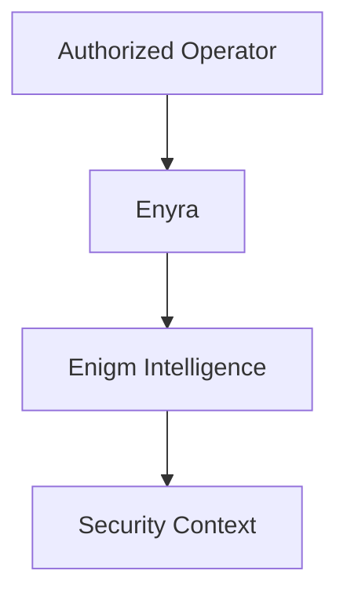

Enyra en la seccion Intelligence es la IA de seguridad y capa de correlación del ecosistema Enigm.

No debe confundirse con Enyra Product Assistant de Enigm Command, que se limita a guía de producto, configuración, navegación y asistencia de usuario.

## Modelo de analista de seguridad

Enyra ayuda a operadores autorizados a entender eventos de seguridad, investigar hallazgos, revisar riesgo, obtener resumenes y consultar contexto de seguridad.

## Contexto de seguridad

Enyra consume contexto producido por Enigm Intelligence. No determina por si sola la verdad de la plataforma.

## Autorización humana

Acciones sensibles cómo blocking, unblocking o administración sensible pueden requerir autorización adicional.

## Consideraciones de privacidad

Enyra debe operar sobre contexto autorizado y minimizado. No está destinado a inspeccionar comunicaciones protegidas.

Consulta [Detección y respuesta](/es/intelligence/detection-and-response) y [Limitaciones de plataforma](/es/legal/limitations).
