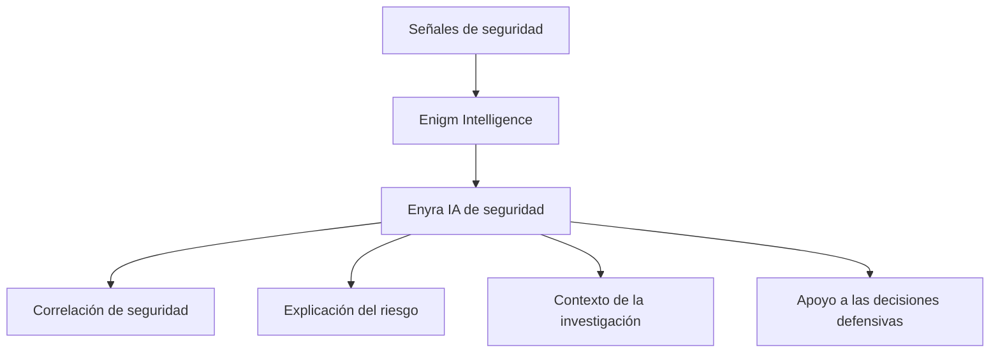

Enyra es la IA de seguridad y la capa de correlación del dominio Enigm Intelligence. Opera sobre un contexto de seguridad para respaldar la correlación de amenazas, la explicación de riesgos, los flujos de trabajo de investigación, el resumen de eventos y el soporte de decisiones defensivas.

Enyra en la sección Inteligencia no es el Asistente de producto de Enigm Command. La guía del producto, la guía de documentación, la asistencia de configuración, la navegación de la plataforma, la asistencia del dispositivo y la asistencia de la cuenta se documentan en [Enigm Command](/es/command/overview).

Enyra no reemplaza al Threat Intelligence Platform, sistemas de detección, sistemas de correlación, controles defensivos o autorización humana. Opera como una capa de IA sobre un contexto de seguridad autorizado.

## Resumen

Enyra admite el análisis de seguridad sobre las salidas Enigm Intelligence.

Enyra no determina de forma independiente la verdad de la plataforma. El contexto de seguridad autorizado sigue basándose en Enigm Intelligence, la telemetría aprobada, los registros de auditoría, los resultados de la evaluación de riesgos, el estado de control defensivo y el estado de la plataforma autorizada.

## Modelo de IA de seguridad

Enyra aplica el análisis asistido por IA al contexto de seguridad producido por Enigm Intelligence.

El modelo de IA de seguridad admite:

- Investigaciones de seguridad.
- Acceso a inteligencia de amenazas.
- Análisis de riesgos.
- Resumen de eventos.
- Recuperación del contexto de seguridad.
- Correlación de señales cruzadas.
- Generación de narrativa de seguridad.
- Revisión de la respuesta defensiva.
- Toma de decisiones defensivas asistida por humanos.

Enyra debe tratarse como una capa analítica sobre el contexto de seguridad, no como una fuente autónoma de verdad final.

## Contexto de seguridad

Enyra consume el contexto de seguridad de Enigm Intelligence.

El contexto de seguridad puede incluir:

- Telemetría de seguridad.
- Señales de detección.
- Grupos de eventos correlacionados.
- Resultados de calificación de riesgos.
- Datos de visibilidad de incidentes.
- Historial de acción defensiva.
- Enigm Command evidencia del ciclo de vida.
- Estado de seguridad del dispositivo y de la cuenta.

Enyra debe transformar el contexto de seguridad en resúmenes, correlaciones, explicaciones de riesgos y apoyo a la investigación, preservando al mismo tiempo los controles de acceso y la minimización de datos.

## Modelo de correlación

Enyra contribuye a la correlación al ayudar a relacionar las observaciones de seguridad a lo largo del tiempo, clases de dispositivos, superficies de productos, eventos del ciclo de vida y resultados defensivos.

Las entradas de correlación pueden incluir:

- Señales de detección.
- Hallazgos Active Defense cuando estén autorizados.
- Device Trust cambia.
- Enigm Command eventos del ciclo de vida.
- Enigm Server eventos del ciclo de vida.
- Resultados de la política de red.
- Resultados del control defensivo.
- Registros de auditoría.

La correlación mejora la comprensión de la seguridad, pero no garantiza la atribución, la determinación de la intención ni la prevención de ataques.

## Operaciones de seguridad conversacional

Cuando una interfaz de lenguaje natural está expuesta a flujos de trabajo de seguridad autorizados, Enyra puede admitir operaciones de seguridad conversacionales en un contexto de seguridad autorizado.

Las categorías de operaciones admitidas incluyen:

- Resumen de eventos.
- Explicación del riesgo.
- Recuperación del contexto de seguridad.
- Revisión de inteligencia de amenazas.
- Apoyo a la investigación.
- Apoyo a las decisiones defensivas.

Esto es diferente del Asistente de producto Enyra en Enigm Command. La asistencia del producto se limita a la orientación del producto y a los flujos de trabajo de comando; Enyra en Inteligencia se centra en análisis de seguridad, correlación y soporte defensivo.

## Autorización humana

Las acciones sensibles a la seguridad pueden requerir autorización adicional antes de su ejecución.

Los ejemplos incluyen:

- Acciones de bloqueo.
- Acciones de desbloqueo.
- Actuaciones administrativas sensibles.
- Acciones del ciclo de vida del dispositivo.
- Acciones del ciclo de vida de la cuenta.
- Cambios de política.

Enyra puede ayudar con el contexto, la explicación y la preparación del flujo de trabajo, pero las acciones sensibles a la autorización siguen estando regidas por políticas, auditables, atribuibles y sujetas a autorización humana cuando sea necesario.

## Consideraciones de privacidad

Enyra debe minimizar la exposición de los datos de seguridad según la función, el contexto de la solicitud, el estado de autorización y el propósito de seguridad.

Las consideraciones de privacidad incluyen:

- Limitar el acceso al contexto de seguridad según el rol y la política.
- Evite exponer contenido de mensajes protegidos, contenido de llamadas seguras, material de clave privada o metadatos de identidad innecesarios.
- El análisis asistido por IA no debería ampliar el acceso más allá del contexto de seguridad autorizado.
- Las consultas y acciones sensibles deben seguir siendo auditables cuando la política así lo requiera.
- Los artefactos analíticos no deben retener un contexto sensible innecesario.

Ver [Limitaciones de la plataforma](/es/legal/limitations).

## Referencias al modelo de amenazas

Las áreas relevantes del modelo de amenazas incluyen acceso no autorizado al contexto de seguridad, manipulación de inteligencia, abuso de Enigm Command, compromiso de cuentas y aplicaciones, uso indebido de acciones defensivas y pérdida de visibilidad de la auditoría.
