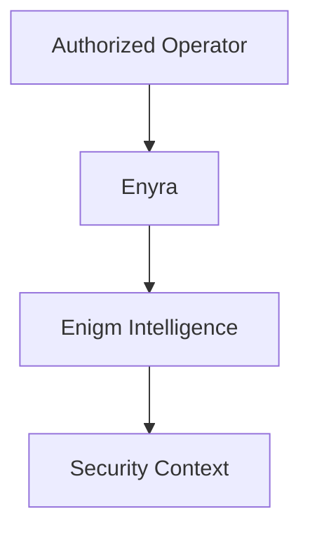

Enyra en la seccion Intelligence es la IA de seguridad y capa de correlación del ecosistema Enigm.

No debe confundirse con Enyra Product Assistant de Enigm Command, que se limita a guia de producto, configuración, navegacion y asistencia de usuario.

## Security Analyst Model

Enyra ayuda a operadores autorizados a entender eventos de seguridad, investigar hallazgos, revisar riesgo, obtener resumenes y consultar contexto de seguridad.

## Security Context

Enyra consume contexto producido por Enigm Intelligence. No determina por si sola la verdad de la plataforma.

## Human Authorization

Acciones sensibles cómo blocking, unblocking o administración sensible pueden requerir autorización adicional.

## Privacy Considerations

Enyra debe operar sobre contexto autorizado y minimizado. No está destinado a inspeccionar comunicaciones protegidas.

Consulta [Detection And Response](/es/intelligence/detection-and-response) y [Platform Limitations](/es/legal/limitations).
