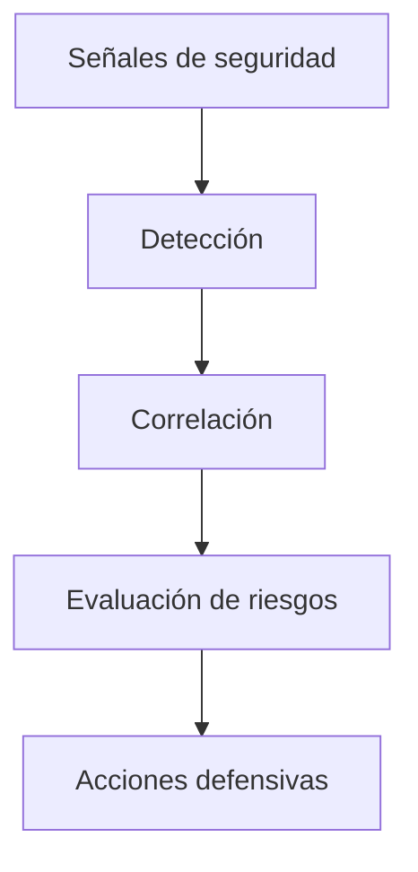

Enigm Intelligence es la capa de monitorización de seguridad, detección de amenazas, correlación de eventos, evaluación de riesgos y respuesta defensiva que protege el ecosistema de Enigm al tiempo que respalda los objetivos de privacidad, minimización de datos y reducción de metadatos.

Admite operaciones de seguridad en hallazgos Enigm App, Active Defense, servicios de plataforma, componentes de red, flujos de trabajo de dispositivos administrados, superficies web públicas y procesos de seguridad operativa.

## Resumen

Enigm Intelligence procesa la telemetría de seguridad minimizada, las señales de detección, los resultados de la plataforma de inteligencia de amenazas y las señales de respuesta defensiva.

La plataforma respalda:

- Monitorización de seguridad.
- Detección de amenazas.
- Correlación de eventos.
- Evaluación de riesgos.
- Analíticas de seguridad.
- Visibilidad de incidentes.
- Automatización defensiva.
- Soporte a operaciones de seguridad.
- Integración con Enyra.

## Objetivos de seguridad

Enigm Intelligence está diseñado para:

- Detectar eventos relevantes para la seguridad en todo el ecosistema Enigm.
- Correlacionar la telemetría de seguridad en casos revisables o categorías de riesgo.
- Apoyar la categorización de riesgos para la toma de decisiones defensivas.
- Proporcionar visibilidad de incidentes para los equipos de seguridad autorizados.
- Apoyar la automatización defensiva cuando la política lo permita.
- Mejorar la postura de seguridad operativa a través de análisis de seguridad consistentes.

## Detección de amenazas

La detección de amenazas utiliza señales de detección y telemetría de seguridad para identificar actividades sospechosas, infracciones de políticas, patrones de uso indebido o anomalías relevantes para la seguridad.

La detección se documenta a nivel de categoría y tiene como objetivo respaldar la revisión defensiva sin ampliar la recopilación de datos innecesaria.

Las categorías de detección pueden incluir:

- Señales de seguridad de la cuenta.
- Señales del ciclo de vida del dispositivo.
- Hallazgos Active Defense.
- Señales de política de red.
- Indicadores de abuso de mensajería segura.
- Indicadores seguros de abuso de llamadas.
- Señalización de seguridad en superficie pública.
- Señales de integridad de plataforma.

## Modelo de correlación

El modelo de correlación agrupa eventos de seguridad relacionados en un contexto de seguridad de nivel superior.

La correlación puede considerar:

- Contexto de la cuenta.
- Contexto del ciclo de vida del dispositivo.
- Privacy-Preserving Device Handles.
- Contexto de política de red.
- Metadatos del ciclo de vida de mensajes o llamadas cuando la política lo permita.
- Enigm Command eventos administrativos.
- Eventos públicos de seguridad en superficie.
- Resultados de la plataforma de inteligencia de amenazas.

La lógica de correlación no se expone en la documentación pública.

## Evaluación de riesgos

La evaluación de riesgos convierte el contexto de seguridad correlacionado en categorías de riesgo, colas de revisión, resultados de políticas o entradas de respuesta defensiva.

La categorización de riesgos tiene como objetivo apoyar una toma de decisiones consistente. Debe ser explicable a nivel de categoría a los revisores autorizados.

La evaluación de riesgos puede informar:

- Revisión de cuenta.
- Revisión del dispositivo.
- Revisión de la sesión.
- Acción de política de red.
- Arquitectura de bloqueo.
- Escalada de incidentes.
- Automatización defensiva.

Las categorías de riesgo deben interpretarse como apoyo a la decisión y no como prueba absoluta de intención o compromiso.

## Controles defensivos

Los controles defensivos pueden responder al riesgo evaluado de acuerdo con la política.

Las acciones defensivas pueden incluir:

- Alerta.
- Restricción de sesión.
- Revisión del dispositivo.
- Recomendación de revocación del dispositivo.
- Ajuste de la política de red.
- Acción de bloqueo.
- Enigm Command revisar el flujo de trabajo.
- Escalado de respuesta a incidentes.

La automatización defensiva debe estar gobernada por políticas, ser auditable y reversible cuando corresponda. La documentación pública no expone procedimientos de respuesta privados.

## Integración con Enyra

Enyra es la IA de seguridad y la capa de correlación dentro del dominio Enigm Intelligence. Se integra con Enigm Intelligence para respaldar los resultados de seguridad evaluados, la evaluación de riesgos, el enriquecimiento de la detección, la correlación de señales cruzadas, el resumen de eventos y los flujos de trabajo de respuesta defensiva.

Las salidas Enyra deben manejarse como inteligencia sensible a la seguridad. Pueden contribuir a la calificación de riesgos, revisar los flujos de trabajo o la automatización defensiva según la política.

Enyra debe preservar los controles de acceso, la minimización de datos y la confidencialidad del contenido al presentar el contexto de seguridad.

## Consideraciones de privacidad

Enigm Intelligence debe minimizar la recopilación y exposición de la telemetría de seguridad siempre que sea posible.

Las consideraciones de privacidad incluyen:

- Separar el contenido protegido de la telemetría de seguridad.
- Utilice identificadores que preserven la privacidad siempre que sea posible.
- Limitar el acceso a los resultados de inteligencia.
- Conservar la telemetría de seguridad según política.
- Evite exponer contenido de mensajes protegidos, contenido de llamadas seguras, material de clave privada o metadatos de identidad innecesarios.

El monitorización de la seguridad debe equilibrarse con la minimización de datos y los límites de revisión autorizados.

Ver [Limitaciones de la plataforma](/es/legal/limitations).

## Referencias al modelo de amenazas

Las áreas relevantes del modelo de amenazas incluyen manipulación de inteligencia, pérdida de visibilidad de auditoría, compromiso de cuentas y aplicaciones, abuso del ciclo de vida del dispositivo, uso indebido de políticas de red, exposición de la superficie pública, intentos de comprometer mensajes seguros e intentos de comprometer llamadas seguras.
