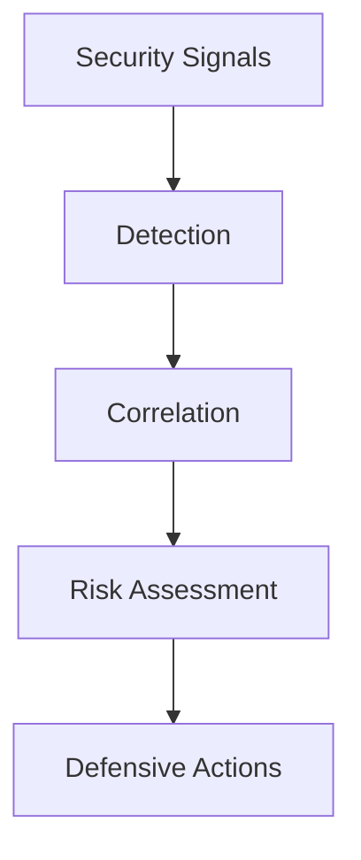

Enigm Intelligence es la capa de monitorización, detección, correlación y respuesta defensiva que protege el ecosistema Enigm.

## Resumen

Enigm Intelligence proporciona visibilidad de eventos de seguridad, análisis, evaluación de riesgo, soporte de operaciones y automatizacion defensiva.

No es una plataforma ofensiva ni un reemplazo completo de juicio humano.

## Objetivos de seguridad

- Visibilidad de amenazas.
- Monitorizacion de seguridad.
- Correlación de eventos.
- Identificación de riesgo.
- Analitica de seguridad.
- Soporte de respuesta defensiva.

## Detección y correlación

La plataforma procesa señales de seguridad, eventos de integridad, eventos de plataforma y observaciones operativas en contexto accionable.

## Integración con Enyra

Enyra en Intelligence es la capa de IA de seguridad y correlación. Ayuda a explicar eventos, resumir hallazgos, recuperar contexto autorizado y apoyar decisiones defensivas.

Enyra Product Assistant en Enigm Command es un modo separado orientado a ayuda de producto.

## Consideraciones de privacidad

Enigm Intelligence está diseñado alrededor de minimización y agregacion. No está destinado a inspeccionar mensajes, llamadas, medios, adjuntos o conversaciones.

Consulta [Limitaciones de plataforma](/es/legal/limitations).
