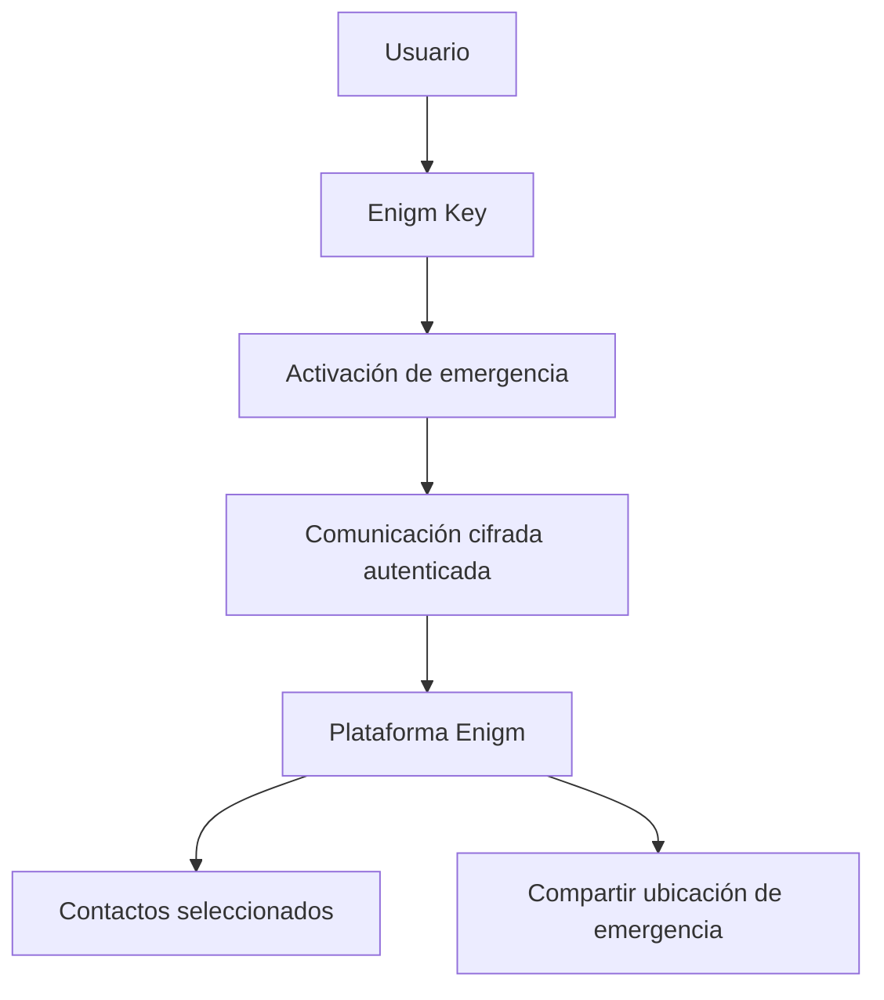

Enigm Key es el dispositivo clave de emergencia física en el ecosistema Enigm. Está diseñado para ayudar al usuario a activar una alerta SOS desde un dispositivo físico dedicado sin necesidad de desbloquear el teléfono o interactuar directamente con la aplicación en el momento de la activación.

Enigm Key es un componente de plataforma de soporte. No reemplaza Enigm App, mensajería segura, llamadas seguras, Device Trust ni la seguridad de la cuenta de usuario. Está diseñado para vincularse con una cuenta de Enigm a través de Enigm App y comunicarse de forma segura con la plataforma Enigm cuando se activa un flujo de trabajo de emergencia.

## Resumen

Enigm Key es un dispositivo de emergencia compacto con conectividad de datos móviles integrada. Está destinado a escenarios en los que un usuario puede necesitar notificar a contactos de confianza seleccionados de forma rápida y discreta.

Enigm Key se administra como dispositivo desde Enigm Command y Enigm App. La vinculación inicial y la configuración de contactos de emergencia son flujos de trabajo Enigm App.

Cuando se activa, Enigm Key está diseñado para:

- Enviar una alerta de emergencia.
- Notificar a los contactos seleccionados por el usuario dentro de la plataforma Enigm.
- Compartir la ubicación del usuario durante el flujo de trabajo de emergencia activo hasta que el usuario cancele el flujo de trabajo de envío de emergencia.
- Autenticar la comunicación del dispositivo.
- Proteger la comunicación con solicitudes cifradas y firmadas.
- Permanecer inactivo durante el funcionamiento normal que no sea de emergencia para respaldar la privacidad del usuario.

El diagrama es conceptual y describe el flujo de alerta de emergencia a nivel de arquitectura pública.

## Superficies de gestión

Enigm Key tiene dos superficies de gestión con diferentes responsabilidades.

### Enigm App

Enigm App es la superficie de configuración principal Enigm Key.

Enigm App controla:

- Vinculación Enigm Key inicial.
- Asociación de cuentas Enigm.
- Configuración de contactos de emergencia.
- Ciclo de vida de los contactos de emergencia.
- Visibilidad de eventos de emergencia.
- Revisión del ciclo de vida del dispositivo.
- Manejo de pérdida de dispositivos.
- Revocación del dispositivo.
- Flujos de trabajo de reemplazo de dispositivos.

### Enigm Command

Enigm Command administra Enigm Key como dispositivo asociado después de vincularlo a través de Enigm App.

Enigm Command admite:

- Visibilidad Enigm Key asociada.
- Visibilidad del ciclo de vida del dispositivo.
- Manejo de pérdida de dispositivos.
- Revocación del dispositivo.
- Estado de sustitución del dispositivo.
- Visibilidad de eventos de emergencia donde esté autorizado.

Enigm Command no es la superficie de enlace inicial y no es la superficie de configuración del contacto de emergencia. La visibilidad de Enigm Command debe permanecer limitada al ciclo de vida autorizado y al contexto del evento; no debe convertirse en un seguimiento de ubicación rutinario o en una visibilidad de comunicación protegida.

## Objetivos de diseño

Enigm Key está diseñado para admitir:

- Alerta de emergencia desde un dispositivo físico dedicado.
- Comportamiento en espera que preserva la privacidad.
- Asociación segura de cuentas.
- Vinculación de cuenta a través de Enigm App.
- Comunicación del dispositivo autenticado.
- Sincronización de plataforma cifrada.
- Contactos de emergencia seleccionados por el usuario.
- Configuración de contactos de emergencia controlados por el usuario a través de Enigm App.
- Administración de dispositivos a través de Enigm App y Enigm Command.
- Compartir ubicación vinculada a eventos durante emergencias hasta la cancelación del usuario.
- Exposición mínima de datos de rutina.

El objetivo es proporcionar capacidad de comunicación de emergencia y al mismo tiempo preservar los principios de diseño de Enigm que priorizan la privacidad.

## Modelo de activación de emergencia

Enigm Key se activa mediante una interacción física deliberada.

El modelo de activación previsto es:

- El usuario presiona el botón del dispositivo tres veces.
- El dispositivo sale del estado inactivo para el flujo de trabajo de emergencia.
- El dispositivo se autentica con la plataforma Enigm.
- La plataforma activa alertas para los contactos de emergencia seleccionados por el usuario.
- Comienza el intercambio de ubicación para el evento de emergencia activo.
- El uso compartido de la ubicación continúa hasta que el usuario cancela el flujo de trabajo de envío de emergencia.

El modelo de activación está diseñado para reducir la operación accidental sin dejar de ser lo suficientemente simple para situaciones de alto estrés.

## Modelo de conectividad

Enigm Key incluye conectividad de datos móviles integrada diseñada para admitir comunicaciones de emergencia cuando el teléfono del usuario no está disponible, está bloqueado o no es seguro operarlo.

La conectividad es una capacidad de transporte. No reemplaza la seguridad de la cuenta, la autenticación del dispositivo, la comunicación cifrada ni la configuración de contactos de emergencia controlada por el usuario.

La capa de conectividad debe tratarse como algo independiente de la mensajería segura Enigm App y las llamadas seguras.

## Asociación de cuentas

Enigm Key está asociado con la cuenta Enigm de un usuario a través de un flujo de trabajo de sincronización explícito en Enigm App.

La asociación de cuentas tiene como objetivo:

- Vincular el dispositivo a una cuenta Enigm autorizada.
- Permitir al usuario configurar contactos de emergencia desde Enigm App.
- Soporte de revisión del ciclo de vida del dispositivo.
- Soporte de revocación o reemplazo en caso de pérdida o retiro del dispositivo.

La asociación de cuentas utiliza identificadores que preservan la privacidad para la correlación del ciclo de vida y las políticas. El dispositivo no debe depender de identificadores públicos innecesarios para el funcionamiento normal de la plataforma.

Enigm Command proporciona administración de dispositivos, visibilidad del ciclo de vida y flujos de trabajo de revocación después de que la clave se asocia con la cuenta. La vinculación inicial sigue siendo un flujo de trabajo Enigm App.

## Flujo de trabajo de contacto de emergencia

El usuario configura qué contactos de confianza deben recibir alertas de emergencia de Enigm App.

La configuración de contactos de emergencia es un flujo de trabajo Enigm App. Enigm Command proporciona visibilidad del ciclo de vida para Enigm Key cuando esté autorizado, pero la configuración de contacto de emergencia permanece controlada desde Enigm App.

Cuando se activa el flujo de trabajo de emergencia, los contactos seleccionados reciben el contexto de emergencia requerido para el flujo de trabajo activo:

- Estado de alerta de emergencia.
- Contexto de identidad del usuario requerido para la alerta.
- Actualizaciones de ubicación durante el evento de emergencia activo.
- Estado del evento.

Los flujos de trabajo de contactos de emergencia deben ser explícitos y controlados por el usuario. Los sistemas administrativos no deberían convertir la visibilidad de los contactos de emergencia en un amplio acceso a las comunicaciones de los usuarios.

La gestión del ciclo de vida de los contactos de emergencia puede incluir:

- Agregar contactos de emergencia de confianza.
- Revisión de contactos configurados.
- Eliminación de contactos.
- Reemplazo de contactos.
- Revisar la elegibilidad de los contactos de emergencia.
- Retirar el acceso al contacto de emergencia cuando ya no sea necesario.

Los contactos de emergencia reciben solo el contexto de emergencia necesario para el flujo de trabajo activo. La configuración de contactos de emergencia no debe exponer mensajes normales, llamadas seguras, medios, archivos adjuntos o conversaciones de usuarios.

## Ciclo de vida de eventos de emergencia

Los eventos de emergencia Enigm Key son eventos del ciclo de vida controlados por el usuario.

El ciclo de vida de un evento de emergencia incluye:

1. Activación del usuario mediante la interacción física deliberada.
2. El dispositivo se activa desde el modo de espera inactivo.
3. Autenticación del dispositivo con la plataforma Enigm.
4. Entrega de alertas de emergencia a contactos seleccionados.
5. Compartir ubicación vinculada a eventos.
6. Cancelación por parte del usuario del flujo de trabajo de envío de emergencia.
7. Retiro por evento de emergencia según política de retención y ciclo de vida.

El uso compartido de la ubicación está pensado para continuar solo durante el flujo de trabajo de emergencia activo y hasta que el usuario cancele el flujo de trabajo de envío de emergencia.

El estado del evento de emergencia debe permanecer separado del contenido normal de los mensajes, las llamadas seguras, los medios, los archivos adjuntos y las conversaciones de los usuarios.

## Límite de autorización de emergencia

La activación de emergencia crea un flujo de trabajo de emergencia limitado.

El límite de la autorización de emergencia se limita a:

- El Enigm Key vinculado.
- La cuenta Enigm asociada.
- El evento de emergencia activo.
- Contactos de emergencia seleccionados por el usuario.
- Compartir ubicación vinculada a eventos.
- Estado del evento de emergencia.

El límite de autorización de emergencia no proporciona:

- Seguimiento de ubicación de rutina.
- Acceso al texto claro del mensaje.
- Acceso al contenido seguro de las llamadas.
- Acceso a contenidos multimedia.
- Acceso a archivos adjuntos.
- Acceso a las conversaciones de los usuarios.
- Acceso a material de clave privada.
- Autoridad para cambiar la política de comunicación normal Enigm App.

La visibilidad de los contactos de emergencia está vinculada a eventos y a un propósito limitado. No debe tratarse como un canal de acceso administrativo, de supervisión general o de gestión de dispositivos.

## Compartir ubicación

Enigm Key está diseñado para compartir la ubicación durante un flujo de trabajo de emergencia activo.

Compartir ubicación debe ser:

- Vinculado a eventos.
- Limitado a contactos seleccionados o flujos de trabajo de emergencia autorizados.
- Protected en tránsito.
- Detenido cuando el usuario cancela el flujo de trabajo de envío de emergencia.
- Retirado según el ciclo de vida de eventos de emergencia y la política de retención.
- Separado del comportamiento de espera de rutina.

Cuando Enigm Key no está activado, debe permanecer inactivo y evitar informes de ubicación de rutina. Esto apoya la privacidad y la minimización de datos.

## Suspensión y privacidad del dispositivo

Enigm Key está diseñado en torno a un comportamiento de espera inactivo.

Durante el funcionamiento normal que no sea de emergencia, el dispositivo debe permanecer en un estado de baja actividad. Esto reduce la actividad innecesaria de la red, la exposición de la ubicación y el uso de la batería.

Los principios de privacidad incluyen:

- No se permite compartir la ubicación de emergencia de forma rutinaria mientras está inactivo.
- Transmisión de datos vinculada a eventos.
- Comunicación en espera mínima.
- Datos de emergencia con finalidad limitada.
- Asociación de cuentas mediante identificadores que preservan la privacidad.
- Separación entre alertas de emergencia y contenido del mensaje.

Enigm Key es un hardware de emergencia orientado a la privacidad, no un dispositivo de seguimiento continuo.

## Autenticación e integridad de la solicitud

La comunicación Enigm Key está diseñada para ser autenticada y protegida.

El dispositivo utiliza material de firma autenticado vinculado al dispositivo para la autenticación de la plataforma. A nivel de arquitectura pública, esto incluye una credencial única basada en HMAC por dispositivo que se utiliza para autenticar solicitudes firmadas para que la plataforma pueda verificar que la comunicación está asociada con un Enigm Key autorizado.

El modelo de seguridad está diseñado para respaldar:

- Autenticación del dispositivo.
- Solicitar integridad.
- Comunicación cifrada.
- Rechazo de tráfico de dispositivos no autenticados.
- Asociación de dispositivos vinculados a cuentas.
- Validación de solicitudes resistentes a la reproducción cuando sea necesario.
- Revocación del ciclo de vida del dispositivo cuando la clave se pierde, se retira o se reemplaza.

La documentación pública describe este modelo de autenticación en un nivel alto adecuado para revisión externa. No revela secretos de HMAC, formatos de solicitud, encabezados, ubicación de firmas, rutas API, ventanas de reproducción, lógica de validación interna ni procedimientos operativos.

## Relación con Enigm App

Enigm App sigue siendo el principal producto orientado al usuario en el ecosistema Enigm.

Enigm App admite:

- Asociación de cuenta Enigm Key.
- Vinculación Enigm Key inicial.
- Configuración de contactos de emergencia.
- Visibilidad de eventos de emergencia.
- Revisión del ciclo de vida del dispositivo.
- Flujos de trabajo de revocación o sustitución.
- Manejo de pérdida de dispositivos.
- Gestión del ciclo de vida de los contactos de emergencia.

Enigm Key no reemplaza a Enigm App mensajería segura, llamadas seguras, material de claves protegido o flujos de trabajo de dispositivos de confianza.

La vinculación inicial y la configuración de los contactos de emergencia se realizan desde Enigm App. Esto mantiene la selección de contactos de emergencia vinculada a la mensajería privada principal y al contexto de la cuenta del usuario.

## Relación con Enigm Command

Enigm Command admite la administración de Enigm Key como dispositivo asociado.

Los flujos de trabajo Enigm Command incluyen:

- Visibilidad del dispositivo asociado.
- Acciones del ciclo de vida del dispositivo.
- Revocación del dispositivo.
- Estado de sustitución del dispositivo.
- Manejo de pérdida de dispositivos.
- Visibilidad de eventos de seguridad.
- Visibilidad de eventos de emergencia donde esté autorizado.

Enigm Command no es la superficie de enlace inicial ni la superficie de configuración de contacto de emergencia. La vinculación inicial y la configuración del contacto de emergencia se controlan desde Enigm App.

La visibilidad de Enigm Command debe permanecer separada del texto claro de los mensajes, el contenido de las llamadas seguras, el contenido multimedia, los archivos adjuntos, las conversaciones de los usuarios y el seguimiento de ubicación de rutina.

## Revocación del dispositivo

La revocación de Enigm Key está disponible desde Enigm App y Enigm Command.

La revocación está destinada a dispositivos perdidos, robados, retirados o reemplazados. Una vez revocado, ya no se debe confiar en el dispositivo para futuros flujos de trabajo de emergencia o comunicación de plataforma.

La revocación afecta futuras decisiones fiduciarias. No implica acceso a contenidos de emergencia anteriores, mensajes normales, llamadas seguras, material de clave privada o conversaciones de usuarios.

## Referencias de modelos de amenazas

Las áreas relevantes del modelo de amenazas incluyen pérdida de Enigm Key, intentos de activación de emergencia no autorizados, uso indebido de contactos de emergencia, exposición de ubicación vinculada a eventos, falla de autenticación de comunicación del dispositivo, intentos de reproducción, compromiso de la cuenta, abuso del ciclo de vida de Enigm Command y divulgación del usuario por parte de contactos de emergencia seleccionados.

Ver [Limitaciones de la plataforma](/es/legal/limitations).
