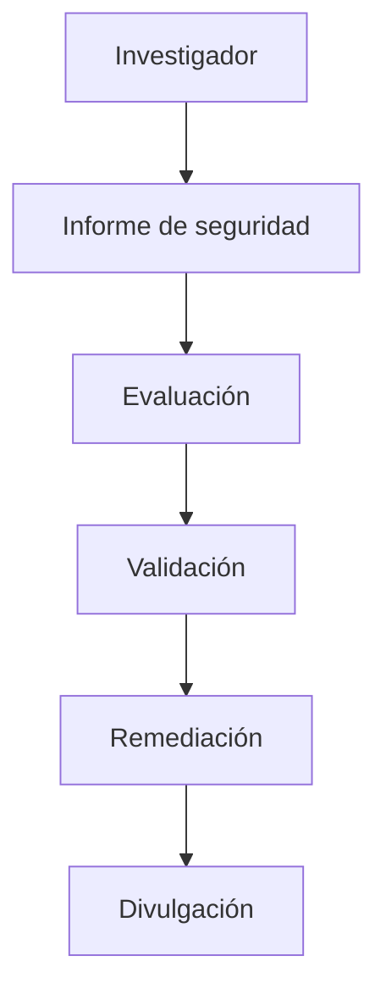

Enigm apoya la investigación de seguridad responsable y la divulgación coordinada de vulnerabilidades. El objetivo es mejorar la seguridad de la plataforma y al mismo tiempo proteger a los usuarios, los entornos de los clientes y la seguridad operativa.

## Resumen

La divulgación responsable proporciona un proceso profesional para informar inquietudes de seguridad legítimas a Enigm.

El modelo de divulgación está diseñado para:

- Apoyar la investigación de seguridad de buena fe.
- Proteger a los usuarios mientras se evalúan los informes.
- Preservar la confidencialidad durante la validación y remediación.
- Fomentar informes técnicos precisos.
- Apoyar la comunicación de seguridad coordinada.

El diagrama es conceptual y describe el ciclo de vida de la divulgación responsable.

## Investigación de seguridad

Se anima a los investigadores de seguridad a informar preocupaciones de seguridad legítimas.

La investigación de seguridad de buena fe contribuye a la resiliencia de la plataforma al ayudar a identificar vulnerabilidades, comportamientos inseguros o brechas de seguridad antes de que puedan afectar a los usuarios.

La investigación debe realizarse de manera responsable y debe evitar acciones que interrumpan los servicios, accedan a datos sin autorización o expongan a otros usuarios a riesgos.

## Informar problemas de seguridad

Los problemas de seguridad deben reportarse a través de canales de notificación de seguridad designados.

Utilice la página [Contacto de seguridad](/es/legal/security-contact) para obtener detalles de comunicación de seguridad actuales.

Los informes deben incluir suficiente información para respaldar la revisión, como por ejemplo:

- Producto o zona de plataforma afectada.
- Descripción del problema de seguridad.
- Impacto potencial.
- Información de reproducción segura cuando corresponda.
- Contexto de seguridad relevante.

No incluya datos confidenciales del usuario, material de credenciales ni material confidencial de terceros a menos que se solicite específicamente a través de una ruta de admisión segura aprobada.

## Principios de divulgación

La divulgación responsable de Enigm se guía por:

- Buena fe.
- Confidencialidad.
- Exactitud.
- Comunicación responsable.
- Protección del usuario.
- Remediación coordinada.
- Seguridad operativa.

Los informes deben manejarse de una manera que respalde la validación técnica y al mismo tiempo reduzca el riesgo innecesario para los usuarios y los sistemas.

## Proceso de investigación

Los problemas reportados se revisan, evalúan y priorizan según el riesgo.

Los problemas validados se rastrean a través de flujos de trabajo de solución. La evaluación puede considerar el impacto, los componentes afectados, la explotabilidad, la exposición del usuario y las mitigaciones disponibles.

La documentación pública describe el proceso a nivel de gobernanza.

## Divulgación coordinada

Enigm apoya prácticas de divulgación coordinadas destinadas a equilibrar la transparencia y la protección del usuario.

La divulgación coordinada puede implicar:

- Validación de informes.
- Planificación de remediación.
- Preparación de actualizaciones de seguridad.
- Planificación de asesoramiento o comunicación en su caso.
- Timing que reduce el riesgo del usuario.

El momento de la divulgación debe manejarse de manera responsable y debe evitarse la exposición de material técnico sensible antes de que los usuarios puedan estar protegidos.

## Investigación de buena fe

La investigación de buena fe puede incluir:

- Pruebas de seguridad.
- Identificación de vulnerabilidades.
- Análisis de seguridad.
- Informes responsables.

La investigación de buena fe debe respetar la privacidad del usuario, evitar interrupciones y limitar la actividad al mínimo necesario para demostrar el problema de seguridad.

## Actividades fuera de alcance

Las siguientes actividades están fuera de alcance:

- Interrupción del servicio.
- Ingeniería social.
- Violaciones de privacidad.
- Acceso a datos no autorizados.
- Agresiones físicas contra el personal.
- Intentos de acceder, modificar o destruir datos ajenos.
- Extorsión, coacción o amenazas.
- Divulgación pública antes del manejo coordinado.

Esta política no crea un programa de recompensas por errores ni implica una recompensa monetaria.

Ver [Limitaciones de la plataforma](/es/legal/limitations).
