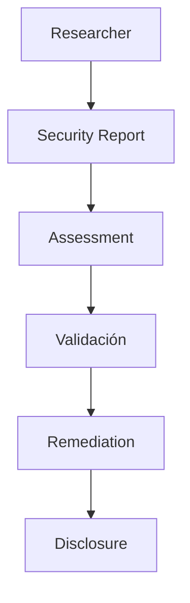

Enigm apoya la investigacion de seguridad responsable y la divulgacion coordinada de vulnerabilidades.

## Investigación de seguridad

Los investigadores de seguridad pueden reportar preocupaciones legitimas de buena fe. La investigacion responsable ayuda a mejorar resiliencia de plataforma.

## Reporte de problemas de seguridad

Los problemas de seguridad deben reportarse mediante los canales designados en [Contacto de seguridad](/es/legal/security-contact).

## Principios de divulgación

- Buena fe.
- Confidencialidad.
- Precision.
- Comunicacion responsable.
- Protección de usuarios.

## Proceso de investigación

Los reportes se revisan, evaluan y priorizan segun riesgo. Los hallazgos validados se gestionan mediante flujos de remediacion.

## Divulgación coordinada

Enigm apoya divulgacion coordinada para equilibrar transparencia y protección de usuarios.

## Fuera de alcance

Quedan fuera actividades cómo disrupcion de servicio, ingeniería social, violaciones de privacidad, acceso no autorizado a datos o ataques físicos contra personas.

Consulta [Limitaciones de plataforma](/es/legal/limitations).
