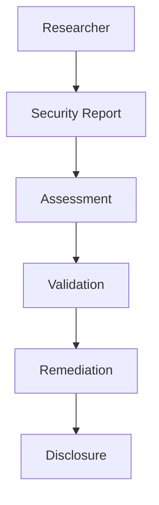

Enigm apoya la investigacion de seguridad responsable y la divulgacion coordinada de vulnerabilidades.

## Security Research

Los investigadores de seguridad pueden reportar preocupaciones legitimas de buena fe. La investigacion responsable ayuda a mejorar resiliencia de plataforma.

## Reporting Security Issues

Los problemas de seguridad deben reportarse mediante los canales designados en [Security Contact](/es/legal/security-contact).

## Disclosure Principles

- Buena fe.
- Confidencialidad.
- Precision.
- Comunicacion responsable.
- Protección de usuarios.

## Investigation Process

Los reportes se revisan, evaluan y priorizan segun riesgo. Los hallazgos validados se gestionan mediante flujos de remediacion.

## Coordinated Disclosure

Enigm apoya divulgacion coordinada para equilibrar transparencia y protección de usuarios.

## Out Of Scope

Quedan fuera actividades cómo disrupcion de servicio, ingeniería social, violaciones de privacidad, acceso no autorizado a datos o ataques físicos contra personas.

Consulta [Platform Limitations](/es/legal/limitations).
