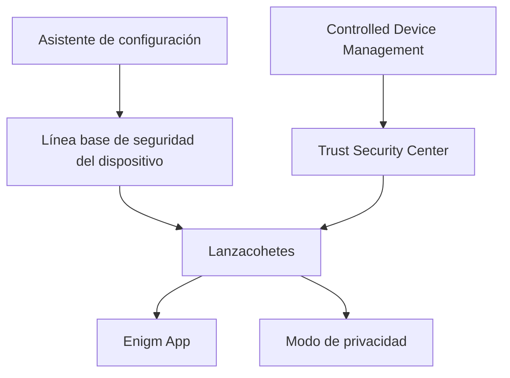

Enigm OS proporciona una experiencia controlada y segura en el dispositivo para los usuarios que requieren confianza adicional en el dispositivo, refuerzo de la plataforma y seguridad operativa. Esta página consolida la incorporación, la experiencia en el hogar, los controles de privacidad de los sensores y las capacidades opcionales de dispositivos administrados.

## Resumen

La experiencia y la administración del dispositivo cubren cuatro capas de seguridad orientadas al usuario:

- Asistente de configuración para el aprovisionamiento inicial y el establecimiento de una línea de base segura.
- Lanzador para una experiencia hogareña orientada a la seguridad y visibilidad de confianza.
- Modo de privacidad para bloqueo de micrófono y cámara de acceso rápido.
- Controlled Device Management para operaciones remotas y inscripción de dispositivos administrados opcionales.

## Asistente de configuración

El asistente de configuración establece una base segura antes del funcionamiento normal. El flujo previsto incluye bienvenida, idioma y región, conectividad móvil, Wi-Fi seguro, fecha y hora, apariencia, configuración segura de PIN, inscripción biométrica opcional, introducción al modo de privacidad, términos y privacidad, y transición a Enigm App.

La autenticación sólida es parte de la base. El flujo de configuración está diseñado para evitar credenciales débiles, priorizar la autenticación antes del uso normal y mantener la incorporación centrada en la funcionalidad de la plataforma Enigm.

## Lanzador

El Iniciador es la principal experiencia doméstica orientada a la seguridad para Enigm OS. No pretende comportarse como un lanzador de uso general.

El Iniciador presenta un estado de confianza resumido desde Trust Security Center, acceso directo a Enigm App, información operativa esencial, estado de red segura, estado del modo de privacidad, notificaciones de seguridad y estado del dispositivo administrado cuando sea relevante. No calcula la Confianza en sí.

Los resúmenes de confianza visibles para el usuario incluyen Device Protected, Device At Risk y Protection Inactive.

## Modo de privacidad

El modo de privacidad proporciona un control rápido del usuario sobre el acceso a sensores sensibles. Cuando está activo, el acceso a la cámara y al micrófono están bloqueados.

El modo de privacidad admite la garantía de privacidad durante el funcionamiento normal, pero no reemplaza Device Trust, el cifrado de extremo a extremo, la mensajería segura, el refuerzo del sistema operativo ni la concienciación de seguridad del usuario.

## Controlled Device Management

Controlled Device Management es opcional. Los usuarios pueden inscribir un dispositivo en el modo de dispositivo administrado para permitir la visibilidad del ciclo de vida y las operaciones remotas a través de Enigm Command.

Los dispositivos administrados pueden informar el estado de integridad del dispositivo, el estado de confianza, el estado de seguridad y el estado de administración. El borrado remoto está diseñado para dispositivos perdidos, robados o comprometidos. El borrado remoto afecta el acceso al dispositivo y el estado del ciclo de vida; no proporciona acceso a contenido protegido.

## Límites de seguridad y privacidad

Los informes de confianza, la visibilidad del iniciador, el estado del modo de privacidad y las operaciones de dispositivos gestionados son controles de seguridad del dispositivo. No inspeccionan el contenido de los mensajes, el contenido de los medios, el contenido de las llamadas, los archivos adjuntos, los documentos ni las conversaciones de los usuarios.

La gestión de dispositivos administrativos permanece separada de la confidencialidad de los mensajes y del material de clave protegido.

Ver [Limitaciones de la plataforma](/es/legal/limitations).
