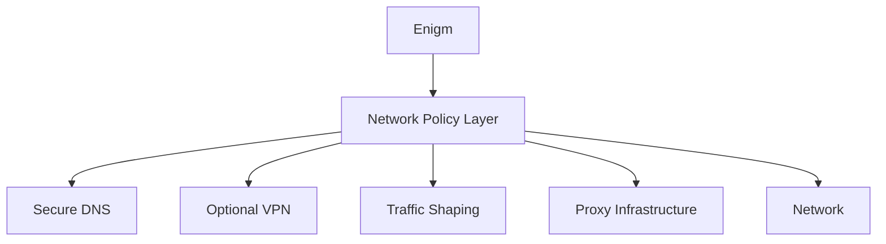

Enigm OS no asume que las redes sean confiables. La arquitectura parte de que redes locales, públicas u operadores pueden observar patrones de tráfico.

## Overview

La política de red de Enigm OS cubre confianza de red, DNS seguro, protección de transporte, reducción de metadatos y controles de conectividad.

## Network Trust Model

El dispositivo debe operar bajo la suposicion de que:

- Las redes locales pueden ser monitorizadas.
- Las redes públicas pueden ser hostiles.
- Los operadores pueden observar patrones.

## Secure Name Resolution

Enigm OS utiliza un modelo de resolución de nombres controlado y cifrado donde aplica. Esto reduce exposición frente a observacion DNS simple.

No se documentan proveedores, valores o configuraciónes internas.

## Transport Protection

La protección de transporte complementa el cifrado de aplicación. No sustituye end-to-end encryption ni Device Trust.

## Traffic Analysis Considerations

La plataforma puede utilizar traffic shaping y actividad adicional de red para reducir fiabilidad de correlaciones simples.

El objetivo es aumentar dificultad y bajar confianza, no garantizar anonimato.

## Relationship With Trust Security Center

Trust Security Center puede evaluar cumplimiento de política de red. No inspecciona contenido de mensajes.

Consulta [Network Privacy](/es/app/network-privacy) y [Platform Limitations](/es/legal/limitations).
