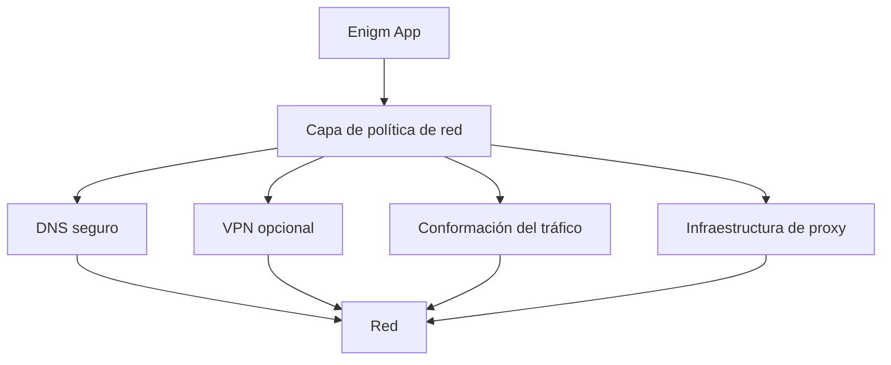

La política de red Enigm OS define cómo se trata la red de dispositivos como una superficie de control de seguridad y privacidad. La plataforma no asume que las redes sean de confianza y está diseñada para reducir la exposición a entornos de red monitoreados, hostiles o que invasan la privacidad.

## Resumen

Enigm OS aborda la creación de redes como un marco político estratificado.

El modelo de política de red cubre:

- Confianza en la red.
- Seguridad DNS.
- Protección del transporte.
- Privacidad de la red.
- Reducción de metadatos.
- Reducción de la visibilidad de la red.
- Controles de red de dispositivos.

El diagrama es conceptual. Muestra funciones de política, no topología de implementación.

## Objetivos de diseño

La política de red Enigm OS está diseñada para:

- Trate las redes locales y públicas como no de confianza de forma predeterminada.
- Reducir la visibilidad innecesaria de la red.
- Proteger la resolución de nombres mediante una política de resolución segura controlada.
- Soporte de protección del transporte.
- Apoyar los objetivos de reducción de metadatos.
- Apoyar la separación del tráfico mediante controles de plataforma.
- Proporcionar una postura de red de dispositivos para Trust Security Center.
- Mantenga los controles de red separados del texto en claro de los mensajes.

La política de red es una capa de seguridad complementaria. No reemplaza el cifrado de extremo a extremo Enigm App, el material de claves protegido, la asociación de dispositivos de confianza ni los flujos de trabajo de verificación de usuarios.

## Modelo de confianza en la red

Enigm OS no asume que las redes sean de confianza.

La plataforma está diseñada basándose en la suposición de que:

- Las redes locales pueden ser monitoreadas.
- Las redes públicas pueden ser hostiles.
- Los operadores de red pueden observar patrones de tráfico.
- Los observadores de la red intermedia pueden intentar realizar una correlación utilizando el tiempo, la frecuencia o el volumen de tráfico.

Debido a este modelo, la política de red Enigm OS se centra en reducir la exposición, hacer cumplir valores predeterminados seguros y respaldar rutas de red que preserven la privacidad cuando estén disponibles.

La confianza de la red no es equivalente a Device Trust. Se puede confiar en un dispositivo mientras está conectado a una red que no es de confianza, y los controles de red deben continuar funcionando independientemente del entorno de red actual del usuario.

## Resolución de nombre segura

La resolución segura de nombres es parte del modelo de seguridad de red Enigm OS.

El modelo incluye:

- DNS cifrado.
- Política DNS controlada.
- Modelo de resolución confiable.
- Protección contra la simple observación de DNS.
- Reducción de la exposición del comportamiento de resolución de nombres a los observadores de la red local.

La resolución segura de nombres tiene como objetivo reducir la visibilidad de las consultas DNS y disminuir la confianza en la inferencia simple basada en observaciones. No proporciona protección completa contra todos los análisis a nivel de red.

La documentación pública describe conceptualmente el modelo de resolución y evita publicar parámetros de red desplegables.

## Protección del transporte

La protección del transporte reduce la exposición entre el dispositivo y los servicios compatibles.

La protección del transporte puede incluir:

- Transporte cifrado para rutas de comunicación compatibles.
- Aplicación de políticas de red.
- Uso de VPN opcional.
- Infraestructura proxy para la separación del tráfico.
- Controles que reduzcan la exposición directa innecesaria.

La protección del transporte es independiente de la confidencialidad del mensaje Enigm App. Enigm App la mensajería segura y las llamadas seguras dependen de la seguridad a nivel de aplicación y del material de claves protegido.

## Privacidad de la red

La privacidad de la red en Enigm OS se basa en controles en capas.

Los controles relevantes incluyen:

- Protecciones de capa de red.
- Separación del tráfico.
- Protección del transporte.
- Metas de reducción de metadatos.
- Resolución de nombres segura.
- Uso de VPN opcional.
- Infraestructura de proxy.

Estos controles están diseñados para reducir la exposición a observadores de redes locales, entornos de redes públicas y análisis de tráfico intermedio. Deben evaluarse como controles que mejoran la privacidad, no como afirmaciones de privacidad absoluta o trazabilidad.

## Reducción de metadatos

La reducción de metadatos es un objetivo central del modelo de política de red.

Enigm OS utiliza controles diseñados para reducir la cantidad, precisión o confiabilidad de los metadatos de la red observables. Estos controles afectan la exposición directa, la confianza en el tiempo, la visibilidad de la resolución de nombres y la confiabilidad de la correlación.

### Consideraciones sobre el análisis de tráfico

La plataforma utiliza técnicas de configuración del tráfico y actividad de red adicional diseñadas para reducir la confiabilidad de un análisis simple de patrones de comunicación.

El modelado del tráfico es un control de privacidad complementario. Se pretende:

- Reducir la confianza en las técnicas básicas de correlación temporal.
- Mitigar la inferencia simple de patrones de comunicación.
- Aumentar la dificultad para los observadores que intentan asignar ráfagas de tráfico a las conversaciones de los usuarios.
- Lower confianza en el análisis basado en la frecuencia de conexión o el tiempo del tráfico.

La configuración del tráfico no elimina el análisis de tráfico avanzado ni proporciona una protección absoluta de la trazabilidad. La actividad adicional de la red no debe interpretarse como prueba de comunicación activa del usuario.

La confidencialidad de las comunicaciones sigue dependiendo del cifrado de extremo a extremo Enigm App y del material de claves protegido.

## Relación con Enigm App

Enigm App sigue siendo el principal producto orientado al usuario en el ecosistema Enigm.

La política de red Enigm OS puede fortalecer el entorno de red alrededor de Enigm App, pero no reemplaza la seguridad a nivel de aplicación. La mensajería y las llamadas seguras dependen del cifrado de extremo a extremo, el material de claves protegido, la asociación de dispositivos y los flujos de trabajo de verificación.

La política de red no proporciona acceso al texto en claro de los mensajes y no inspecciona el contenido de los mensajes.

## Relación con VPN

VPN es una capa opcional de protección de transporte y privacidad de la red.

La VPN y el cifrado de extremo a extremo resuelven diferentes problemas:

- La VPN puede reducir la visibilidad de los observadores de la red local o intermedia.
- El cifrado de extremo a extremo protege el contenido de los mensajes entre endpoints de confianza.

VPN y modelado de tráfico son controles complementarios. La VPN puede proteger las rutas de transporte, mientras que la configuración del tráfico puede reducir la confianza en una simple inferencia basada en tiempos. Ninguno de los controles hace que un punto final comprometido sea confiable.

## Relación con la infraestructura proxy

La infraestructura de proxy proporciona separación del tráfico y límites de privacidad adicionales.

Dentro del ecosistema Enigm, la infraestructura proxy admite:

- Reducción de la exposición directa entre dispositivos y servicios de plataforma.
- Propósitos de separación del tráfico.
- Propósitos de reducción de metadatos.
- Límites de privacidad adicionales.

La infraestructura de proxy es independiente del cifrado Enigm App y no reemplaza el material de clave protegido o Device Trust.

## Relación con Trust Security Center

Trust Security Center evalúa el cumplimiento de la política de red como parte de la postura del dispositivo.

Las señales de confianza relacionadas con la red pueden incluir:

- Estado de resolución de nombres seguro.
- Protected estado de la red.
- Estado de cumplimiento de la política.
- Postura VPN opcional.
- Estado del servicio de seguridad.

Trust Security Center no inspecciona el contenido de mensajes, contenido multimedia, contenido de llamadas, archivos adjuntos, documentos o conversaciones de usuarios. La confianza evalúa las señales de dispositivos y políticas en lugar del contenido del usuario.

Ver [Limitaciones de la plataforma](/es/legal/limitations).
