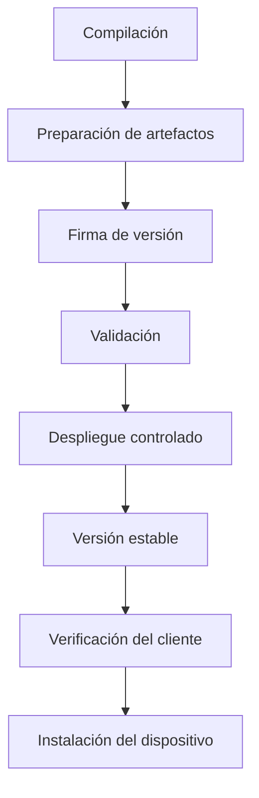
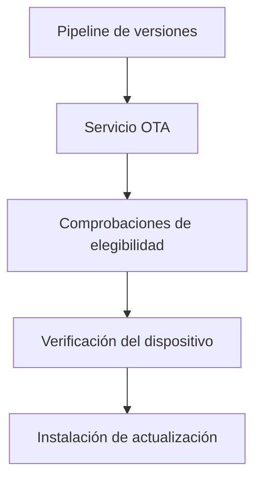
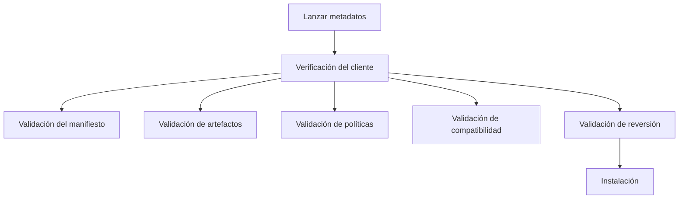

La arquitectura OTA de Enigm OS ofrece de forma segura actualizaciones de software de confianza a dispositivos elegibles a través de control de versiones gobernado, verificación de actualizaciones e implementación por etapas.

Esta página consolida la descripción general de OTA, el ciclo de vida de la versión y las responsabilidades de verificación del cliente.

## Resumen

Enigm OS OTA es la arquitectura de actualización controlada para entregar actualizaciones de software de confianza a dispositivos elegibles. Las actualizaciones OTA son parte del modelo de seguridad Enigm OS porque Device Trust depende de la autenticidad del software, la integridad del software, la elegibilidad del dispositivo y el comportamiento de implementación gobernado.

## Objetivos de diseño

La arquitectura OTA está diseñada para admitir:

- Entrega segura de software.
- Distribución controlada de actualizaciones.
- Autenticidad de versión.
- Liberación de integridad.
- Elegibilidad del dispositivo.
- Actualizar la confianza.
- Gobernanza del despliegue.
- Verificación del cliente independiente antes de la instalación.

La entrega OTA no reemplaza la firma de versión, la verificación de artefactos, la validación en cliente, Device Trust ni los controles de producción.

## Propósito de la OTA

OTA existe para entregar de forma segura actualizaciones de software de confianza a dispositivos elegibles.

La arquitectura está diseñada para garantizar que los dispositivos reciban el software publicado a través de flujos de trabajo de versión autorizados de Enigm y que los dispositivos verifiquen la autenticidad, la integridad y el cumplimiento de las políticas de la versión antes de aceptar una actualización.

## Entrega segura de software

La entrega segura de software combina control de versión, firma, validación, controles de elegibilidad, control de despliegue y verificación en el dispositivo.

La entrega segura depende de:

- Flujos de trabajo de versión autorizados.
- Verificación de metadatos de versión.
- Validación de integridad de artefactos.
- Elegibilidad del dispositivo.
- Política de despliegue.
- Verificación del cliente.

## Arquitectura OTA

La arquitectura OTA separa la preparación del versión, la evaluación de elegibilidad, la verificación del dispositivo y la instalación.

Estas funciones son responsabilidades de seguridad separadas en lugar de una única decisión de confianza.

## Objetivos de la versión

Los versións OTA pasan por un ciclo de vida controlado antes de una amplia disponibilidad. El ciclo de vida de la versión existe para reducir el riesgo de implementación, preservar la integridad del software y mantener la responsabilidad de la versión.

Los objetivos de versión incluyen:

- Autenticidad del software.
- Liberación de integridad.
- Validación de compatibilidad.
- Gobernanza del despliegue.
- Aplicación de la elegibilidad del dispositivo.
- Resiliencia de usuarios y plataformas.

## Etapas de publicación

El ciclo de vida de la versión se organiza conceptualmente como:

1. Creación de edificios.
2. Preparación de artefactos.
3. Creación del manifiesto.
4. Liberación de firma.
5. Registro de versión.
6. Validación.
7. Despliegue controlado.
8. Liberación estable.
9. Instalación del dispositivo.

Cada etapa contribuye a la gobernanza de la liberación. Ninguna etapa por sí sola debe considerarse suficiente para establecer una confianza total en la actualización.

## Proceso de validación

La validación incluye:

- Comprobaciones de integridad de los artefactos.
- Verificación de liberación.
- Verificación de elegibilidad.
- Validación de compatibilidad de dispositivos.
- Validación de políticas de implementación.

La validación reduce el riesgo de implementación antes de que una versión esté ampliamente disponible.

## Estrategia de despliegue

OTA admite modelos de implementación por etapas, que incluyen:

- Borrador.
- Validación.
- Versión limitado.
- Implementación estable.
- Despliegue de seguridad.

No todos los dispositivos elegibles reciben una versión simultáneamente. La implementación controlada respalda la seguridad operativa, la revisión de compatibilidad y la priorización de seguridad.

## Elegibilidad del dispositivo

No todos los dispositivos reciben automáticamente todas las versiones.

La elegibilidad puede depender de:

- Identidad del dispositivo.
- Integridad del dispositivo.
- Estado de inscripción.
- Canal de liberación.
- Política de despliegue.
- Remote Attestation.
- Compatibilidad de compilación.
- Compatibilidad de dispositivos.

La elegibilidad del dispositivo es independiente de la verificación de artefactos. Un dispositivo puede ser elegible para una versión y aún así se le exigirá verificar los metadatos de la versión y la integridad de los artefactos antes de la instalación.

## Instalación del dispositivo

Dispositivos elegibles:

- Descubre versións.
- Verificar la autenticidad de la liberación.
- Verificar la integridad de la liberación.
- Verificar los requisitos de la política.
- Validar compatibilidad.
- Aplicar restricciones de reversión.
- Instalar actualizaciones.

La instalación debe realizarse sólo después de que se realicen correctamente las comprobaciones requeridas.

## Verificación del cliente

El cliente OTA actúa como una capa de verificación independiente antes de la instalación del software. El cliente no debe confiar ciegamente en la información de disponibilidad de actualizaciones.

El cliente verifica:

- Autenticidad de versión.
- Liberación de integridad.
- Elegibilidad del dispositivo.
- Cumplimiento de políticas.
- Actualizar compatibilidad.
- Política de reversión.

## Verificación del manifiesto

El cliente verifica:

- Autenticidad del manifiesto.
- Integridad del manifiesto.
- Autorización de liberación.

El cliente rechaza manifiestos inválidos, no de confianza o modificados.

## Verificación de artefactos

El cliente verifica:

- Integridad de los artefactos.
- Hashes esperados.
- Consistencia de versión.

El cliente rechaza artefactos corruptos, artefactos inesperados y fallas de integridad.

## Verificación de políticas

El cliente verifica:

- Elegibilidad del dispositivo.
- Canal de liberación.
- Pólizas de caducidad.
- Políticas de despliegue.
- Requisitos de compatibilidad.

La verificación de políticas garantiza que los artefactos técnicamente válidos sigan siendo apropiados para el dispositivo solicitante y el contexto de versión.

## Protección de reversión

El cliente aplica restricciones de reversión cuando corresponde. El cliente no debe instalar versiones que violen la política de reversión.

La protección de reversión respalda la integridad del software al evitar que los dispositivos acepten versiones que entren en conflicto con la política de actualización o los requisitos de seguridad.

## Gobernanza de la versión

La publicación de la versión se rige por:

- Requisitos de firma.
- Requisitos de validación.
- Controles de elegibilidad.
- Controles de despliegue.
- Controles de verificación.

La firma de versións autoriza los versións. El ciclo de vida de la versión rige la implementación. La verificación del cliente valida la aceptación de la versión antes de la instalación. Estas funciones tienen diferentes propósitos.

## Relación con Trust Security Center

Trust Security Center evalúa la integridad del dispositivo local.

OTA evalúa la elegibilidad de la versión y la entrega de software.

Estos sistemas están relacionados pero tienen propósitos diferentes. Trust Security Center puede reflejar la postura local después de la instalación de la actualización, mientras que OTA gobierna la entrega y verificación de la actualización.

## Relación con Remote Attestation

Remote Attestation aporta señales de elegibilidad adicionales antes de que se expongan las emisiones protegidas.

Remote Attestation complementa los controles de seguridad de OTA y puede ayudar a determinar la inscripción, el acceso a metadatos, el acceso a artefactos, el acceso a canales y la elegibilidad de implementación.

La verificación del cliente sigue siendo necesaria incluso cuando se utiliza Remote Attestation.

## Relación con la firma de autorización de versiones

La firma de versións autoriza los versións.

El ciclo de vida de la versión rige la implementación de la versión.

La verificación del cliente valida la aceptación antes de la instalación.

Estas funciones permanecen separadas para que la entrega, autorización, elegibilidad e instalación no se integren en un solo control.

## Relación con la seguridad OTA

La arquitectura OTA depende de:

- Autenticación de transporte.
- Solicitud de validación.
- Verificación del manifiesto.
- Verificación de artefactos.
- Elegibilidad del dispositivo.
- Remote Attestation.
- Hardware-Backed Signing.
- Controles de despliegue.

El modelo de seguridad más profundo está documentado en [Seguridad OTA](/es/os/ota-security).

## Limitaciones

Ver [Limitaciones de la plataforma](/es/legal/limitations).
